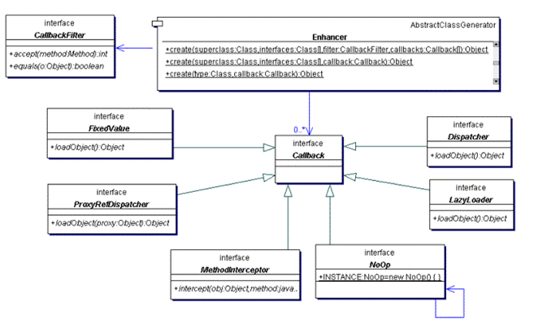
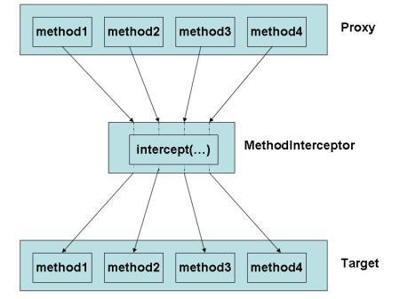

com.demo1的运行结果
```
CGLIB debugging enabled, writing to '/Users/yangxiaohuan/Downloads/java_tmp'
Before invoke public void com.demo1.Dao.select()
select 1 from dual
After invokepublic void com.demo1.Dao.select()
delete from ...
insert into ...
```


## CGLIB

CGLIB基于ASM实现。提供比反射更为强大的动态特性。使用CGLIB可以非常方便的实现的动态代理。

- net.sf.cglib.core    底层字节码处理类。
- net.sf.cglib.transform    该包中的类用于class文件运行时转换或编译时转换。
- net.sf.cglib.proxy    该包中的类用于创建代理和方法拦截。
- net.sf.cglib.reflect    该包中的类用于快速反射，并提供了C#风格的委托。
- net.sf.cglib.util    集合排序工具类。
- net.sf.cglib.beans    JavaBean工具类。

### 1 使用CGLIB实现动态代理

#### 1.1 CGLIB代理相关的类

net.sf.cglib.proxy.Enhancer    主要的增强类。
net.sf.cglib.proxy.MethodInterceptor    主要的方法拦截类，它是Callback接口的子接口，需要用户实现。
net.sf.cglib.proxy.MethodProxy    JDK的java.lang.reflect.Method类的代理类，可以方便的实现对源对象方法的调用。

cglib是通过动态的生成一个子类去覆盖所要代理类的非final方法，并设置好callback，则原有类的每个方法调用就会转变成调用用户定义的拦截方法（interceptors）。



net.sf.cglib.proxy.Callback接口在CGLIB包中是一个重要的接口，所有被net.sf.cglib.proxy.Enhancer类调用的回调（callback）接口都要继承这个接口。

net.sf.cglib.proxy.MethodInterceptor能够满足任何的拦截（interception ）需要。对有些情况下可能过度。为了简化和提高性能，CGLIB包提供了一些专门的回调（callback）类型：

- net.sf.cglib.proxy.FixedValue 为提高性能，FixedValue回调对强制某一特别方法返回固定值是有用的。
- net.sf.cglib.proxy.NoOp NoOp回调把对方法调用直接委派到这个方法在父类中的实现。
- net.sf.cglib.proxy.LazyLoader 当实际的对象需要延迟装载时，可以使用LazyLoader回调。一旦实际对象被装载，它将被每一个调用代理对象的方法使用。
- net.sf.cglib.proxy.Dispatcher Dispathcer回调和LazyLoader回调有相同的特点，不同的是，当代理方法被调用时，装载对象的方法也总要被调用。
- net.sf.cglib.proxy.ProxyRefDispatcher ProxyRefDispatcher回调和Dispatcher一样，不同的是，它可以把代理对象作为装载对象方法的一个参数传递。


#### 1.2 CGLIB动态代理的基本原理
CGLIB动态代理的原理就是用Enhancer生成一个原有类的子类，并且设置好callback到proxy， 则原有类的每个方法调用都会转为调用实现了MethodInterceptor接口的proxy的intercept() 函数，如图


在intercept()函数里，除执行代理类的原因方法，在原有方法前后加入其他需要实现的过程，改变原有方法的参数值，即可以实现对原有类的代理了。这似于AOP中的around advice。

在这里，通过 `System.setProperty(DebuggingClassWriter.DEBUG_LOCATION_PROPERTY, "/Users/yangxiaohuan/Downloads/java_tmp");` 生成的class文件，反编译得到：
```java
public class Dao$$EnhancerByCGLIB$$d9472938 extends Dao implements Factory {  
  //省略
}
```

#### 1.3 使用MethodInterceptor接口实现方法回调
当对代理中所有方法的调用时，都会转向MethodInterceptor类型的拦截（intercept）方法,在拦截方法中再调用底层对象相应的方法。
下面我们举个例子，假设你想对目标对象的所有方法调用进行权限的检查，如果没有经过授权，就抛出一个运行时的异常。
net.sf.cglib.proxy.MethodInterceptor接口是最通用的回调（callback）类型，它经常被基于代理的AOP用 来实现拦截（intercept）方法的调用。

MethodInterceptor接口只定义了一个方法：

public Object intercept(Object object, java.lang.reflect.Method method, Object[] args, MethodProxy proxy) throws Throwable;
参数Object object是被代理对象，不会出现死循环的问题。
参数java.lang.reflect.Method method是java.lang.reflect.Method类型的被拦截方法。
参数Object[] args是被被拦截方法的参数。
参数MethodProxy proxy是CGLIB提供的MethodProxy 类型的被拦截方法。

注意：

1、若原方法的参数存在基本类型，则对于第三个参数Object[] args会被转化成类的类型。如原方法的存在一个参数为int，则在intercept方法中，对应的会存在一个Integer类型的参数。
2、若原方法为final方法，则MethodInterceptor接口无法拦截该方法。

由于性能的原因，对原始方法的调用使用CGLIB的net.sf.cglib.proxy.MethodProxy对象，而不是反射中一般使用java.lang.reflect.Method对象。


#### 1.4 使用CGLIB代理最核心类Enhancer生成代理对象
net.sf.cglib.proxy.Enhancer中有几个常用的方法：
```
void setSuperclass(java.lang.Class superclass) 设置产生的代理对象的父类。
void setCallback(Callback callback) 设置CallBack接口的实例。
void setCallbacks(Callback[] callbacks) 设置多个CallBack接口的实例。
void setCallbackFilter(CallbackFilter filter) 设置方法回调过滤器。
Object create() 使用默认无参数的构造函数创建目标对象。
Object create(Class[], Object[]) 使用有参数的构造函数创建目标对象。参数Class[] 定义了参数的类型，第二个Object[]是参数的值。
注意：在参数中，基本类型应被转化成类的类型。
```

基本代码：

```java
public Object createProxy(Class targetClass) {
    Enhancer enhancer = new Enhancer();
    enhancer.setSuperclass(targetClass);
    enhancer.setCallback(new MethodInterceptorImpl ());
    return enhancer.create();
}
```

createProxy方法返回值是targetClass的一个实例的代理。


### 2.回调过滤器CallbackFilter
这部分具体看 com.demo1例子

### 3.CGLIB对Mixin的支持
CGLIB的代理包net.sf.cglib.proxy.Mixin类提供对Minix编程的支持。Minix允许多个对象绑定到一个单个的大对象上。在代理中对方法的调用委托到下面相应的对象中。 这是一种将多个接口混合在一起的方式, 实现了多个接口。
Minix是一种多继承的替代方案, 很大程度上解决了多继承的很多问题, 实现和理解起来都比较容易。
见 com.mixin

### 4.CGLIB用来对象之间拷贝属性
com.bean_copy

### 5.使用CGLIB动态生成Bean
com.genarator_bean

### 6.FastClass
顾明思义，FastClass就是对Class对象进行特定的处理，比如通过数组保存method引用，因此FastClass引出了一个index下标的新概念，比如getIndex(String name, Class[] parameterTypes)就是以前的获取method的方法。通过数组存储method,constructor等class信息，从而将原先的反射调用，转化为class.index的直接调用，从而体现所谓的FastClass。

com.fast_class

### 7.BulkBean

相比于BeanCopier，BulkBean将copy的动作拆分为getPropertyValues和setPropertyValues两个方法，允许自定义处理属性。

com.bulk_bean

使用注意： 

1. 避免每次进行BulkBean.create创建对象，一般将其声明为static的 
2. 应用场景：针对特定属性的get,set操作，一般适用通过xml配置注入和注出的属性，运行时才确定处理的Source,Target类，只需要关注属性名即可。

### 8.内部类

com.inner_class

```
Exception in thread "main" java.lang.IllegalArgumentException: Superclass has no null constructors but no arguments were given
```


原因:

代理目标对象不能是内部类【内部类的创建依赖外部类】，如果是内部类，cglib代理内部会获取到一个有参构造函数【参数是外部类对象】

**如果非要代理内部类，有两种方式**

1.内部类加static【即static class Student,因为被static修饰的内部类可以直接作为一个普通类来使用，而不需实例一个外部类】

2.改为Target.Student student = (Target.Student) enhancer.create(new Class[]{Target.class}, new Object[]{new Target()}); 在cglib创建类对象时传入外部类对象


## 什么是CGLIB
CGLIB（Code Generator Library）是一个强大的、高性能的代码生成库。其被广泛应用于AOP框架（Spring、dynaop）中，用以提供方法拦截操作。Hibernate作为一个比较受欢迎的ORM框架，同样使用CGLIB来代理单端（多对一和一对一）关联（延迟提取集合使用的另一种机制）。

#### 为什么使用CGLIB
CGLIB代理主要通过对字节码的操作，为对象引入间接级别，以控制对象的访问。我们知道Java中有一个动态代理也是做这个事情的，那我们为什么不直接使用Java动态代理，而要使用CGLIB呢？答案是CGLIB相比于JDK动态代理更加强大，JDK动态代理虽然简单易用，但是其有一个致命缺陷是，只能对接口进行代理。如果要代理的类为一个普通类、没有接口，那么Java动态代理就没法使用了。
CGLIB底层使用了ASM（一个短小精悍的字节码操作框架）来操作字节码生成新的类。除了CGLIB库外，脚本语言（如Groovy何BeanShell）也使用ASM生成字节码。ASM使用类似SAX的解析器来实现高性能。我们不鼓励直接使用ASM，因为它需要对Java字节码的格式足够的了解


由于CGLIB的大部分类是直接对Java字节码进行操作，这样生成的类会在Java的永久堆中。如果动态代理操作过多，容易造成永久堆满，触发OutOfMemory异常。


## CGLIB和Java动态代理的区别:

1.jdk动态代理实现了被代理对象的接口，cglib是继承了被代理的对象【通过字节码技术创建这个类的子类，实现动态代理】

2.都是在运行期间，jdk是直接写class字节码，cglib使用asm框架写字节码，实现更复杂

3.java动态代理是利用反射机制生成一个实现代理接口的匿名类，在调用具体方法时用InvokeHandler，cglib是通过继承要被代理类的机制

4.

```
jdk动态代理要求
1.动态代理类实现InvocationHandler接口【必须】
2.被代理的类必须要实现一个接口
3.使用Proxy.newProxyInstance产生代理对象

cglib要求
1.动态代理类库中已有，而cglib必须加入第三方依赖(cglib、asm)


```

5.jdk调用代理方法，通过反射机制，cglib通过fastclass机制直接调用方法，这方面cglib执行效率更高。


Java动态代理只能够对接口进行代理，不能对普通的类进行代理（因为所有生成的代理类的父类为Proxy，Java类继承机制不允许多重继承）；CGLIB能够代理普通类；
Java动态代理使用Java原生的反射API进行操作，在生成类上比较高效；CGLIB使用ASM框架直接对字节码进行操作，在类的执行过程中比较高效


### cglib的局限性(缺点)

1.cglib无法代理final修饰的类和final修饰的方法

原因:

final类不能被继承、没有子类、final类中修饰的方法默认是final

final方法不能被子类的方法覆盖，而cglib的底层的代理类恰好就是通过继承要代理的目标类来实现种种操作。

** 特别说明：参考于 [CGLIB学习笔记](https://www.cnblogs.com/shijiaqi1066/p/3429691.html)   [CGLIB原理及实现机制](https://blog.csdn.net/gyshun/article/details/81000997) [cglib动态代理、asm学习笔记](https://www.jianshu.com/p/a728dac249e1) **