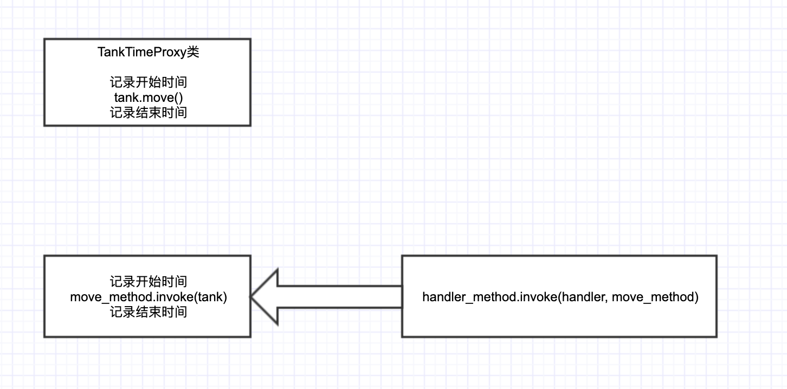

### 在com.xiaohuan的package中
使用了自己的方式，实现动态代理。

```java
package com.xiaohuan;
public class TankTimeProxy implements Moveable{
  Moveable t;
  public TankTimeProxy(Moveable t){
    super();
    this.t = t;
  }

  @Override
  public void move() {
    long start = System.currentTimeMillis();
    t.move();
    long end = System.currentTimeMillis();
    System.out.println("time:" + (end-start));
  }
}
```

使用聚合（implements）的方式，实现代理。

换成使用反射的方式：动态生成java文件，并且编译生成class文件，加载到JVM内存。


（1）直接生成原模原样的java文件
com.xiaohuan 的package
one的package里面，在Proxy1类中，需要提前知道 Moveable 接口中的move方法，根据这个来生成java文件。文件内容如下：

```java
package com.xiaohuan;
public class TankTimeProxy implements Moveable{
  Moveable t;
  public TankTimeProxy(Moveable t){
    super();
    this.t = t;
  }
  @Override
  public void move() {
    long start = System.currentTimeMillis();
    t.move();
    long end = System.currentTimeMillis();
    System.out.println("time:" + (end-start));
  }
}
```

借助 `Moveable` 接口，此代理可以获取 实现了Moveable类中的move方法的执行时间。

---

（2）将需要 `@Override` 的方法，使用反射的方式获取到
在two的package中，Proxy2类，将需要生成的TankTimeProxy类，字符串中，将原来的写固定的move方法，换成使用反射的方式获取得到方法名。
```java
Method[] methods =infce.getMethods();
for(Method method: methods){
  method.getName(); 
}
```

（3）在2的基础上，将需要执行的方法进行invoke。



利用两次invoke，实现动态代理。
将原来的method中需要执行的操作，放到外部的一个Handler中。
然后在原来的method中，去invoke 外部Handler中的方法。

这样，可以在外部的Handler中，根据需求，任意写需要的逻辑。
如记录操作的耗时、权限认证等。而原有的方法，逻辑，都无须任何变动。

```java
package com.xiaohuan;
import java.lang.reflect.Method;
public class TankTimeProxy implements com.xiaohuan.Moveable{
    Moveable t;
    public TankTimeProxy(InvocationHandler h){
        super();
        this.h = h;
    }
    com.xiaohuan.InvocationHandler h;
    @Override
    public void move() {
        try {
            Method md = com.xiaohuan.Moveable.class.getMethod("move");
            h.invoke(this, md);
        }catch (Exception ex){
            System.err.println(ex.toString());
        }
    }
}

（4）在usage的包里面
不仅仅局限于Tank的move方法，对于其他的方法，一样适用。
```

### 在com.jdk_usage的package中
使用了jdk提供的动态代理


### 在test中

MethodInvoke.java

这里面，invoke的基本用法。


