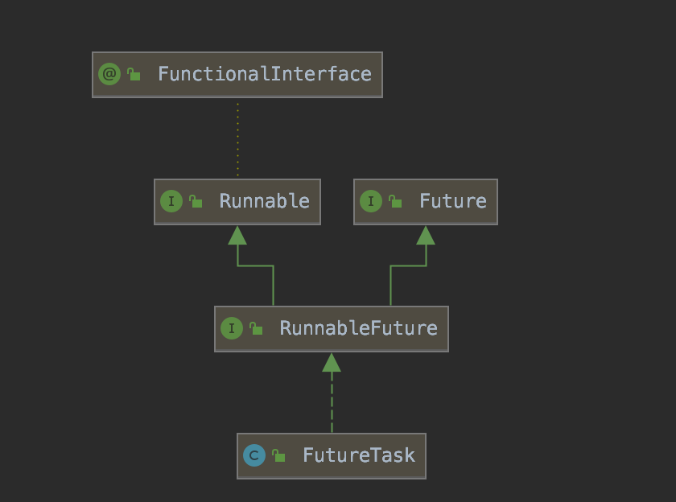

## Callable
[Java并发编程](./Java并发编程.pdf) 这里面提供了 callable的使用方法。
具体例子，还可以见 com.demo.callable包里面的例子。


## Future
Future表示一个任务的周期，并提供了相应的方法来判断是否已经完成或者取消，以及获取任务的结果和取消任务。

Future represents the result of an asynchronous computation。future表示异步的结果计算。

具体例子，还可以见 com.demo.future 包里面的例子。

如果调用future.get()的时候，线程还没有处理完，是需要同步等待的，也就是说需要主线程不停的轮询多线程的处理结果，这样的话代码比较复杂并且效率也不高。

ListenableFuture是guava中提供的对多线程的比较优秀的支持，ListenableFuture顾名思义就是可以监听的Future，它是对java原生Future的扩展增强。我们知道Future表示一个异步计算任务，当任务完成时可以得到计算结果。使用ListenableFuture Guava帮我们检测Future是否完成了，如果完成就自动调用回调函数，这样可以减少并发程序的复杂度。ListenableFuture是一个接口，它从jdk的Future接口继承。

另外，为了对比，这里面还有一个ListenableFuture的例子。




```java
package java.util.concurrent;

/**
 *
 * @see FutureTask
 * @see Executor
 * @since 1.5
 * @author Doug Lea
 * @param <V> The result type returned by this Future's {@code get} method
 */
public interface Future<V> {
    boolean cancel(boolean mayInterruptIfRunning);
    
    boolean isCancelled();

    boolean isDone();

    V get() throws InterruptedException, ExecutionException;
    
    V get(long timeout, TimeUnit unit)
        throws InterruptedException, ExecutionException, TimeoutException;
}

```


future的包里面Future_demo1 执行结果是：
```
call()方法被自动调用,干活！！！             pool-1-thread-1
call()方法被自动调用,干活！！！             pool-1-thread-2
call()方法被自动调用,干活！！！             pool-1-thread-1
call()方法被自动调用,干活！！！             pool-1-thread-2
call()方法被自动调用,干活！！！             pool-1-thread-1
call()方法被自动调用,干活！！！             pool-1-thread-2
call()方法被自动调用,干活！！！             pool-1-thread-2
call()方法被自动调用,干活！！！             pool-1-thread-1
call()方法被自动调用,干活！！！             pool-1-thread-3
call()方法被自动调用,干活！！！             pool-1-thread-2
java.util.concurrent.ExecutionException: com.demo.future.TaskException: Meet error in task.pool-1-thread-1
	at java.util.concurrent.FutureTask.report(FutureTask.java:122)
	at java.util.concurrent.FutureTask.get(FutureTask.java:192)
	at com.demo.future.Future_demo1.main(Future_demo1.java:30)
Caused by: com.demo.future.TaskException: Meet error in task.pool-1-thread-1
	at com.demo.future.TaskWithResult.call(TaskWithResult.java:33)
	at com.demo.future.TaskWithResult.call(TaskWithResult.java:17)
	at java.util.concurrent.FutureTask.run(FutureTask.java:266)
	at java.util.concurrent.ThreadPoolExecutor.runWorker(ThreadPoolExecutor.java:1149)
	at java.util.concurrent.ThreadPoolExecutor$Worker.run(ThreadPoolExecutor.java:624)
	at java.lang.Thread.run(Thread.java:748)
java.util.concurrent.ExecutionException: com.demo.future.TaskException: Meet error in task.pool-1-thread-2
	at java.util.concurrent.FutureTask.report(FutureTask.java:122)
	at java.util.concurrent.FutureTask.get(FutureTask.java:192)
	at com.demo.future.Future_demo1.main(Future_demo1.java:30)
Caused by: com.demo.future.TaskException: Meet error in task.pool-1-thread-2
	at com.demo.future.TaskWithResult.call(TaskWithResult.java:33)
	at com.demo.future.TaskWithResult.call(TaskWithResult.java:17)
	at java.util.concurrent.FutureTask.run(FutureTask.java:266)
	at java.util.concurrent.ThreadPoolExecutor.runWorker(ThreadPoolExecutor.java:1149)
	at java.util.concurrent.ThreadPoolExecutor$Worker.run(ThreadPoolExecutor.java:624)
	at java.lang.Thread.run(Thread.java:748)
java.util.concurrent.ExecutionException: com.demo.future.TaskException: Meet error in task.pool-1-thread-1
	at java.util.concurrent.FutureTask.report(FutureTask.java:122)
	at java.util.concurrent.FutureTask.get(FutureTask.java:192)
	at com.demo.future.Future_demo1.main(Future_demo1.java:30)
Caused by: com.demo.future.TaskException: Meet error in task.pool-1-thread-1
	at com.demo.future.TaskWithResult.call(TaskWithResult.java:33)
	at com.demo.future.TaskWithResult.call(TaskWithResult.java:17)
	at java.util.concurrent.FutureTask.run(FutureTask.java:266)
	at java.util.concurrent.ThreadPoolExecutor.runWorker(ThreadPoolExecutor.java:1149)
	at java.util.concurrent.ThreadPoolExecutor$Worker.run(ThreadPoolExecutor.java:624)
	at java.lang.Thread.run(Thread.java:748)
java.util.concurrent.ExecutionException: com.demo.future.TaskException: Meet error in task.pool-1-thread-2
	at java.util.concurrent.FutureTask.report(FutureTask.java:122)
	at java.util.concurrent.FutureTask.get(FutureTask.java:192)
	at com.demo.future.Future_demo1.main(Future_demo1.java:30)
Caused by: com.demo.future.TaskException: Meet error in task.pool-1-thread-2
	at com.demo.future.TaskWithResult.call(TaskWithResult.java:33)
	at com.demo.future.TaskWithResult.call(TaskWithResult.java:17)
	at java.util.concurrent.FutureTask.run(FutureTask.java:266)
	at java.util.concurrent.ThreadPoolExecutor.runWorker(ThreadPoolExecutor.java:1149)
	at java.util.concurrent.ThreadPoolExecutor$Worker.run(ThreadPoolExecutor.java:624)
	at java.lang.Thread.run(Thread.java:748)
java.util.concurrent.ExecutionException: com.demo.future.TaskException: Meet error in task.pool-1-thread-1
	at java.util.concurrent.FutureTask.report(FutureTask.java:122)
	at java.util.concurrent.FutureTask.get(FutureTask.java:192)
	at com.demo.future.Future_demo1.main(Future_demo1.java:30)
Caused by: com.demo.future.TaskException: Meet error in task.pool-1-thread-1
	at com.demo.future.TaskWithResult.call(TaskWithResult.java:33)
	at com.demo.future.TaskWithResult.call(TaskWithResult.java:17)
	at java.util.concurrent.FutureTask.run(FutureTask.java:266)
	at java.util.concurrent.ThreadPoolExecutor.runWorker(ThreadPoolExecutor.java:1149)
	at java.util.concurrent.ThreadPoolExecutor$Worker.run(ThreadPoolExecutor.java:624)
	at java.lang.Thread.run(Thread.java:748)
java.util.concurrent.ExecutionException: com.demo.future.TaskException: Meet error in task.pool-1-thread-2
	at java.util.concurrent.FutureTask.report(FutureTask.java:122)
	at java.util.concurrent.FutureTask.get(FutureTask.java:192)
	at com.demo.future.Future_demo1.main(Future_demo1.java:30)
Caused by: com.demo.future.TaskException: Meet error in task.pool-1-thread-2
	at com.demo.future.TaskWithResult.call(TaskWithResult.java:33)
	at com.demo.future.TaskWithResult.call(TaskWithResult.java:17)
	at java.util.concurrent.FutureTask.run(FutureTask.java:266)
	at java.util.concurrent.ThreadPoolExecutor.runWorker(ThreadPoolExecutor.java:1149)
	at java.util.concurrent.ThreadPoolExecutor$Worker.run(ThreadPoolExecutor.java:624)
	at java.lang.Thread.run(Thread.java:748)
call()方法被自动调用，任务的结果是：3    pool-1-thread-2
call()方法被自动调用，任务的结果是：4    pool-1-thread-1
call()方法被自动调用，任务的结果是：6    pool-1-thread-2
call()方法被自动调用，任务的结果是：7    pool-1-thread-3

Process finished with exit code 0

```


## FutureTask
FutureTask是Future的一个具体实现类，ThreadPoolExecutor的submit方法返回的就是一个Future的实现，这个实现就是FutureTask的一个具体实例，FutureTask帮助实现了具体的任务执行，以及和Future接口中的get方法的关联。


future_task 包里面，Main1结果
```
futureTask线程现在开始启动，启动时间为：2020-05-11 11:46:46
futureTask线程开始执行其他任务
现在你在其他账户中的总金额为88818
等待私有账户总金额统计完毕...
私有账户计算未完成继续等待...
私有账户计算未完成继续等待...
私有账户计算未完成继续等待...
私有账户计算未完成继续等待...
私有账户计算未完成继续等待...
私有账户计算未完成继续等待...
私有账户计算未完成继续等待...
私有账户计算未完成继续等待...
私有账户计算未完成继续等待...
您当前有8849在您的私有账户中
私有账户计算未完成继续等待...
futureTask线程计算完毕，此时时间为2020-05-11 11:46:51
您现在的总金额为：88818||8849

Process finished with exit code 0

```


future_task 包里面，Main2 结果
```
/Library/Java/JavaVirtualMachines/jdk1.8.0_181.jdk/Contents/Home/bin/java "-javaagent:/Applications/IntelliJ IDEA.app/Contents/lib/idea_rt.jar=54201:/Applications/IntelliJ IDEA.app/Contents/bin" -Dfile.encoding=UTF-8 -classpath /Library/Java/JavaVirtualMachines/jdk1.8.0_181.jdk/Contents/Home/jre/lib/charsets.jar:/Library/Java/JavaVirtualMachines/jdk1.8.0_181.jdk/Contents/Home/jre/lib/deploy.jar:/Library/Java/JavaVirtualMachines/jdk1.8.0_181.jdk/Contents/Home/jre/lib/ext/cldrdata.jar:/Library/Java/JavaVirtualMachines/jdk1.8.0_181.jdk/Contents/Home/jre/lib/ext/dnsns.jar:/Library/Java/JavaVirtualMachines/jdk1.8.0_181.jdk/Contents/Home/jre/lib/ext/jaccess.jar:/Library/Java/JavaVirtualMachines/jdk1.8.0_181.jdk/Contents/Home/jre/lib/ext/jfxrt.jar:/Library/Java/JavaVirtualMachines/jdk1.8.0_181.jdk/Contents/Home/jre/lib/ext/localedata.jar:/Library/Java/JavaVirtualMachines/jdk1.8.0_181.jdk/Contents/Home/jre/lib/ext/nashorn.jar:/Library/Java/JavaVirtualMachines/jdk1.8.0_181.jdk/Contents/Home/jre/lib/ext/sunec.jar:/Library/Java/JavaVirtualMachines/jdk1.8.0_181.jdk/Contents/Home/jre/lib/ext/sunjce_provider.jar:/Library/Java/JavaVirtualMachines/jdk1.8.0_181.jdk/Contents/Home/jre/lib/ext/sunpkcs11.jar:/Library/Java/JavaVirtualMachines/jdk1.8.0_181.jdk/Contents/Home/jre/lib/ext/zipfs.jar:/Library/Java/JavaVirtualMachines/jdk1.8.0_181.jdk/Contents/Home/jre/lib/javaws.jar:/Library/Java/JavaVirtualMachines/jdk1.8.0_181.jdk/Contents/Home/jre/lib/jce.jar:/Library/Java/JavaVirtualMachines/jdk1.8.0_181.jdk/Contents/Home/jre/lib/jfr.jar:/Library/Java/JavaVirtualMachines/jdk1.8.0_181.jdk/Contents/Home/jre/lib/jfxswt.jar:/Library/Java/JavaVirtualMachines/jdk1.8.0_181.jdk/Contents/Home/jre/lib/jsse.jar:/Library/Java/JavaVirtualMachines/jdk1.8.0_181.jdk/Contents/Home/jre/lib/management-agent.jar:/Library/Java/JavaVirtualMachines/jdk1.8.0_181.jdk/Contents/Home/jre/lib/plugin.jar:/Library/Java/JavaVirtualMachines/jdk1.8.0_181.jdk/Contents/Home/jre/lib/resources.jar:/Library/Java/JavaVirtualMachines/jdk1.8.0_181.jdk/Contents/Home/jre/lib/rt.jar:/Library/Java/JavaVirtualMachines/jdk1.8.0_181.jdk/Contents/Home/lib/ant-javafx.jar:/Library/Java/JavaVirtualMachines/jdk1.8.0_181.jdk/Contents/Home/lib/dt.jar:/Library/Java/JavaVirtualMachines/jdk1.8.0_181.jdk/Contents/Home/lib/javafx-mx.jar:/Library/Java/JavaVirtualMachines/jdk1.8.0_181.jdk/Contents/Home/lib/jconsole.jar:/Library/Java/JavaVirtualMachines/jdk1.8.0_181.jdk/Contents/Home/lib/packager.jar:/Library/Java/JavaVirtualMachines/jdk1.8.0_181.jdk/Contents/Home/lib/sa-jdi.jar:/Library/Java/JavaVirtualMachines/jdk1.8.0_181.jdk/Contents/Home/lib/tools.jar:/Users/yangxiaohuan/my_private/github/my_public/java/guava_demo/out/production/classes:/Users/yangxiaohuan/my_private/github/my_public/java/guava_demo/out/production/resources:/Users/yangxiaohuan/.gradle/caches/modules-2/files-2.1/com.google.guava/guava/29.0-jre/801142b4c3d0f0770dd29abea50906cacfddd447/guava-29.0-jre.jar:/Users/yangxiaohuan/.gradle/caches/modules-2/files-2.1/junit/junit/4.13/e49ccba652b735c93bd6e6f59760d8254cf597dd/junit-4.13.jar:/Users/yangxiaohuan/.gradle/caches/modules-2/files-2.1/org.slf4j/slf4j-log4j12/1.7.30/c21f55139d8141d2231214fb1feaf50a1edca95e/slf4j-log4j12-1.7.30.jar:/Users/yangxiaohuan/.gradle/caches/modules-2/files-2.1/org.slf4j/slf4j-api/1.7.30/b5a4b6d16ab13e34a88fae84c35cd5d68cac922c/slf4j-api-1.7.30.jar:/Users/yangxiaohuan/.gradle/caches/modules-2/files-2.1/com.google.guava/failureaccess/1.0.1/1dcf1de382a0bf95a3d8b0849546c88bac1292c9/failureaccess-1.0.1.jar:/Users/yangxiaohuan/.gradle/caches/modules-2/files-2.1/com.google.guava/listenablefuture/9999.0-empty-to-avoid-conflict-with-guava/b421526c5f297295adef1c886e5246c39d4ac629/listenablefuture-9999.0-empty-to-avoid-conflict-with-guava.jar:/Users/yangxiaohuan/.gradle/caches/modules-2/files-2.1/com.google.code.findbugs/jsr305/3.0.2/25ea2e8b0c338a877313bd4672d3fe056ea78f0d/jsr305-3.0.2.jar:/Users/yangxiaohuan/.gradle/caches/modules-2/files-2.1/org.checkerframework/checker-qual/2.11.1/8c43bf8f99b841d23aadda6044329dad9b63c185/checker-qual-2.11.1.jar:/Users/yangxiaohuan/.gradle/caches/modules-2/files-2.1/com.google.errorprone/error_prone_annotations/2.3.4/dac170e4594de319655ffb62f41cbd6dbb5e601e/error_prone_annotations-2.3.4.jar:/Users/yangxiaohuan/.gradle/caches/modules-2/files-2.1/com.google.j2objc/j2objc-annotations/1.3/ba035118bc8bac37d7eff77700720999acd9986d/j2objc-annotations-1.3.jar:/Users/yangxiaohuan/.gradle/caches/modules-2/files-2.1/org.hamcrest/hamcrest-core/1.3/42a25dc3219429f0e5d060061f71acb49bf010a0/hamcrest-core-1.3.jar:/Users/yangxiaohuan/.gradle/caches/modules-2/files-2.1/log4j/log4j/1.2.17/5af35056b4d257e4b64b9e8069c0746e8b08629f/log4j-1.2.17.jar com.demo.future_task.Main2
启动时间为：2020-05-11 11:48:16
异步任务完成!

Process finished with exit code 0

```


## ListenableFuture


ListenableFuture顾名思义就是可以监听的Future，它是对java原生Future的扩展增强。我们知道Future表示一个异步计算任务，当任务完成时可以得到计算结果。如果我们希望一旦计算完成就拿到结果展示给用户或者做另外的计算，就必须使用另一个线程不断的查询计算状态。这样做，代码复杂，而且效率低下。使用ListenableFuture Guava帮我们检测Future是否完成了，如果完成就自动调用回调函数，这样可以减少并发程序的复杂度。


参考地址：
[Java并发编程：Callable、Future和FutureTask](https://www.cnblogs.com/dolphin0520/p/3949310.html)
[Java 线程池Future和FutureTask](https://www.cnblogs.com/hongdada/p/6120698.html)
[ListenableFuture并发编程](https://cloud.tencent.com/developer/news/319160)
