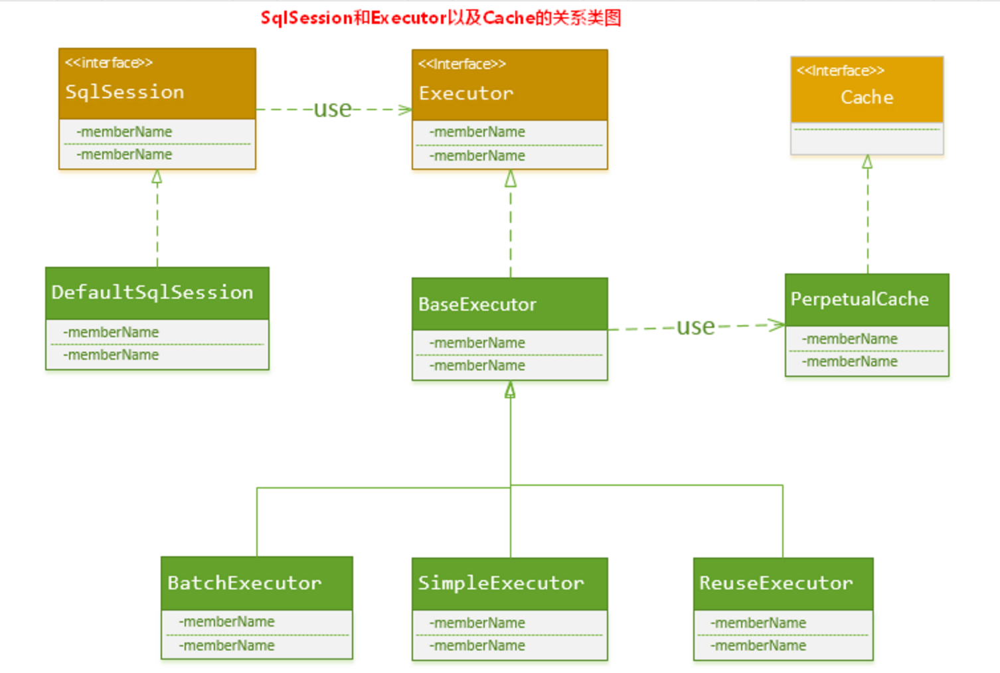
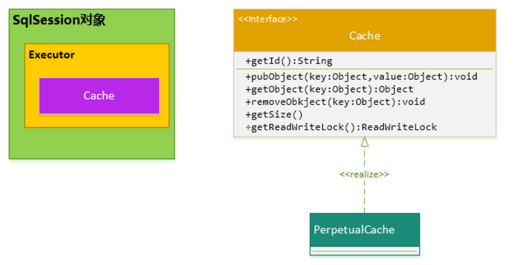
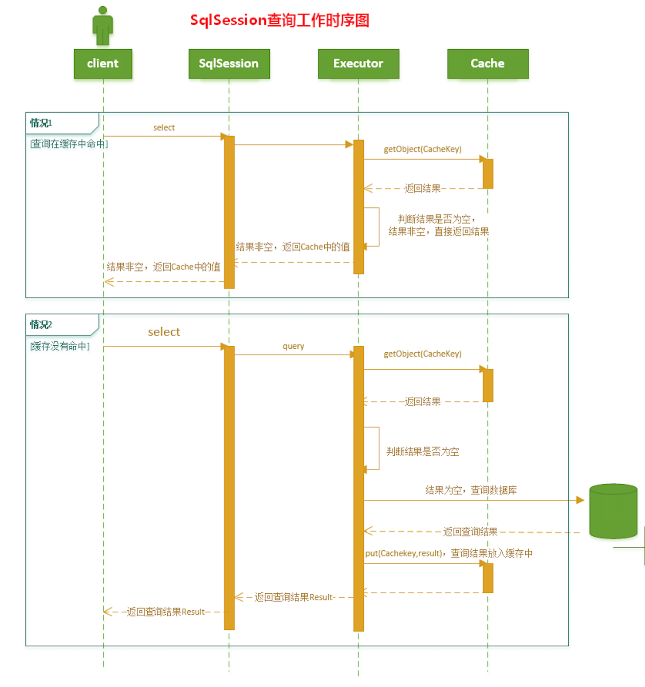
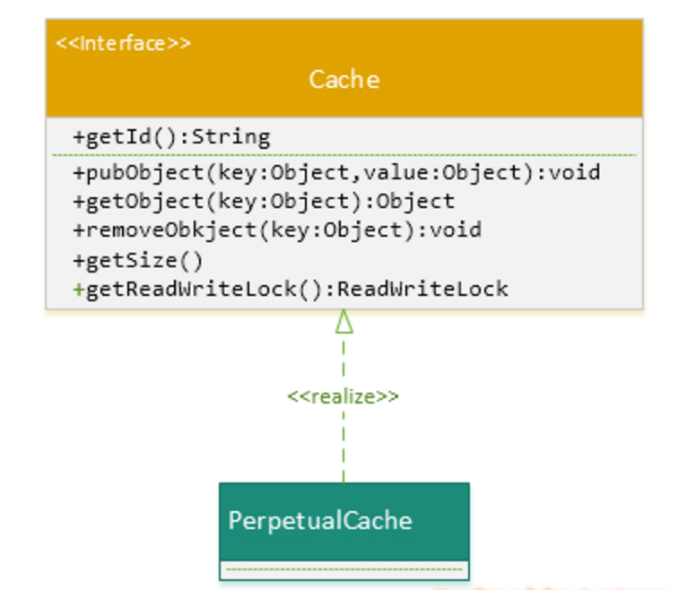
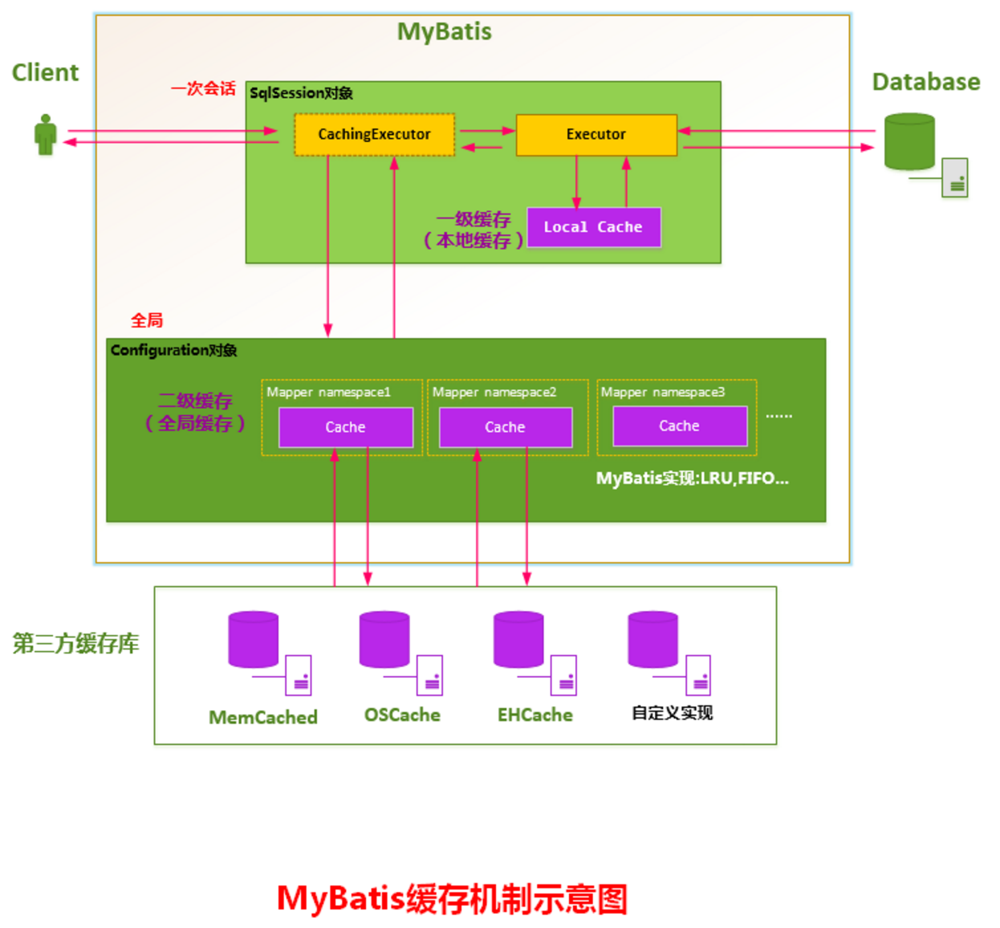
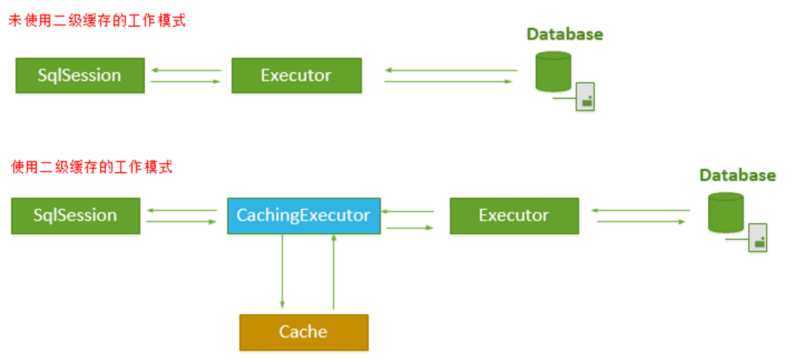
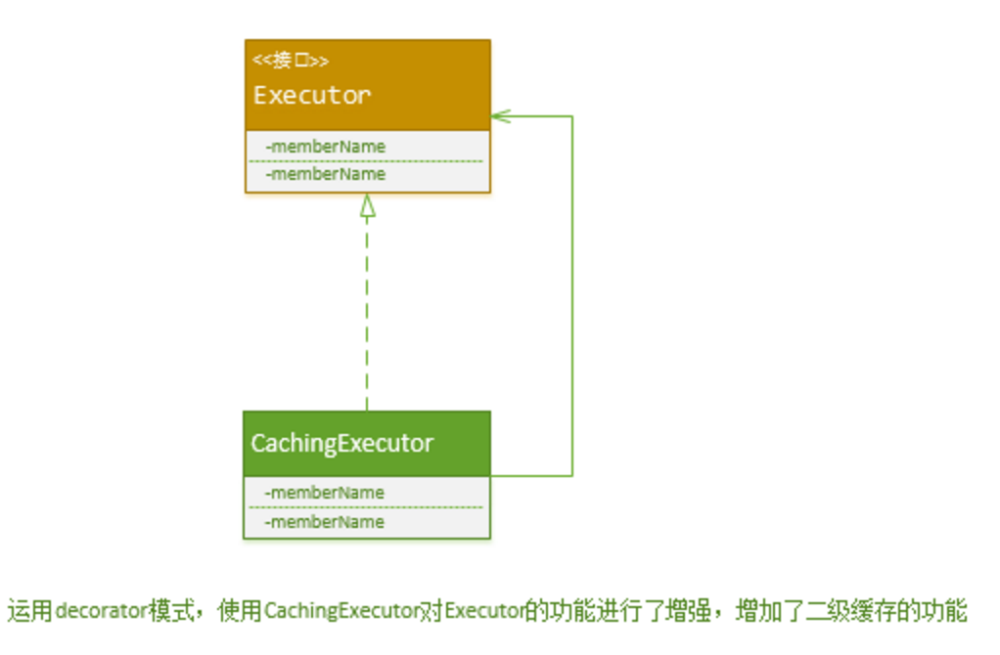
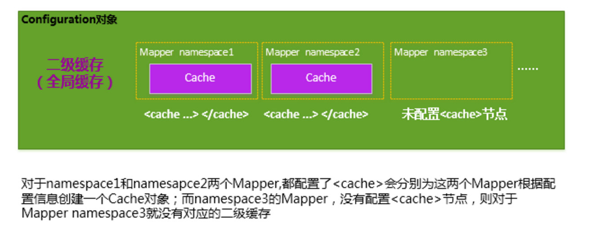
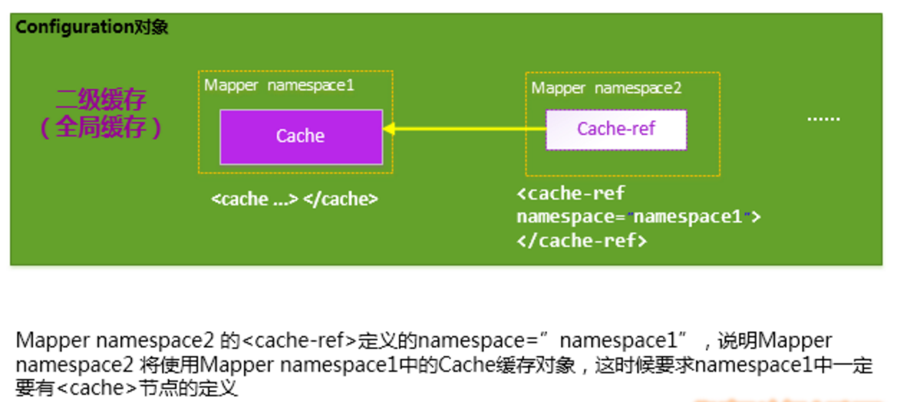
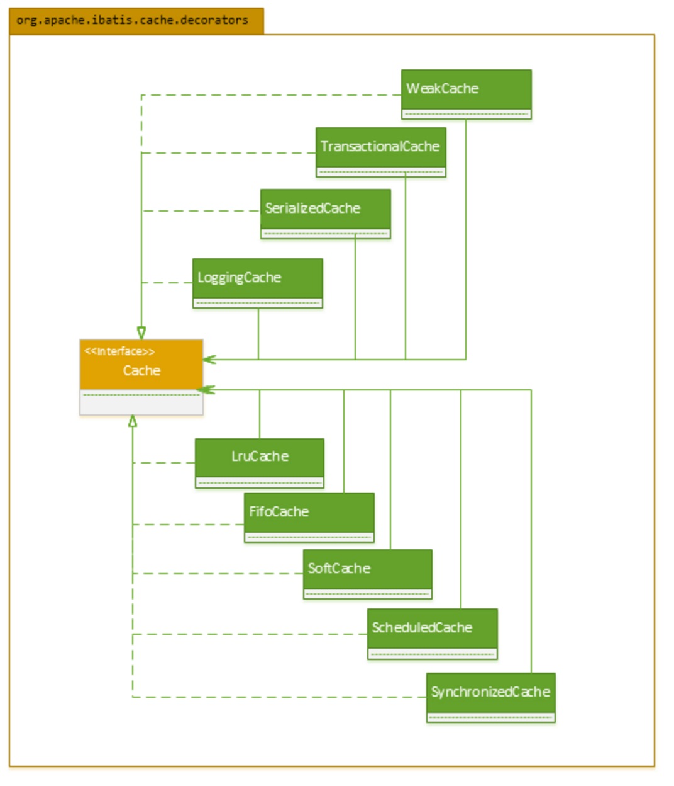

### Mybatis的缓存级别

Mybatis提供了查询缓存来查询数据，使在项目开发中提高性能。 Mybatis的缓存分为一级缓存和二级缓存，一级缓存是SqlSession级别的缓存，二级缓存是mapper级别的缓存，二级缓存是多个SqlSession共享的。Mybatis通过缓存机制减轻数据压力，提高数据库的性能。

#### 一级缓存没有过期时间，只有生命周期

（1）Mybatis在开启一个数据库会话时，会创建一个新的SqlSession对象。SqlSession对象的缓存是Mybatis的一级缓存，**在操作数据库时需要创建SqlSession对象，在对象中有hashMap用于保存缓存数据（对象的id作为key，而对象作为 value保存的）**。一级缓存的作用范围是SqlSession范围的，当一个SqlSession中执行两次相同的sql第一次执行完就会将数据库查询到的数据写进缓存，第二次查询时直接去缓存中查找，从而提高数据库的效率。
（2）如果SqlSession执行DML(insert，update，delete)操作，并且提交到数据库，Mybatis会清空SqlSession的一级缓存，这样做的目的是为了保存最新的数据，避免出现脏读的现象。**当Mybatis会清空SqlSession的一级缓存（生命周期结束）**
(3）SqlSession对象中会有一个Executor对象，Executor对象中持有一个PerpetualCache对象，见下面代码。当会话结束时，SqlSession对象及其内部的Executor对象还有PerpetualCache对象也一并释放掉。

```
protected BaseExecutor(Configuration configuration, Transaction transaction) {
this.transaction = transaction;
this.deferredLoads = new ConcurrentLinkedQueue<DeferredLoad>();
this.localCache = new PerpetualCache("LocalCache");
this.localOutputParameterCache = new PerpetualCache("LocalOutputParameterCache");
this.closed = false;
this.configuration = configuration;
this.wrapper = this;
}
```


a.如果SqlSession调用了close（）方法，会释放掉以及缓存PerpetualCache，一级缓存将不可用;
b.如果SqlSession调用了clearCache()，会清空PerpetualCache对象中的数据，但是该对象仍可使用;
c.SqlSession中执行了任何一个更新操作，例如：update、delete、insert ，都会清空PerpetualCache对象的数据，但是该对象可以继续使用；

#### 二级缓存有过期时间，但是没有后台线程检测

**<u>以下待验证。</u>**

（1）二级缓存是mapper级别的缓存，使用二级缓存时，多个SqlSession使用同一个mapper的sql语句去操作数据库，得到的数据存在二级缓存区域。同样是使用hashMap进行存储。
（2）相比于一级缓存，二级缓存的范围更大，多个SqlSession可以共用二级缓存，二级缓存时跨SqlSession的。
（3）二级缓存是多个SqlSession共享的，其作用域是SqlSession的namespace。Mybatis一级缓存是默认开启的，二级缓存没有默认开启，需要在setting全局配置中配置开启二级缓存。

二级缓存有过期时间，并不是key-value的过期时间，而是这个cache的过期时间，是flushInterval，意味着整个清空缓存cache，所以不需要后台线程去定时检测。

```
public class ScheduledCache implements Cache
{

    private final Cache delegate;
    protected long clearInterval;
    protected long lastClear;

    public ScheduledCache(Cache delegate)
    {
        this.delegate = delegate;
        this.clearInterval = 60 * 60 * 1000;
        this.lastClear = System.currentTimeMillis();
    }

    public void setClearInterval(long clearInterval)
    {
        this.clearInterval = clearInterval;


```

----


# MyBatis缓存深入解析

## 11 MyBatis一级缓存实现

### 11.1 什么是一级缓存？ 为什么使用一级缓存？

每当我们使用MyBatis开启一次和数据库的会话，MyBatis会创建出一个SqlSession对象表示一次数据库会话。

在对数据库的一次会话中，我们有可能会反复地执行完全相同的查询语句，如果不采取一些措施的话，每一次查询都会查询一次数据库,而我们在极短的时间内做了完全相同的查询，那么它们的结果极有可能完全相同，由于查询一次数据库的代价很大，这有可能造成很大的资源浪费。

> 为了解决这一问题，减少资源的浪费，**MyBatis会在表示会话的SqlSession对象中建立一个简单的缓存，将每次查询到的结果结果缓存起来，当下次查询的时候，如果判断先前有个完全一样的查询，会直接从缓存中直接将结果取出，返回给用户，不需要再进行一次数据库查询了。**

> 如下图所示，MyBatis会在一次会话的表示----**一个SqlSession对象中创建一个本地缓存(local cache)，对于每一次查询，都会尝试根据查询的条件去本地缓存中查找是否在缓存中，如果在缓存中，就直接从缓存中取出，然后返回给用户；否则，从数据库读取数据，将查询结果存入缓存并返回给用户**。


**对于会话（Session）级别的数据缓存，我们称之为一级数据缓存，简称一级缓存。**


### 11.2 MyBatis中的一级缓存是怎样组织的？（即SqlSession中的缓存是怎样组织的？）

由于MyBatis使用SqlSession对象表示一次数据库的会话，那么，**对于会话级别的一级缓存也应该是在SqlSession中控制的**。

实际上, SqlSession只是一个MyBatis对外的接口，**SqlSession将它的工作交给了Executor执行器这个角色来完成，负责完成对数据库的各种操作**。当创建了一个SqlSession对象时，**MyBatis会为这个SqlSession对象创建一个新的Executor执行器，而缓存信息就被维护在这个Executor执行器中**，MyBatis将缓存和对缓存相关的操作封装成了Cache接口中。SqlSession、Executor、Cache之间的关系如下列类图所示：




如上述的类图所示，Executor接口的实现类BaseExecutor中拥有一个Cache接口的实现类PerpetualCache，**则对于BaseExecutor对象而言，它将使用PerpetualCache对象维护缓存**。

综上，SqlSession对象、Executor对象、Cache对象之间的关系如下图所示：




由于Session级别的一级缓存实际上就是使用PerpetualCache维护的，那么PerpetualCache是怎样实现的呢？

**PerpetualCache实现原理其实很简单，其内部就是通过一个简单的HashMap<k,v> 来实现的，没有其他的任何限制。如下是PerpetualCache的实现代码：**

```
package org.apache.ibatis.cache.impl;  
  
import java.util.HashMap;  
import java.util.Map;  
import java.util.concurrent.locks.ReadWriteLock;  
  
import org.apache.ibatis.cache.Cache;  
import org.apache.ibatis.cache.CacheException;  
  
/** 
 * 使用简单的HashMap来维护缓存 
 * @author Clinton Begin 
 */  
public class PerpetualCache implements Cache {  
  
  private String id;  
  
  private Map<Object, Object> cache = new HashMap<Object, Object>();  
  
  public PerpetualCache(String id) {  
    this.id = id;  
  }  
  
  public String getId() {  
    return id;  
  }  
  
  public int getSize() {  
    return cache.size();  
  }  
  
  public void putObject(Object key, Object value) {  
    cache.put(key, value);  
  }  
  
  public Object getObject(Object key) {  
    return cache.get(key);  
  }  
  
  public Object removeObject(Object key) {  
    return cache.remove(key);  
  }  
  
  public void clear() {  
    cache.clear();  
  }  
  
  public ReadWriteLock getReadWriteLock() {  
    return null;  
  }  
  
  public boolean equals(Object o) {  
    if (getId() == null) throw new CacheException("Cache instances require an ID.");  
    if (this == o) return true;  
    if (!(o instanceof Cache)) return false;  
  
    Cache otherCache = (Cache) o;  
    return getId().equals(otherCache.getId());  
  }  
  
  public int hashCode() {  
    if (getId() == null) throw new CacheException("Cache instances require an ID.");  
    return getId().hashCode();  
  }  
  
} 
```


### 11.3 一级缓存的生命周期有多长？

> 1. MyBatis在开启一个数据库会话时，会创建一个新的SqlSession对象，SqlSession对象中会有一个新的Executor对象，Executor对象中持有一个新的PerpetualCache对象；**当会话结束时，SqlSession对象及其内部的Executor对象还有PerpetualCache对象也一并释放掉**。

> 1. **如果SqlSession调用了close()方法**，会释放掉一级缓存PerpetualCache对象，一级缓存将不可用；

> 1. **如果SqlSession调用了clearCache()**，会清空PerpetualCache对象中的数据，但是该对象仍可使用；

> 1. **SqlSession中执行了任何一个update操作(update()、delete()、insert()) **，都会清空PerpetualCache对象的数据，但是该对象可以继续使用；


### 11.4 SqlSession 一级缓存的工作流程

> 1. 对于某个查询，**根据statementId,params,rowBounds来构建一个key值**，根据这个key值去缓存Cache中取出对应的key值存储的缓存结果；
> 2. 判断从Cache中根据特定的key值取的数据数据是否为空，即是否命中；
> 3. 如果命中，则直接将缓存结果返回；
> 4. 如果没命中：
>    4.1 去数据库中查询数据，得到查询结果；
>    4.2 将key和查询到的结果分别作为key,value对存储到Cache中；
>    4.3 将查询结果返回；
> 5. 结束。




### 11.5 Cache接口的设计以及CacheKey的定义

如下图所示，**MyBatis定义了一个org.apache.ibatis.cache.Cache接口作为其Cache提供者的SPI(Service Provider Interface)，所有的MyBatis内部的Cache缓存，都应该实现这一接口**。MyBatis定义了一个PerpetualCache实现类实现了Cache接口，实际上，**在SqlSession对象里的Executor对象内维护的Cache类型实例对象，就是PerpetualCache子类创建的**。

> MyBatis内部还有很多Cache接口的实现，**一级缓存只会涉及到这一个PerpetualCache子类**，Cache的其他实现将会放到二级缓存中介绍。




我们知道，Cache最核心的实现其实就是一个Map，将本次查询使用的特征值作为key，将查询结果作为value存储到Map中。现在最核心的问题出现了：**怎样来确定一次查询的特征值？换句话说就是：怎样判断某两次查询是完全相同的查询？也可以这样说：如何确定Cache中的key值？**

**MyBatis认为，对于两次查询，如果以下条件都完全一样，那么就认为它们是完全相同的两次查询：**

> 1. **传入的 statementId **
> 2. 查询时要求的结果集中的**结果范围** （结果的范围通过rowBounds.offset和rowBounds.limit表示）
> 3. 这次查询所产生的最终要传递给JDBC java.sql.Preparedstatement的**Sql语句字符串**（boundSql.getSql() ）
> 4. 传递给java.sql.Statement要**设置的参数值**

**现在分别解释上述四个条件：**

> 1. 传入的statementId，对于MyBatis而言，你要使用它，**必须需要一个statementId，它代表着你将执行什么样的Sql**；

> 1. MyBatis自身提供的分页功能是通过RowBounds来实现的，它通过rowBounds.offset和rowBounds.limit来**过滤查询出来的结果集**，这种分页功能是基于查询结果的再过滤，而不是进行数据库的物理分页；

> 1. 由于MyBatis底层还是依赖于JDBC实现的，那么，对于两次完全一模一样的查询，MyBatis要保证对于底层JDBC而言，也是完全一致的查询才行。而对于JDBC而言，**两次查询，只要传入给JDBC的SQL语句完全一致，传入的参数也完全一致**，就认为是两次查询是完全一致的。

> 1. 上述的第3个条件正是要求保证传递给JDBC的SQL语句完全一致；第4条则是保证传递给JDBC的参数也完全一致；即3、4两条MyBatis最本质的要求就是：**调用JDBC的时候，传入的SQL语句要完全相同，传递给JDBC的参数值也要完全相同**。

综上所述，CacheKey由以下条件决定：**statementId + rowBounds + 传递给JDBC的SQL + 传递给JDBC的参数值**；

1. **CacheKey的创建**

对于每次的查询请求，Executor都会根据传递的参数信息以及动态生成的SQL语句，将上面的条件根据一定的计算规则，创建一个对应的CacheKey对象。

**我们知道创建CacheKey的目的，就两个：**

> 1. 根据CacheKey作为key,去Cache缓存中查找缓存结果；
> 2. 如果查找缓存命中失败，则通过此CacheKey作为key，将从数据库查询到的结果作为value，组成key,value对存储到Cache缓存中；

**CacheKey的构建被放置到了Executor接口的实现类BaseExecutor中，定义如下：**


```csharp
/** 
   * 所属类:  org.apache.ibatis.executor.BaseExecutor 
   * 功能   :   根据传入信息构建CacheKey 
   */  
public CacheKey createCacheKey(MappedStatement ms, Object parameterObject, RowBounds rowBounds, BoundSql boundSql) {  
      if (closed) throw new ExecutorException("Executor was closed.");  
      CacheKey cacheKey = new CacheKey();  
      //1.statementId  
      cacheKey.update(ms.getId());  
      //2. rowBounds.offset  
      cacheKey.update(rowBounds.getOffset());  
      //3. rowBounds.limit  
      cacheKey.update(rowBounds.getLimit());  
      //4. SQL语句  
      cacheKey.update(boundSql.getSql());  
      //5. 将每一个要传递给JDBC的参数值也更新到CacheKey中  
      List<ParameterMapping> parameterMappings = boundSql.getParameterMappings();  
      TypeHandlerRegistry typeHandlerRegistry = ms.getConfiguration().getTypeHandlerRegistry();  
      for (int i = 0; i < parameterMappings.size(); i++) { // mimic DefaultParameterHandler logic  
          ParameterMapping parameterMapping = parameterMappings.get(i);  
          if (parameterMapping.getMode() != ParameterMode.OUT) {  
              Object value;  
              String propertyName = parameterMapping.getProperty();  
              if (boundSql.hasAdditionalParameter(propertyName)) {  
                  value = boundSql.getAdditionalParameter(propertyName);  
              } else if (parameterObject == null) {  
                  value = null;  
              } else if (typeHandlerRegistry.hasTypeHandler(parameterObject.getClass())) {  
                  value = parameterObject;  
              } else {  
                  MetaObject metaObject = configuration.newMetaObject(parameterObject);  
                  value = metaObject.getValue(propertyName);  
              }  
              //将每一个要传递给JDBC的参数值也更新到CacheKey中  
              cacheKey.update(value);  
          }  
      }  
      return cacheKey;  
} 
```

1. **CacheKey的hashcode生成算法**

刚才已经提到，**Cache接口的实现，本质上是使用的HashMap<k,v>,而构建CacheKey的目的就是为了作为HashMap<k,v>中的key值**。**而HashMap是通过key值的hashcode 来组织和存储的，那么，构建CacheKey的过程实际上就是构造其hashCode的过程**。下面的代码就是CacheKey的核心hashcode生成算法，感兴趣的话可以看一下：


```csharp
public void update(Object object) {  
      if (object != null && object.getClass().isArray()) {  
          int length = Array.getLength(object);  
          for (int i = 0; i < length; i++) {  
              Object element = Array.get(object, i);  
              doUpdate(element);  
          }  
      } else {  
          doUpdate(object);  
      }  
}  
 
private void doUpdate(Object object) {  
 
      //1. 得到对象的hashcode;    
      int baseHashCode = object == null ? 1 : object.hashCode();  
      //对象计数递增  
      count++;  
      checksum += baseHashCode;  
      //2. 对象的hashcode 扩大count倍  
      baseHashCode *= count;  
      //3. hashCode * 拓展因子（默认37）+拓展扩大后的对象hashCode值  
      hashcode = multiplier * hashcode + baseHashCode;  
      updateList.add(object);  
}  
```

> **MyBatis认为的完全相同的查询，不是指使用sqlSession查询时传递给算起来Session的所有参数值完完全全相同，你只要保证statementId，rowBounds,最后生成的SQL语句，以及这个SQL语句所需要的参数完全一致就可以了。**

### 11.6 一级缓存的性能分析

1. **MyBatis对会话（Session）级别的一级缓存设计的比较简单，就简单地使用了HashMap来维护，并没有对HashMap的容量和大小进行限制**

读者有可能就觉得不妥了：如果我一直使用某一个SqlSession对象查询数据，这样会不会导致HashMap太大，而导致 java.lang.OutOfMemoryError错误啊？读者这么考虑也不无道理，不过MyBatis的确是这样设计的。

**MyBatis这样设计也有它自己的理由：**

> a. **一般而言SqlSession的生存时间很短。**一般情况下使用一个SqlSession对象执行的操作不会太多，执行完就会消亡；
>
> b. **对于某一个SqlSession对象而言，只要执行update操作（update、insert、delete），都会将这个SqlSession对象中对应的一级缓存清空掉**，所以一般情况下不会出现缓存过大，影响JVM内存空间的问题；
>
> c. **可以手动地释放掉SqlSession对象中的缓存。**

1. **一级缓存是一个粗粒度的缓存，没有更新缓存和缓存过期的概念**

MyBatis的一级缓存就是使用了简单的HashMap，MyBatis只负责将查询数据库的结果存储到缓存中去， 不会去判断缓存存放的时间是否过长、是否过期，因此也就没有对缓存的结果进行更新这一说了。

根据一级缓存的特性，在使用的过程中，我认为应该注意：

> 1. 对于数据变化频率很大，并且需要高时效准确性的数据要求，我们使用SqlSession查询的时候，**要控制好SqlSession的生存时间，SqlSession的生存时间越长，它其中缓存的数据有可能就越旧，从而造成和真实数据库的误差**；同时对于这种情况，**用户也可以手动地适时清空SqlSession中的缓存**；
> 2. **对于只执行、并且频繁执行大范围的select操作的SqlSession对象**，SqlSession对象的生存时间不应过长。


## 12 MyBatis二级缓存实现

**MyBatis的二级缓存是Application级别的缓存**，它可以提高对数据库查询的效率，以提高应用的性能。

### 12.1 MyBatis的缓存机制整体设计以及二级缓存的工作模式




如上图所示，当开一个会话时，一个SqlSession对象会使用一个Executor对象来完成会话操作，**MyBatis的二级缓存机制的关键就是对这个Executor对象做文章**。如果用户配置了"cacheEnabled=true"，那么MyBatis在为SqlSession对象创建Executor对象时，**会对Executor对象加上一个装饰者：CachingExecutor**，这时SqlSession使用CachingExecutor对象来完成操作请求。**CachingExecutor对于查询请求，会先判断该查询请求在Application级别的二级缓存中是否有缓存结果**，如果有查询结果，则直接返回缓存结果；如果缓存中没有，再交给真正的Executor对象来完成查询操作，**之后CachingExecutor会将真正Executor返回的查询结果放置到缓存中**，然后在返回给用户。




**CachingExecutor是Executor的装饰者，以增强Executor的功能，使其具有缓存查询的功能，这里用到了设计模式中的装饰者模式**，CachingExecutor和Executor的接口的关系如下类图所示：




### 12.2 MyBatis二级缓存的划分

MyBatis并不是简单地对整个Application就只有一个Cache缓存对象，它将缓存划分的更细，**即是Mapper级别的，即每一个Mapper都可以拥有一个Cache对象**，具体如下：

1. **为每一个Mapper分配一个Cache缓存对象（使用<cache>节点配置）**

**MyBatis将Application级别的二级缓存细分到Mapper级别，即对于每一个Mapper.xml,如果在其中使用了<cache> 节点，则MyBatis会为这个Mapper创建一个Cache缓存对象**，如下图所示：




> **注：上述的每一个Cache对象，都会有一个自己所属的namespace命名空间，并且会将Mapper的 namespace作为它们的ID；**

1. **多个Mapper共用一个Cache缓存对象（使用<cache-ref>节点配置）**

如果你想让多个Mapper公用一个Cache的话，**你可以使用<cache-ref namespace="">节点，来指定你的这个Mapper使用到了哪一个Mapper的Cache缓存**。




### 12.3 使用二级缓存，必须要具备的条件

MyBatis对二级缓存的支持粒度很细，**它会指定某一条查询语句是否使用二级缓存**。

虽然在Mapper中配置了<cache>,并且为此Mapper分配了Cache对象，**这并不表示我们使用Mapper中定义的查询语句查到的结果都会放置到Cache对象之中**，我们必须指定Mapper中的某条选择语句是否支持缓存，**即如下所示，在<select> 节点中配置useCache="true"，Mapper才会对此Select的查询支持缓存特性，否则，不会对此Select查询，不会经过Cache缓存**。如下所示，Select语句配置了useCache="true"，则表明这条Select语句的查询会使用二级缓存。


```csharp
<select id="selectByMinSalary" resultMap="BaseResultMap" parameterType="java.util.Map" useCache="true">
```

**总之，要想使某条Select查询支持二级缓存，你需要保证：**

> 1. MyBatis支持二级缓存的总开关：**全局配置变量参数 cacheEnabled=true**；
> 2. 该select语句所在的Mapper，**配置了<cache> 或<cached-ref>节点**，并且有效；
> 3. **该select语句的参数 useCache=true**；

### 12.4 一级缓存和二级缓存的使用顺序

请注意，如果你的MyBatis使用了二级缓存，并且你的Mapper和select语句也配置使用了二级缓存，那么**在执行select查询的时候，MyBatis会先从二级缓存中取输入，其次才是一级缓存，即MyBatis查询数据的顺序是：二级缓存 ———> 一级缓存 ——> 数据库**。

### 12.5 二级缓存实现的选择

**MyBatis对二级缓存的设计非常灵活，它自己内部实现了一系列的Cache缓存实现类，并提供了各种缓存刷新策略如LRU，FIFO等等**；另外，**MyBatis还允许用户自定义Cache接口实现，用户是需要实现org.apache.ibatis.cache.Cache接口，然后将Cache实现类配置在<cache type="">节点的type属性上即可**；除此之外，MyBatis还支持跟第三方内存缓存库如Memecached的集成，总之，使用MyBatis的二级缓存有三个选择:

> 1. **MyBatis自身提供的缓存实现**；
> 2. **用户自定义的Cache接口实现**；
> 3. **跟第三方内存缓存库的集成**；

### 12.6 MyBatis自身提供的二级缓存的实现

MyBatis自身提供了丰富的，并且功能强大的二级缓存的实现，它拥有一系列的Cache接口装饰者，可以满足各种对缓存操作和更新的策略。

**MyBatis定义了大量的Cache的装饰器来增强Cache缓存的功能**，如下类图所示。

**对于每个Cache而言，都有一个容量限制，MyBatis各供了各种策略来对Cache缓存的容量进行控制，以及对Cache中的数据进行刷新和置换。MyBatis主要提供了以下几个刷新和置换策略：**

> **LRU：（Least Recently Used）,最近最少使用算法**，即如果缓存中容量已经满了，会将缓存中最近最少被使用的缓存记录清除掉，然后添加新的记录；
>
> **FIFO：（First in first out）,先进先出算法**，如果缓存中的容量已经满了，那么会将最先进入缓存中的数据清除掉；
>
> **Scheduled：指定时间间隔清空算法**，该算法会以指定的某一个时间间隔将Cache缓存中的数据清空；




## 13 如何细粒度地控制你的MyBatis二级缓存

### 13.1 一个关于MyBatis的二级缓存的实际问题

现有AMapper.xml中定义了对数据库表 ATable 的CRUD操作，BMapper定义了对数据库表BTable的CRUD操作；

假设 MyBatis 的二级缓存开启，并且 AMapper 中使用了二级缓存，AMapper对应的二级缓存为ACache；

除此之外，AMapper 中还定义了一个跟BTable有关的查询语句，类似如下所述：


```csharp
<select id="selectATableWithJoin" resultMap="BaseResultMap" useCache="true">  
      select * from ATable left join BTable on ....  
</select>
```

**执行以下操作：**

> 1. 执行AMapper中的"selectATableWithJoin" 操作，此时会将查询到的结果放置到AMapper对应的二级缓存ACache中；
> 2. 执行BMapper中对BTable的更新操作(update、delete、insert)后，BTable的数据更新；
> 3. 再执行1完全相同的查询，这时候会直接从AMapper二级缓存ACache中取值，将ACache中的值直接返回；

**好，问题就出现在第3步上：**

由于AMapper的“selectATableWithJoin” 对应的SQL语句需要和BTable进行join查找，而在第 2 步BTable的数据已经更新了，但是第 3 步查询的值是第 1 步的缓存值，已经极有可能跟真实数据库结果不一样，即ACache中缓存数据过期了！

**总结来看，就是：**

> 对于某些使用了 join连接的查询，如果其关联的表数据发生了更新，join连接的查询由于先前缓存的原因，导致查询结果和真实数据不同步；

**从MyBatis的角度来看，这个问题可以这样表述：**

> 对于某些表执行了更新(update、delete、insert)操作后，如何去清空跟这些表有关联的查询语句所造成的缓存；

### 13.2 当前MyBatis二级缓存的工作机制


MyBatis二级缓存的一个重要特点：**即松散的Cache缓存管理和维护**。

> **一个Mapper中定义的增删改查操作只能影响到自己关联的Cache对象。**如上图所示的Mapper namespace1中定义的若干CRUD语句，产生的缓存只会被放置到相应关联的Cache1中，即Mapper namespace2,namespace3,namespace4 中的CRUD的语句不会影响到Cache1。

> **可以看出，Mapper之间的缓存关系比较松散，相互关联的程度比较弱。**

现在再回到上面描述的问题，**如果我们将AMapper和BMapper共用一个Cache对象，那么，当BMapper执行更新操作时，可以清空对应Cache中的所有的缓存数据，**这样的话，数据不是也可以保持最新吗？

确实这个也是一种解决方案，**不过，它会使缓存的使用效率变的很低！**AMapper和BMapper的任意的更新操作都会将共用的Cache清空，会频繁地清空Cache，**导致Cache实际的命中率和使用率就变得很低了**，所以这种策略实际情况下是不可取的。

**最理想的解决方案就是：**

> **对于某些表执行了更新(update、delete、insert)操作后，如何去清空跟这些表有关联的查询语句所造成的缓存；**这样，就是以很细的粒度管理MyBatis内部的缓存，使得缓存的使用率和准确率都能大大地提升。

### 13.3 mybatis-enhanced-cache插件的设计和工作原理

该插件主要由两个构件组成：`EnhancedCachingExecutor和EnhancedCachingManager`。源码地址：[https://github.com/LuanLouis/mybatis-enhanced-cache](https://link.jianshu.com/?t=https://github.com/LuanLouis/mybatis-enhanced-cache)。

**EnhancedCachingExecutor是针对于Executor的拦截器，拦截Executor的几个关键的方法；EnhancedCachingExecutor主要做以下几件事：**

> 1. 每当有Executor执行query操作时，
>    1.1 记录下该查询StatementId和CacheKey，然后将其添加到EnhancedCachingManager中；
>    1.2 记录下该查询StatementId和此StatementId所属Mapper内的Cache缓存对象引用，添加到EnhancedCachingManager中；
> 2. 每当Executor执行了update操作时，将此update操作的StatementId传递给EnhancedCachingManager，让EnhancedCachingManager根据此update的StatementId的配置，去清空指定的查询语句所产生的缓存；

**另一个构件：EnhancedCachingManager，它也是本插件的核心，它维护着以下几样东西：**

> 1. 整个MyBatis的所有查询所产生的CacheKey集合（以statementId分类）；
> 2. 所有的使用过了的查询的statementId 及其对应的Cache缓存对象的引用；
> 3. update类型的StatementId和查询StatementId集合的映射，用于当Update类型的语句执行时，根据此映射决定应该清空哪些查询语句产生的缓存；

**如下图所示：**


> **原理很简单，就是 当执行了某个update操作时，根据配置信息去清空指定的查询语句在Cache中所产生的缓存数据。**

### 13.4 mybatis-enhanced-cache 插件的使用实例

1. **配置MyBatis配置文件**


```xml
<plugins>  
      <plugin interceptor="org.luanlouis.mybatis.plugin.cache.EnhancedCachingExecutor">  
         <property name="dependency" value="dependencys.xml"/>  
         <property name="cacheEnabled" value="true"/>  
      </plugin>  
</plugins>
```

> 其中，**<property name="dependency"> 中的value属性是 StatementId之间的依赖关系的配置文件路径**。

1. **配置StatementId之间的依赖关系**


```xml
<?xml version="1.0" encoding="UTF-8"?>  
<dependencies>  
    <statements>  
        <statement id="com.louis.mybatis.dao.DepartmentsMapper.updateByPrimaryKey">  
            <observer id="com.louis.mybatis.dao.EmployeesMapper.selectWithDepartments" />  
        </statement>  
    </statements>  
</dependencies>  
```

**<statement>节点配置的是更新语句的statementId，其内的子节点<observer> 配置的是当更新语句执行后，应当清空缓存的查询语句的StatementId。子节点<observer>可以有多个。**

> 如上的配置，则说明，如果
> "com.louis.mybatis.dao.DepartmentsMapper.updateByPrimaryKey"
> 更新语句执行后，由
> “com.louis.mybatis.dao.EmployeesMapper.selectWithDepartments”
> 语句所产生的放置在Cache缓存中的数据都都会被清空。

1. **配置DepartmentsMapper.xml 和EmployeesMapper.xml**


```xml
<?xml version="1.0" encoding="UTF-8" ?>  
<!DOCTYPE mapper PUBLIC "-//mybatis.org//DTD Mapper 3.0//EN" "http://mybatis.org/dtd/mybatis-3-mapper.dtd" >  
<mapper namespace="com.louis.mybatis.dao.DepartmentsMapper" >     
    <cache></cache>  
    <resultMap id="BaseResultMap" type="com.louis.mybatis.model.Department" >  
        <id column="DEPARTMENT_ID" property="departmentId" jdbcType="DECIMAL" />  
        <result column="DEPARTMENT_NAME" property="departmentName" jdbcType="VARCHAR" />  
        <result column="MANAGER_ID" property="managerId" jdbcType="DECIMAL" />  
        <result column="LOCATION_ID" property="locationId" jdbcType="DECIMAL" />  
    </resultMap>  
    <sql id="Base_Column_List" >  
        DEPARTMENT_ID, DEPARTMENT_NAME, MANAGER_ID, LOCATION_ID  
    </sql>  
    <update id="updateByPrimaryKey" parameterType="com.louis.mybatis.model.Department" >  
        update HR.DEPARTMENTS  
        set DEPARTMENT_NAME = #{departmentName,jdbcType=VARCHAR},  
        MANAGER_ID = #{managerId,jdbcType=DECIMAL},  
        LOCATION_ID = #{locationId,jdbcType=DECIMAL}  
        where DEPARTMENT_ID = #{departmentId,jdbcType=DECIMAL}  
    </update>  
    <select id="selectByPrimaryKey" resultMap="BaseResultMap" parameterType="java.lang.Integer" >  
        select   
        <include refid="Base_Column_List" />  
        from HR.DEPARTMENTS  
        where DEPARTMENT_ID = #{departmentId,jdbcType=DECIMAL}  
    </select>  
</mapper> 
```


```xml
<?xml version="1.0" encoding="UTF-8"?>  
<!DOCTYPE mapper PUBLIC "-//mybatis.org//DTD Mapper 3.0//EN" "http://mybatis.org/dtd/mybatis-3-mapper.dtd">  
<mapper namespace="com.louis.mybatis.dao.EmployeesMapper">  
    <cache eviction="LRU" flushInterval="100000" size="10000"/>   
    <resultMap id="BaseResultMap" type="com.louis.mybatis.model.Employee">  
        <id column="EMPLOYEE_ID" jdbcType="DECIMAL" property="employeeId" />  
        <result column="FIRST_NAME" jdbcType="VARCHAR" property="firstName" />  
        <result column="LAST_NAME" jdbcType="VARCHAR" property="lastName" />  
        <result column="EMAIL" jdbcType="VARCHAR" property="email" />  
        <result column="PHONE_NUMBER" jdbcType="VARCHAR" property="phoneNumber" />  
        <result column="HIRE_DATE" jdbcType="DATE" property="hireDate" />  
        <result column="JOB_ID" jdbcType="VARCHAR" property="jobId" />  
        <result column="SALARY" jdbcType="DECIMAL" property="salary" />  
        <result column="COMMISSION_PCT" jdbcType="DECIMAL" property="commissionPct" />  
        <result column="MANAGER_ID" jdbcType="DECIMAL" property="managerId" />  
        <result column="DEPARTMENT_ID" jdbcType="DECIMAL" property="departmentId" />  
     </resultMap>   
     <sql id="Base_Column_List">  
        EMPLOYEE_ID, FIRST_NAME, LAST_NAME, EMAIL, PHONE_NUMBER, HIRE_DATE, JOB_ID, SALARY,   
        COMMISSION_PCT, MANAGER_ID, DEPARTMENT_ID  
     </sql>    
     <select id="selectWithDepartments" parameterType="java.lang.Integer" resultMap="BaseResultMap" useCache="true" >  
        select   
        *  
        from HR.EMPLOYEES t left join HR.DEPARTMENTS S ON T.DEPARTMENT_ID = S.DEPARTMENT_ID  
        where EMPLOYEE_ID = #{employeeId,jdbcType=DECIMAL}  
     </select>
</mapper>
```

1. **测试代码：**


```dart
public class SelectDemo3 {  
   private static final Logger loger = Logger.getLogger(SelectDemo3.class);  
   public static void main(String[] args) throws Exception {  
       InputStream inputStream = Resources.getResourceAsStream("mybatisConfig.xml");  
       SqlSessionFactoryBuilder builder = new SqlSessionFactoryBuilder();  
       SqlSessionFactory factory = builder.build(inputStream);  
         
       SqlSession sqlSession = factory.openSession(true);  
       SqlSession sqlSession2 = factory.openSession(true);  
       //3.使用SqlSession查询  
       Map<String,Object> params = new HashMap<String,Object>();  
       params.put("employeeId",10);  
       //a.查询工资低于10000的员工  
       Date first = new Date();  
       //第一次查询  
       List<Employee> result = sqlSession.selectList("com.louis.mybatis.dao.EmployeesMapper.selectWithDepartments",params);  
       sqlSession.commit();  
       checkCacheStatus(sqlSession);  
       params.put("employeeId", 11);  
       result = sqlSession.selectList("com.louis.mybatis.dao.EmployeesMapper.selectWithDepartments",params);  
       sqlSession.commit();  
       checkCacheStatus(sqlSession);  
       params.put("employeeId", 12);  
       result = sqlSession.selectList("com.louis.mybatis.dao.EmployeesMapper.selectWithDepartments",params);  
       sqlSession.commit();  
       checkCacheStatus(sqlSession);  
       params.put("employeeId", 13);  
       result = sqlSession.selectList("com.louis.mybatis.dao.EmployeesMapper.selectWithDepartments",params);  
       sqlSession.commit();  
       checkCacheStatus(sqlSession);  
       Department department = sqlSession.selectOne("com.louis.mybatis.dao.DepartmentsMapper.selectByPrimaryKey",10);  
       department.setDepartmentName("updated");  
       sqlSession2.update("com.louis.mybatis.dao.DepartmentsMapper.updateByPrimaryKey", department);  
       sqlSession.commit();  
       checkCacheStatus(sqlSession);  
   }      
   public static void checkCacheStatus(SqlSession sqlSession)  
   {  
       loger.info("------------Cache Status------------");  
       Iterator<String> iter = sqlSession.getConfiguration().getCacheNames().iterator();  
       while(iter.hasNext())  
       {  
           String it = iter.next();  
           loger.info(it+":"+sqlSession.getConfiguration().getCache(it).getSize());  
       }  
       loger.info("------------------------------------");     
   } 
}  
```

**结果分析：**

> 从上述的结果可以看出，前四次执行了
> “com.louis.mybatis.dao.EmployeesMapper.selectWithDepartments”
> 语句，EmployeesMapper对应的Cache缓存中存储的结果缓存有1个增加到4个。
>
> 当执行了
> "com.louis.mybatis.dao.DepartmentsMapper.updateByPrimaryKey"
> 后，EmployeeMapper对应的缓存Cache结果被清空了,即
> "com.louis.mybatis.dao.DepartmentsMapper.updateByPrimaryKey"更新语句引起了EmployeeMapper中的
> "com.louis.mybatis.dao.EmployeesMapper.selectWithDepartments"
> 缓存的清空。


参考文章：

1、https://blog.csdn.net/dpf373521/article/details/102748592

2、https://www.jianshu.com/p/cf32582169db