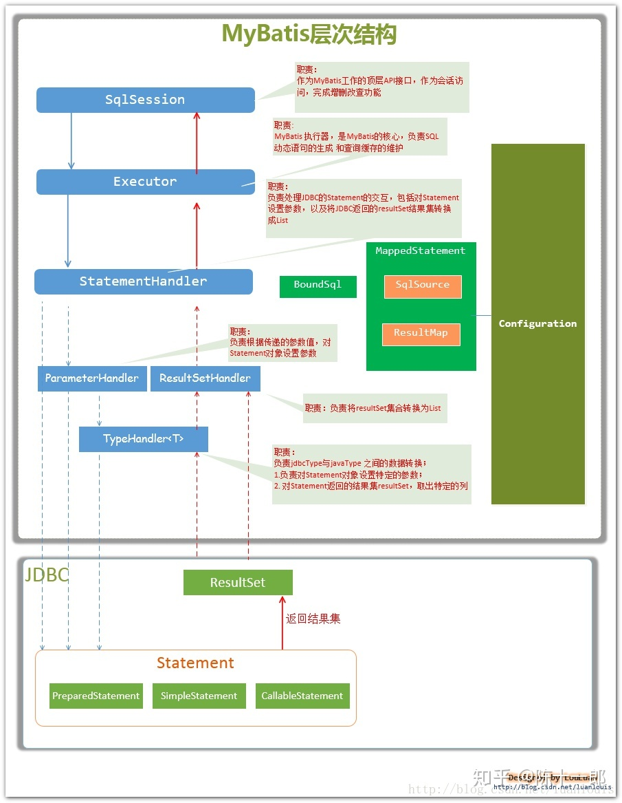
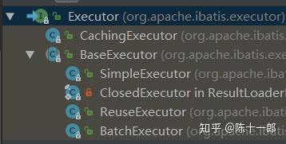

最近几天通过看源码来研究了一下mybatis的运行步骤，本篇文章以最基础的mybatis利用sqlSession操作数据库来讲解。我相信只要各位跟着我的节奏看完这篇文章就会对mybatis的运行步骤有个大体的认识（希望大家像我一样编写一个简单例子，然后跟着我的步骤看源码，不明白的地方debug)。这篇绝对是全网最详细的介绍mybatis运行原理的文章，当然如果你没有耐心看完的话，我也没任何办法，毕竟研究源码是一种枯燥的行为。如果你真的想去了解mybatis背后是怎么运行的，我相信这篇文章肯定会帮助到你。（文章如果有欠缺的地方，欢迎各位大佬指正）。


具体的项目源码，可以见 mybatis_demo这个maven工程。


## 第一部分：mybatis重要组件和运行流程图

- Configuration MyBatis所有的配置信息都保存在Configuration对象之中，配置文件中的大部分配置都会存储到该类中
- SqlSession 作为MyBatis工作的主要顶层API，表示和数据库交互时的会话，完成必要数据库增删改查功能
- Executor MyBatis执行器，是MyBatis 调度的核心，负责SQL语句的生成和查询缓存的维护
- StatementHandler 封装了JDBC Statement操作，负责对JDBC statement 的操作，如设置参数等
- ParameterHandler 负责对用户传递的参数转换成JDBC Statement 所对应的数据类型
- ResultSetHandler 负责将JDBC返回的ResultSet结果集对象转换成List类型的集合
- TypeHandler 负责java数据类型和jdbc数据类型(也可以说是数据表列类型)之间的映射和转换
- MappedStatement MappedStatement维护一条<select|update|delete|insert>节点的封装
- SqlSource 负责根据用户传递的parameterObject，动态地生成SQL语句，将信息封装到BoundSql对象中，并返回
- BoundSql 表示动态生成的SQL语句以及相应的参数信息





## 第二部分：初始化源码分析

首先我把测试类粘贴过来方便一点。

```
@Component
public class TestMybatis implements CommandLineRunner{

    @Override
    public void run(String... args) throws Exception {
        String resource = "mybatis-config.xml";
        InputStream inputStream = Resources.getResourceAsStream(resource);
        SqlSessionFactory sqlSessionFactory = new SqlSessionFactoryBuilder().build(inputStream);
        SqlSession session = sqlSessionFactory.openSession();
        try {
            /*UserMapper mapper = session.getMapper(UserMapper.class);
            User user = mapper.selectUserById(1);
            System.out.println(user);*/
            Object o = session.selectOne("com.wsdsg.spring.boot.analyze.mapper.UserMapper.selectUserById", 1);
            System.out.println("我是第一次查询的"+o);
            System.out.println("-------------------------------我是分割线---------------------");
            Object z = session.selectOne("com.wsdsg.spring.boot.analyze.mapper.UserMapper.selectUserById", 1);
            System.out.println("我是第二次查询的"+z);
           /*User user = new User();
           user.setAge(15);
           user.setName("achuan");
           int insert = session.insert("com.wsdsg.spring.boot.analyze.mapper.UserMapper.addOneUser", user);
           session.commit();
           System.out.println(insert);*/
        } finally {
            session.close();
        }
    }
}
```


这是mybatis操作数据库最基本的步骤，前两行代码没什么好说的就是资源加载mybatis的主配置文件获取输入流对象，我们看第三行代码。

```java
SqlSessionFactory sqlSessionFactory = new SqlSessionFactoryBuilder().build(inputStream);
```

这行代码的意思就是根据主配置文件的流对象构建一个会话工厂对象。而且还用到了建造者模式--->大致意思就是要创建某个对象不直接new这个对象而是利用其它的类来创建这个对象。mybatis的所有初始化工作都是这行代码完成，那么我们进去一探究竟。

第一步：进入build方法。

```java
public SqlSessionFactory build(InputStream inputStream, String environment, Properties properties) {
    try {
      XMLConfigBuilder parser = new XMLConfigBuilder(inputStream, environment, properties);
      return build(parser.parse());
    } catch (Exception e) {
      throw ExceptionFactory.wrapException("Error building SqlSession.", e);
    } finally {
      ErrorContext.instance().reset();
      try {
        inputStream.close();
      } catch (IOException e) {
        // Intentionally ignore. Prefer previous error.
      }
    }
  }
```

可以看到会创建一个XMLConfigBuilder对象，这个对象的作用就是解析主配置文件用的。先说明一下，我们可以看出主配置文件的最外层节点是<configuration>标签，mybatis的初始化就是把这个标签以及他的所有子标签进行解析，把解析好的数据封装在Configuration这个类中。


第二步：进入parse()方法

```java
public Configuration parse() {
    if (parsed) {
      throw new BuilderException("Each XMLConfigBuilder can only be used once.");
    }
    parsed = true;
    parseConfiguration(parser.evalNode("/configuration"));
    return configuration;
  }
```

XMLConfigBuilder维护一个parsed属性默认为false，这个方法一开始就判断这个主配置文件是否已经被解析，如果解析过了就抛异常。


第三步：进入parseConfiguration(...)方法

```java
private void parseConfiguration(XNode root) {
    try {
      //issue #117 read properties first
      propertiesElement(root.evalNode("properties"));
      Properties settings = settingsAsProperties(root.evalNode("settings"));
      loadCustomVfs(settings);
      loadCustomLogImpl(settings);
      typeAliasesElement(root.evalNode("typeAliases"));
      pluginElement(root.evalNode("plugins"));
      objectFactoryElement(root.evalNode("objectFactory"));
      objectWrapperFactoryElement(root.evalNode("objectWrapperFactory"));
      reflectorFactoryElement(root.evalNode("reflectorFactory"));
      settingsElement(settings);
      // read it after objectFactory and objectWrapperFactory issue #631
      environmentsElement(root.evalNode("environments"));
      databaseIdProviderElement(root.evalNode("databaseIdProvider"));
      typeHandlerElement(root.evalNode("typeHandlers"));
      mapperElement(root.evalNode("mappers"));
    } catch (Exception e) {
      throw new BuilderException("Error parsing SQL Mapper Configuration. Cause: " + e, e);
    }
  }
```

我们可以看出这个方法是对<configuration>的所有子标签挨个解析。比如常在配置文件中出现的settings属性配置，在settings会配置缓存，日志之类的。还有typeAliases是配置别名。environments是配置数据库链接和事务。这些子节点会被一个个解析并且把解析后的数据封装在Configuration 这个类中，可以看第二步方法的返回值就是Configuration对象。在这里我们重点分析的解析mappers这个子标签，这个标签里面还会有一个个的mapper标签去映射mapper所对应的mapper.xml，可以回头看看主配置文件。


第四步：进入mapperElement（）方法。

```java
private void mapperElement(XNode parent) throws Exception {
    if (parent != null) {
      for (XNode child : parent.getChildren()) {
        if ("package".equals(child.getName())) {
          String mapperPackage = child.getStringAttribute("name");
          configuration.addMappers(mapperPackage);
        } else {
          String resource = child.getStringAttribute("resource");
          String url = child.getStringAttribute("url");
          String mapperClass = child.getStringAttribute("class");
          if (resource != null && url == null && mapperClass == null) {
            ErrorContext.instance().resource(resource);
            InputStream inputStream = Resources.getResourceAsStream(resource);
            XMLMapperBuilder mapperParser = new XMLMapperBuilder(inputStream, configuration, resource, configuration.getSqlFragments());
            mapperParser.parse();
          } else if (resource == null && url != null && mapperClass == null) {
            ErrorContext.instance().resource(url);
            InputStream inputStream = Resources.getUrlAsStream(url);
            XMLMapperBuilder mapperParser = new XMLMapperBuilder(inputStream, configuration, url, configuration.getSqlFragments());
            mapperParser.parse();
          } else if (resource == null && url == null && mapperClass != null) {
            Class<?> mapperInterface = Resources.classForName(mapperClass);
            configuration.addMapper(mapperInterface);
          } else {
            throw new BuilderException("A mapper element may only specify a url, resource or class, but not more than one.");
          }
        }
      }
    }
  }
```

（1）这个方法一开始是一个循环，为什么要循环呢？因为一个mappers节点下面可能会有很多mapper节点。在应用中肯定不止一个mapper.xml。所以他会去遍历每一个mapper节点去解析该节点所映射的xml文件。

（2）循环下面是一个if..else判断。它先判断mappers下面的子节点是不是package节点。因为在实际开发中有很多的xml文件，不可能每一个xml文件都用一个mapper节点去映射，我们干脆会用一个package节点去映射一个包下面的所有的xml，这是多文件映射。

（3）如果不是package节点那肯定就是mapper节点做单文件映射。我们看下面的三行代码，发现单文件映射有3种方式-->1 第一种使用mapper节点的resource属性直接映射xml文件。2 第二种是使用mapper节点url属性映射磁盘内的某个xml文件。3 第三种是使用mapper节点的class属性直接映射某个mapper接口。可以回头看看我的主配置文件的mappers节点。

（4）实际上映射xml的方式看源码可以得出有4种方式，我们先看单文件映射的resource方式，因为这种方式理解了其他三种方式就比较好理解了。


第五步：看resource方式解析xml。

```java
if (resource != null && url == null && mapperClass == null) {
     ErrorContext.instance().resource(resource);
     InputStream inputStream = Resources.getResourceAsStream(resource);
     XMLMapperBuilder mapperParser = new XMLMapperBuilder(inputStream, configuration, resource, configuration.getSqlFragments());
     mapperParser.parse();
}
```

（1）第一行代码的意思是实例化一个错误上下文对象。这个对象是干什么用的呢？我们回忆一下我们使用mybatis的过程中如果出现错误会不会提示这个错误在哪个xml中，还提示这个错误在xml中的哪个sql中。这个对象的作用就是把错误信息封装起来，如果出现错误就会调用这个对象的toString方法，感兴趣的可以去看看这个对象的源码。这个resource参数就是String类型的xml的名字，在我们的项目中是UserMapper.xml.

(2)第二行没什么好说的就是读取这个xml获取输入流对象。

（3）然后创建一个mapper的xml文件解析器，你看他们这名字起的，一看就知道是什么意思。就好比那个XMLConfigBuilder一看就是解析主配置文件用的。


第六步：进入parse()方法：

```java
public void parse() {
    if (!configuration.isResourceLoaded(resource)) {
      configurationElement(parser.evalNode("/mapper"));
      configuration.addLoadedResource(resource);
      bindMapperForNamespace();
    }

    parsePendingResultMaps();
    parsePendingCacheRefs();
    parsePendingStatements();
  }
```

（1）一开始就一个判断这个xml是否被解析过了。因为onfiguration对象会维护一个String类型的set集合loadedResources，这个集合中存放了所有已经被解析过的xml的名字，我们在这里是没有被解析的，所以进入if中。


第七步：进入configurationElement（）方法。

```java
private void configurationElement(XNode context) {
    try {
      String namespace = context.getStringAttribute("namespace");
      if (namespace == null || namespace.equals("")) {
        throw new BuilderException("Mapper's namespace cannot be empty");
      }
      builderAssistant.setCurrentNamespace(namespace);
      cacheRefElement(context.evalNode("cache-ref"));
      cacheElement(context.evalNode("cache"));
      parameterMapElement(context.evalNodes("/mapper/parameterMap"));
      resultMapElements(context.evalNodes("/mapper/resultMap"));
      sqlElement(context.evalNodes("/mapper/sql"));
      buildStatementFromContext(context.evalNodes("select|insert|update|delete"));
    } catch (Exception e) {
      throw new BuilderException("Error parsing Mapper XML. The XML location is '" + resource + "'. Cause: " + e, e);
    }
  }
```

这个方法就是解析一个mapper.xml所有节点数据。比如解析namespace,resultMap等等。重点是最后一句

```java
buildStatementFromContext(context.evalNodes("select|insert|update|delete"));
```

我们进入这个方法中buildStatementFromContext（）

```java
private void buildStatementFromContext(List<XNode> list) {
    if (configuration.getDatabaseId() != null) {
      buildStatementFromContext(list, configuration.getDatabaseId());
    }
    buildStatementFromContext(list, null);
  }
```

没什么好说的，继续进入buildStatementFromContext（）

```java
 private void buildStatementFromContext(List<XNode> list, String requiredDatabaseId) {
    for (XNode context : list) {
      final XMLStatementBuilder statementParser = new XMLStatementBuilder(configuration, builderAssistant, context, requiredDatabaseId);
      try {
        statementParser.parseStatementNode();
      } catch (IncompleteElementException e) {
        configuration.addIncompleteStatement(statementParser);
      }
    }
  }
```

（1）这个方法一开始是一个循环，遍历一个list，这个list里装的是xml中的所有sql节点，比如select insert update delete ，每一个sql是一个节点。循环解析每一个sql节点。

（2）创建一个xml的会话解析器去解析每个节点。


第八步：进入parseStatementNode()方法

```java
public void parseStatementNode() {
    String id = context.getStringAttribute("id");
    String databaseId = context.getStringAttribute("databaseId");

    if (!databaseIdMatchesCurrent(id, databaseId, this.requiredDatabaseId)) {
      return;
    }

    String nodeName = context.getNode().getNodeName();
    SqlCommandType sqlCommandType = SqlCommandType.valueOf(nodeName.toUpperCase(Locale.ENGLISH));
    boolean isSelect = sqlCommandType == SqlCommandType.SELECT;
    boolean flushCache = context.getBooleanAttribute("flushCache", !isSelect);
    boolean useCache = context.getBooleanAttribute("useCache", isSelect);
    boolean resultOrdered = context.getBooleanAttribute("resultOrdered", false);

    // Include Fragments before parsing
    XMLIncludeTransformer includeParser = new XMLIncludeTransformer(configuration, builderAssistant);
    includeParser.applyIncludes(context.getNode());

    String parameterType = context.getStringAttribute("parameterType");
    Class<?> parameterTypeClass = resolveClass(parameterType);

    String lang = context.getStringAttribute("lang");
    LanguageDriver langDriver = getLanguageDriver(lang);

    // Parse selectKey after includes and remove them.
    processSelectKeyNodes(id, parameterTypeClass, langDriver);

    // Parse the SQL (pre: <selectKey> and <include> were parsed and removed)
    KeyGenerator keyGenerator;
    String keyStatementId = id + SelectKeyGenerator.SELECT_KEY_SUFFIX;
    keyStatementId = builderAssistant.applyCurrentNamespace(keyStatementId, true);
    if (configuration.hasKeyGenerator(keyStatementId)) {
      keyGenerator = configuration.getKeyGenerator(keyStatementId);
    } else {
      keyGenerator = context.getBooleanAttribute("useGeneratedKeys",
          configuration.isUseGeneratedKeys() && SqlCommandType.INSERT.equals(sqlCommandType))
          ? Jdbc3KeyGenerator.INSTANCE : NoKeyGenerator.INSTANCE;
    }

    SqlSource sqlSource = langDriver.createSqlSource(configuration, context, parameterTypeClass);
    StatementType statementType = StatementType.valueOf(context.getStringAttribute("statementType", StatementType.PREPARED.toString()));
    Integer fetchSize = context.getIntAttribute("fetchSize");
    Integer timeout = context.getIntAttribute("timeout");
    String parameterMap = context.getStringAttribute("parameterMap");
    String resultType = context.getStringAttribute("resultType");
    Class<?> resultTypeClass = resolveClass(resultType);
    String resultMap = context.getStringAttribute("resultMap");
    String resultSetType = context.getStringAttribute("resultSetType");
    ResultSetType resultSetTypeEnum = resolveResultSetType(resultSetType);
    String keyProperty = context.getStringAttribute("keyProperty");
    String keyColumn = context.getStringAttribute("keyColumn");
    String resultSets = context.getStringAttribute("resultSets");

    builderAssistant.addMappedStatement(id, sqlSource, statementType, sqlCommandType,
        fetchSize, timeout, parameterMap, parameterTypeClass, resultMap, resultTypeClass,
        resultSetTypeEnum, flushCache, useCache, resultOrdered,
        keyGenerator, keyProperty, keyColumn, databaseId, langDriver, resultSets);
  }
```

看到这个方法很长，其实大致意思就是解析这个sql标签里的所有数据，并把所有数据通过addMappedStatement这个方法封装在MappedStatement这个对象中。这个对象我们在第二部分介绍过，这个对象中封装了一条sql所在标签的所有内容，比如这个sql标签的id ，sql语句，入参，出参，等等。我们要牢记一个sql的标签对应一个MappedStatement对象。


第九步：进入addMapperStatement()方法

```java
public MappedStatement addMappedStatement(
      String id,
      SqlSource sqlSource,
      StatementType statementType,
      SqlCommandType sqlCommandType,
      Integer fetchSize,
      Integer timeout,
      String parameterMap,
      Class<?> parameterType,
      String resultMap,
      Class<?> resultType,
      ResultSetType resultSetType,
      boolean flushCache,
      boolean useCache,
      boolean resultOrdered,
      KeyGenerator keyGenerator,
      String keyProperty,
      String keyColumn,
      String databaseId,
      LanguageDriver lang,
      String resultSets) {

    if (unresolvedCacheRef) {
      throw new IncompleteElementException("Cache-ref not yet resolved");
    }

    id = applyCurrentNamespace(id, false);
    boolean isSelect = sqlCommandType == SqlCommandType.SELECT;

    MappedStatement.Builder statementBuilder = new MappedStatement.Builder(configuration, id, sqlSource, sqlCommandType)
        .resource(resource)
        .fetchSize(fetchSize)
        .timeout(timeout)
        .statementType(statementType)
        .keyGenerator(keyGenerator)
        .keyProperty(keyProperty)
        .keyColumn(keyColumn)
        .databaseId(databaseId)
        .lang(lang)
        .resultOrdered(resultOrdered)
        .resultSets(resultSets)
        .resultMaps(getStatementResultMaps(resultMap, resultType, id))
        .resultSetType(resultSetType)
        .flushCacheRequired(valueOrDefault(flushCache, !isSelect))
        .useCache(valueOrDefault(useCache, isSelect))
        .cache(currentCache);

    ParameterMap statementParameterMap = getStatementParameterMap(parameterMap, parameterType, id);
    if (statementParameterMap != null) {
      statementBuilder.parameterMap(statementParameterMap);
    }

    MappedStatement statement = statementBuilder.build();
    configuration.addMappedStatement(statement);
    return statement;
  }
```

乍一看这个方法很长，我们只看最后三行代码。

（1） MappedStatement statement = statementBuilder.build();通过解析出的参数构建了一个MapperStatement对象。

（2）configuration.addMappedStatement(statement); 这行是把解析出来的MapperStatement装到Configuration维护的Map集合中。key值是这个sql标签的id值，我们这里应该就是selectUserById,value值就是我们解析出来的MapperStatement对象。

其实我们解析xml的目的就是把每个xml中的每个增删改查的sql标签解析成一个个MapperStatement并把解析出来的这些对象装到Configuration的Map中备用。


第十步: 返回第六步的代码：

```java
public void parse() {
    if (!configuration.isResourceLoaded(resource)) {
      configurationElement(parser.evalNode("/mapper"));
      configuration.addLoadedResource(resource);
      bindMapperForNamespace();
    }

    parsePendingResultMaps();
    parsePendingCacheRefs();
    parsePendingStatements();
  }
```

刚才到第九步都是在执行configurationElement(parser.evalNode("/mapper"));这行代码，接下来看下一行代码configuration.addLoadedResource(resource); 到第九步的时候我们已经把一个xml完全解析完了，所以在此就会把这个解析完的xml的名字装到set集合中。

接下来我们看看bindMapperForNamespace(); 这个名字起得就很望文生义，通过命名空间绑定mapper


第十一步：进入bindMapperForNamespace()方法。

```java
private void bindMapperForNamespace() {
    String namespace = builderAssistant.getCurrentNamespace();
    if (namespace != null) {
      Class<?> boundType = null;
      try {
        boundType = Resources.classForName(namespace);
      } catch (ClassNotFoundException e) {
        //ignore, bound type is not required
      }
      if (boundType != null) {
        if (!configuration.hasMapper(boundType)) {
          // Spring may not know the real resource name so we set a flag
          // to prevent loading again this resource from the mapper interface
          // look at MapperAnnotationBuilder#loadXmlResource
          configuration.addLoadedResource("namespace:" + namespace);
          configuration.addMapper(boundType);
        }
      }
    }
  }
```

（1）一开始获取名称空间，名称空间一般都是我们mapper的全限定名，它通过反射获取这个mapper的class对象。

（2）if判断，Configuration中也维护了一个Map对象，key值是我们刚才通过反射生产的mapper的class对象，value值是通过动态代理生产的class对象的代理对象。

（3）因为Map中还没有装我们生产的mapper对象，进入if中，它先把名称空间存到我们刚才存xml名字的set集合中。然后再把生产的mapper的class对象存到Mapper中。


第十二步：进入ddMapper()方法

```java
public <T> void addMapper(Class<T> type) {
    mapperRegistry.addMapper(type);
  }
```

我们发现它调用了mapperRegistry的addMapper方法，这个类通过名字就知道是mapper注册类，我们再点进入看看

```java
public <T> void addMapper(Class<T> type) {
    if (type.isInterface()) {
      if (hasMapper(type)) {
        throw new BindingException("Type " + type + " is already known to the MapperRegistry.");
      }
      boolean loadCompleted = false;
      try {
        knownMappers.put(type, new MapperProxyFactory<>(type));
        // It's important that the type is added before the parser is run
        // otherwise the binding may automatically be attempted by the
        // mapper parser. If the type is already known, it won't try.
        MapperAnnotationBuilder parser = new MapperAnnotationBuilder(config, type);
        parser.parse();
        loadCompleted = true;
      } finally {
        if (!loadCompleted) {
          knownMappers.remove(type);
        }
      }
    }
  }
```

我们可以看出mapperRegistry这个类维护的Map的名字是knownMappers---->(已知的mapper--->就是注册过的mapper). 我们看他的put，key是我们生成的mapper的class对象，value是通过动态代理生成的mapper的代理对象。

到此mybatis根据主配置文件初始化就完成了，那说了这么久到底做了什么呢？我们总结一下。

1 总的来说就是解析主配置文件把主配置文件里的所有信息封装到Configuration这个对象中。

2 稍微细一点就是 通过XmlConfigBuilder解析主配置文件，然后通过XmlMapperBuild解析mappers下映射的所有xml文件（循环解析）。把每个xml中的各个sql解析成一个个MapperStatement对象装在Configuration维护的一个Map集合中，key值是id，value是mapperstatement对象-----然后把解析过的xml的名字和名称空间装在set集合中，通过名称空间反射生成的mapper的class对象以及class对象的代理对象装在Configuration对象维护的mapperRegistry中的Map中。

3简化一点：主要就是把每个sql标签解析成mapperstatement对象装进集合，然后把mapper接口的class对象以及代理对象装进集合，方便后来使用。

4 注意一点： 我们用resource引入xml的方法是先解析xml ，把各个sql标签解析成mapperstatement对象装进集合，然后再把mapper接口的class对象以及代理对象装进集合，但是引入xml的方式有4种，其中单文件引入方式还有url方式和class方式，看源码可以知道url方式就是直接引入一个xml和resource方式一模一样。而class方式是引入一个mapper接口却同（resource和url方式相反）


第十三步：我们看一下使用class方式引入的方法

```java
else if (resource == null && url == null && mapperClass != null) {
  Class<?> mapperInterface = Resources.classForName(mapperClass);
  configuration.addMapper(mapperInterface);
} 
```

我们可以看出是不是先反射生产mapper接口的class对象，然后调用Configuration的addMpper方法，这个方法是不是很熟悉，我们点进去看一下

```java
public <T> void addMapper(Class<T> type) {
    mapperRegistry.addMapper(type);
  }

public <T> void addMapper(Class<T> type) {
    if (type.isInterface()) {
      if (hasMapper(type)) {
        throw new BindingException("Type " + type + " is already known to the MapperRegistry.");
      }
      boolean loadCompleted = false;
      try {
        knownMappers.put(type, new MapperProxyFactory<>(type));
        // It's important that the type is added before the parser is run
        // otherwise the binding may automatically be attempted by the
        // mapper parser. If the type is already known, it won't try.
        MapperAnnotationBuilder parser = new MapperAnnotationBuilder(config, type);
        parser.parse();
        loadCompleted = true;
      } finally {
        if (!loadCompleted) {
          knownMappers.remove(type);
        }
      }
    }
  }
```

是不是跟上面最后一步一样，生产mapper的class对象后，再通过动态代理生产代理对象然后装进集合。那我们接口对象生成了不还没解析xml呢嘛，别急我们进入parser.parse()这个方法

```java
public void parse() {
    String resource = type.toString();
    if (!configuration.isResourceLoaded(resource)) {
      loadXmlResource();
      configuration.addLoadedResource(resource);
      assistant.setCurrentNamespace(type.getName());
      parseCache();
      parseCacheRef();
      Method[] methods = type.getMethods();
      for (Method method : methods) {
        try {
          // issue #237
          if (!method.isBridge()) {
            parseStatement(method);
          }
        } catch (IncompleteElementException e) {
          configuration.addIncompleteMethod(new MethodResolver(this, method));
        }
      }
    }
    parsePendingMethods();
  }
```

你看它一开始会判断这个mapper对应的xml是否存在于装已经解析过的xml的set集合中，肯定没有，没有进入if中 重点来了---->loadXmlResource(); 这个方法看名字就知道是加载xml资源，我们点进去看一下

```java
private void loadXmlResource() {
    // Spring may not know the real resource name so we check a flag
    // to prevent loading again a resource twice
    // this flag is set at XMLMapperBuilder#bindMapperForNamespace
    if (!configuration.isResourceLoaded("namespace:" + type.getName())) {
      String xmlResource = type.getName().replace('.', '/') + ".xml";
      // #1347
      InputStream inputStream = type.getResourceAsStream("/" + xmlResource);
      if (inputStream == null) {
        // Search XML mapper that is not in the module but in the classpath.
        try {
          inputStream = Resources.getResourceAsStream(type.getClassLoader(), xmlResource);
        } catch (IOException e2) {
          // ignore, resource is not required
        }
      }
      if (inputStream != null) {
        XMLMapperBuilder xmlParser = new XMLMapperBuilder(inputStream, assistant.getConfiguration(), xmlResource, configuration.getSqlFragments(), type.getName());
        xmlParser.parse();
      }
    }
  }
```

就是一顿往下走，走到 xmlParser.parse();这个方法中 我们点进去看一下：

```java
public void parse() {
    if (!configuration.isResourceLoaded(resource)) {
      configurationElement(parser.evalNode("/mapper"));
      configuration.addLoadedResource(resource);
      bindMapperForNamespace();
    }

    parsePendingResultMaps();
    parsePendingCacheRefs();
    parsePendingStatements();
  }
```

这个方法是不是很眼熟？没错，这就是我们第六步的代码。接下来想必大家都知道了，就是上面第六步到第九步。

我们可以看出--->用resource、url 和 class来解析的方式步骤是相反的。

resource和url是直接引入xml，那我们就先解析xml，然后通过xml的名称空间反射生成mapper的class对象，再通过动态代理生产class对象的代理对象

二用class方式呢---class方式填写的是mapper接口的全限定名，就是上面的那个名称空间，所以先生成class对象和代理对象，然后通过拼接字符串就是全限定名+“.xml”获取xml的名称，然后再解析xml。

说到这单文件映射就说完了，我们再说说多文件映射。


第十四步：多文件映射

```java
if ("package".equals(child.getName())) {
    String mapperPackage = child.getStringAttribute("name");
    configuration.addMappers(mapperPackage);
 }
```

它首先或得xml所在的包名，然后调用configuration的addMappers对象，是不是有点眼熟，单文件映射是addMapper，多文件映射是addMappers 你看人家这名字取得 绝了。我们点进去看看

```java
  public void addMappers(String packageName) {
    mapperRegistry.addMappers(packageName);
  }


public void addMappers(String packageName) {
    addMappers(packageName, Object.class);
  }


public void addMappers(String packageName, Class<?> superType) {
    ResolverUtil<Class<?>> resolverUtil = new ResolverUtil<>();
    resolverUtil.find(new ResolverUtil.IsA(superType), packageName);
    Set<Class<? extends Class<?>>> mapperSet = resolverUtil.getClasses();
    for (Class<?> mapperClass : mapperSet) {
      addMapper(mapperClass);
    }
  }
```

我们看第三段代码，这是什么意思呢？就是通过ResolverUtil这个解析工具类找出该包下的所有mapper的名称通过反射生产mapper的class对象装进集合中，然后看出循环调用addMapper(mapperClass)这个方法，这就和单文件映射的class类型一样了，把mapper接口的class对象作为参数传进去，然后生产代理对象装进集合然后再解析xml。

到此mybatis的初始化就说完了。


## 第三部分：获取session会话对象源码分析

我们上一部分是mybatis的初始化，走的代码是：

```java
SqlSessionFactory sqlSessionFactory = new SqlSessionFactoryBuilder().build(inputStream);
```

其实我们点进去会发现最后返回的是 DefaultSqlSessionFactory对象

```java
public SqlSessionFactory build(Configuration config) {
    return new DefaultSqlSessionFactory(config);
  }
```

获取会话对象走的代码是：

```java
SqlSession session = sqlSessionFactory.openSession();
```

直接open一个session，我们知道session是我们与数据库互动的顶级api，所有的增删改查都要调用session.我们进入openSession()

```java
public interface SqlSessionFactory {

  SqlSession openSession();

  SqlSession openSession(boolean autoCommit);

  SqlSession openSession(Connection connection);

  SqlSession openSession(TransactionIsolationLevel level);

  SqlSession openSession(ExecutorType execType);

  SqlSession openSession(ExecutorType execType, boolean autoCommit);

  SqlSession openSession(ExecutorType execType, TransactionIsolationLevel level);

  SqlSession openSession(ExecutorType execType, Connection connection);

  Configuration getConfiguration();

}
```

我们发现这个一个接口，不慌我们找他的实现类-->DefaultSqlSessionFactory

```java
@Override
  public SqlSession openSession() {
    return openSessionFromDataSource(configuration.getDefaultExecutorType(), null, false);
  }


private SqlSession openSessionFromDataSource(ExecutorType execType, TransactionIsolationLevel level, boolean autoCommit) {
    Transaction tx = null;
    try {
      final Environment environment = configuration.getEnvironment();
      final TransactionFactory transactionFactory = getTransactionFactoryFromEnvironment(environment);
      tx = transactionFactory.newTransaction(environment.getDataSource(), level, autoCommit);
      final Executor executor = configuration.newExecutor(tx, execType);
      return new DefaultSqlSession(configuration, executor, autoCommit);
    } catch (Exception e) {
      closeTransaction(tx); // may have fetched a connection so lets call close()
      throw ExceptionFactory.wrapException("Error opening session.  Cause: " + e, e);
    } finally {
      ErrorContext.instance().reset();
    }
  }
```

我们看第二段代码：因为我们解析主配置文件把所有的节点信息都保存在了configuration对象中，它开始直接或得Environment节点的信息，这个节点配置了数据库连接和事务。之后通过Environment创建了一个事务工厂，然后通过事务工厂实例化了一个事务对象。 重点来了------> 最后他创建了一个执行器Executor ，我们知道session是与数据库交互的顶层api，session中会维护一个Executor 来负责sql生产和执行和查询缓存等。我们再来看看new这个执行器的时候的过程

```java
public Executor newExecutor(Transaction transaction, ExecutorType executorType) {
    executorType = executorType == null ? defaultExecutorType : executorType;
    executorType = executorType == null ? ExecutorType.SIMPLE : executorType;
    Executor executor;
    if (ExecutorType.BATCH == executorType) {
      executor = new BatchExecutor(this, transaction);
    } else if (ExecutorType.REUSE == executorType) {
      executor = new ReuseExecutor(this, transaction);
    } else {
      executor = new SimpleExecutor(this, transaction);
    }
    if (cacheEnabled) {
      executor = new CachingExecutor(executor);
    }
    executor = (Executor) interceptorChain.pluginAll(executor);
    return executor;
  }
```

这个过程就是判断生成哪一种执行器的过程，mybatis的执行器有三种--->

```java
public enum ExecutorType {
  SIMPLE, REUSE, BATCH
}
```

**SimpleExecutor**: 简单执行器，是 MyBatis 中默认使用的执行器，每执行一次 update 或 select，就开启一个 Statement 对象，用完就直接关闭 Statement 对象(可以是 Statement 或者是 PreparedStatment 对象)

**ReuseExecutor**: 可重用执行器，这里的重用指的是重复使用 Statement，它会在内部使用一个 Map 把创建的 Statement 都缓存起来，每次执行 SQL 命令的时候，都会去判断是否存在基于该 SQL 的 Statement 对象，如果存在 Statement 对象并且**对应的 connection 还没有关闭的情况下**就继续使用之前的 Statement 对象，**并将其缓存起来**。

因为每一个 SqlSession 都有一个新的 Executor 对象，所以我们缓存在 ReuseExecutor 上的Statement 作用域是同一个 SqlSession。

**BatchExecutor**: 批处理执行器，用于将多个SQL一次性输出到数据库

（粘贴过来的） 我们如果没有配置或者指定的话默认生成的就是SimpleExecutor。

执行器生成完后返回了一个DefaultSqlSession，这里面维护了Configuration和Executor。


## 第四部分：查询过程源码分析

首先我们把查询的代码粘贴过来

```java
 Object o = session.selectOne("com.wsdsg.spring.boot.analyze.mapper.UserMapper.selectUserById", 1);
System.out.println("我是第一次查询的"+o);
System.out.println("-------------------------------我是分割线---------------------");
Object z = session.selectOne("com.wsdsg.spring.boot.analyze.mapper.UserMapper.selectUserById", 1);
System.out.println("我是第二次查询的"+z);
```

我为什么要写两个一模一样的查询呢？因为mybatis有一级缓存和二级缓存，默认二级缓存是不开启的，可以通过配置开启。而一级缓存是开启的，一级缓存是session级别的缓存，mybatis在查询的时候会根据sql的id和参数等生产一个缓存key，查询数据库的时候先查询缓存key是不是存在于缓存中，如果没有就查询数据库，如果存在就直接返回缓存中的数据。需要注意的是除了查询，其他的新增，更新，删除都会清除所有缓存，包括二级缓存（如果开启的话）.下面我们运行上面的测试类，看看控制台的打印信息。


我们看控制台信息可以发现，第一次查的时候有sql语句打印，就是我红线框的地方，然后输出了 “我是第一次查询的User(id=1, name=achuan, age=15)” 接着分割线下面直接输出了 “我是第二次查询的User(id=1, name=achuan, age=15)”，因为第一次查询的时候拿着缓存key去缓存中查，没有查到对应该key的缓存，就查询数据库返回并把查出的数据放在缓存中，第二次查询的生成的key与第一次一样，去缓存中查到数据直接返回，没有查询数据库，这样可以提高查询效率。

好了说了这么多我们来开始分析源码-->selectOne() 我们进入selectOne()方法

```java
<T> T selectOne(String statement, Object parameter);

@Override
  public <T> T selectOne(String statement) {
    return this.selectOne(statement, null);
  }

@Override
  public <T> T selectOne(String statement, Object parameter) {
    // Popular vote was to return null on 0 results and throw exception on too many.
    List<T> list = this.selectList(statement, parameter);
    if (list.size() == 1) {
      return list.get(0);
    } else if (list.size() > 1) {
      throw new TooManyResultsException("Expected one result (or null) to be returned by selectOne(), but found: " + list.size());
    } else {
      return null;
    }
  }
```

我们点进去发现是一个接口，不慌找它的实现类DefaultSqlSession,我们发现它进入了上面第三段代码，我们发现它调用了selectList()方法，其实查询一个或者多个都是调用selectList方法，我们进入selectList()方法中

```java
@Override
  public <E> List<E> selectList(String statement, Object parameter) {
    return this.selectList(statement, parameter, RowBounds.DEFAULT);
  }


@Override
  public <E> List<E> selectList(String statement, Object parameter, RowBounds rowBounds) {
    try {
      MappedStatement ms = configuration.getMappedStatement(statement);
      return executor.query(ms, wrapCollection(parameter), rowBounds, Executor.NO_RESULT_HANDLER);
    } catch (Exception e) {
      throw ExceptionFactory.wrapException("Error querying database.  Cause: " + e, e);
    } finally {
      ErrorContext.instance().reset();
    }
  }
```

重点来了，我们看下这行代码

```java
MappedStatement ms = configuration.getMappedStatement(statement);
```

我们调用selectOne的时候传的参数是sql的id值 ：selectUserById 和 sql的参数：1，在这行代码中参数statement的值就是selectUserById ， 我们回忆一下，mybatis初始化的时候是不是把每个sql标签解析成一个个的MapperStatement,并且把这些MapperStatement装进configuration对象维护的一个Map集合中，这个Map集合的key值就是sql标签的id，value是对应的mapperstatement对象，我们之前说装进集合中备用就是在这里用的，这里用sql标签的id值从Map中取出对应的MapperStatement对象。

比如我们现在selectOne方法调用的的是selectUserById 这个sql，所以现在通过selectUserById 这个key值从configuration维护的Map中取出对应的MapperStatement对象。为什么要取出这个对象呢？因为mybatis把一个sql标签的所有数据都封装在了MapperStatement对象中。比如：出参类型，出参值，入参类型，入参值还有sql语句等等。

然后我们取出MapperStatement对象看下一行代码

```java
executor.query(ms, wrapCollection(parameter), rowBounds, Executor.NO_RESULT_HANDLER);
```

MapperStatement被当做参数传入query方法，这个query方法是执行器调用的，我们知道执行器的作用是sql的生成执行和查询缓存等操作，在这个query方法中我们会查询缓存和执行sql语句，我们进入query（)方法

```text
<E> List<E> query(MappedStatement ms, Object parameter, RowBounds rowBounds, ResultHandler resultHandler) throws SQLException;


@Override
  public <E> List<E> query(MappedStatement ms, Object parameterObject, RowBounds rowBounds, ResultHandler resultHandler) throws SQLException {
    BoundSql boundSql = ms.getBoundSql(parameterObject);
    CacheKey key = createCacheKey(ms, parameterObject, rowBounds, boundSql);
    return query(ms, parameterObject, rowBounds, resultHandler, key, boundSql);
  }


@Override
  public <E> List<E> query(MappedStatement ms, Object parameterObject, RowBounds rowBounds, ResultHandler resultHandler, CacheKey key, BoundSql boundSql)
      throws SQLException {
    Cache cache = ms.getCache();
    if (cache != null) {
      flushCacheIfRequired(ms);
      if (ms.isUseCache() && resultHandler == null) {
        ensureNoOutParams(ms, boundSql);
        @SuppressWarnings("unchecked")
        List<E> list = (List<E>) tcm.getObject(cache, key);
        if (list == null) {
          list = delegate.query(ms, parameterObject, rowBounds, resultHandler, key, boundSql);
          tcm.putObject(cache, key, list); // issue #578 and #116
        }
        return list;
      }
    }
    return delegate.query(ms, parameterObject, rowBounds, resultHandler, key, boundSql);
  }
```

我们点进去发现是进入的Executor接口，不慌，找他的实现类，它先走的是CachingExcutor缓存执行器，我们研究一下代码，我们看第二段代码他一开始从MapperStatement中获取BoundSql 这个对象，因为真正的sql语句封装在这个对象中，而且这个对象也负责把sql中的占位符替换成我们传的参数，只是MapperStatement维护了BoundSql 的引用而已。

然后我们继续看createCacheKey，这个的意思就是根据这些参数生成一个缓存key，当我们调用同一个sql，并且传的参数是一样的时候，生成的缓存key是相同的。

然后我们看第三段代码，它一开始就是获取缓存，但是他这个缓存并不是我们存储查询结果的地方（具体是缓存什么的我也不太清楚，我猜测这里查的是二级缓存，具体我没测试，不出意外的话应该是二级缓存，我们没有开启二级缓存，所以这里为null），它查询缓存为null,就会走最后一句代码

```java
return delegate.query(ms, parameterObject, rowBounds, resultHandler, key, boundSql);
```

我们发现它又调用了delegate的query方法，delegate是什么呢？我们看一下CachingExcutor的属性

```java
private final Executor delegate;
private final TransactionalCacheManager tcm = new TransactionalCacheManager();
```

我们发现delegate是一个执行器的引用，在这里其实是SimpleExcutor简单执行器的引用，我们知道获取一个会话session的时候会创建一个执行器，如果没有配置的话默认创建的就是SimpleExcutor，在这里把SimpleExcutor的引用维护到CachingExcutor中。实际这里用到了委托者模式----->大致意思就是我自己不行我就找行的来做[手动滑稽] ，这里就是缓存执行器不行未能执行sql就交给SimpleExcutor来执行，我们进入这个query方法内。

```java
<E> List<E> query(MappedStatement ms, Object parameter, RowBounds rowBounds, ResultHandler resultHandler, CacheKey cacheKey, BoundSql boundSql) throws SQLException;


@SuppressWarnings("unchecked")
  @Override
  public <E> List<E> query(MappedStatement ms, Object parameter, RowBounds rowBounds, ResultHandler resultHandler, CacheKey key, BoundSql boundSql) throws SQLException {
    ErrorContext.instance().resource(ms.getResource()).activity("executing a query").object(ms.getId());
    if (closed) {
      throw new ExecutorException("Executor was closed.");
    }
    if (queryStack == 0 && ms.isFlushCacheRequired()) {
      clearLocalCache();
    }
    List<E> list;
    try {
      queryStack++;
      list = resultHandler == null ? (List<E>) localCache.getObject(key) : null;
      if (list != null) {
        handleLocallyCachedOutputParameters(ms, key, parameter, boundSql);
      } else {
        list = queryFromDatabase(ms, parameter, rowBounds, resultHandler, key, boundSql);
      }
    } finally {
      queryStack--;
    }
    if (queryStack == 0) {
      for (DeferredLoad deferredLoad : deferredLoads) {
        deferredLoad.load();
      }
      // issue #601
      deferredLoads.clear();
      if (configuration.getLocalCacheScope() == LocalCacheScope.STATEMENT) {
        // issue #482
        clearLocalCache();
      }
    }
    return list;
  }
```




一点进去发现是Executor接口，不慌我们看他的实现类，他有两个实现类缓存执行器和基础执行器，而基础执行器有三个正常的儿子，他先回调用爸爸基础执行器里面的query方法，也就是上面第二段代码，乍一看好像有点看不懂，没事我们来分析一下，我们直接看try里面的代码很容易明白

```java
List<E> list;
    try {
      queryStack++;
      list = resultHandler == null ? (List<E>) localCache.getObject(key) : null;
      if (list != null) {
        handleLocallyCachedOutputParameters(ms, key, parameter, boundSql);
      } else {
        list = queryFromDatabase(ms, parameter, rowBounds, resultHandler, key, boundSql);
      }
    } finally {
      queryStack--;
    }
    if (queryStack == 0) {
      for (DeferredLoad deferredLoad : deferredLoads) {
        deferredLoad.load();
      }
      // issue #601
      deferredLoads.clear();
      if (configuration.getLocalCacheScope() == LocalCacheScope.STATEMENT) {
        // issue #482
        clearLocalCache();
      }
    }
    return list;
  }
```

一开始声明了一个集合list,然后通过我们之前创建的缓存key去本地缓存localCache中查询是否有缓存，下面判断，如果集合不是null就处理一下缓存数据直接返回list，如果没有缓存，他回从数据库中查，你看他们这名字起的一看就知道是什么意思queryFromDatabase，我们现在执行的是第一条selectOne，没有缓存我们进入queryFromDatabase方法

```java
private <E> List<E> queryFromDatabase(MappedStatement ms, Object parameter, RowBounds rowBounds, ResultHandler resultHandler, CacheKey key, BoundSql boundSql) throws SQLException {
    List<E> list;
    localCache.putObject(key, EXECUTION_PLACEHOLDER);
    try {
      list = doQuery(ms, parameter, rowBounds, resultHandler, boundSql);
    } finally {
      localCache.removeObject(key);
    }
    localCache.putObject(key, list);
    if (ms.getStatementType() == StatementType.CALLABLE) {
      localOutputParameterCache.putObject(key, parameter);
    }
    return list;
  }
```

你看这段代码，先在本地缓存中占个位，然后执行doQuery从数据库中查数据，然后移除刚才的缓存中的占位，最后把查出来的数据put进本地缓存中，我不知道他这个占位又移除到底想搞什么幺蛾子，反正我们明白，那不重要，重要的是他执行了doQuery从数据库中查到数据并放入缓存中，我们接着看一下doQuery这个方法的代码

```java
protected abstract <E> List<E> doQuery(MappedStatement ms, Object parameter, RowBounds rowBounds, ResultHandler resultHandler, BoundSql boundSql)
      throws SQLException;


@Override
  public <E> List<E> doQuery(MappedStatement ms, Object parameter, RowBounds rowBounds, ResultHandler resultHandler, BoundSql boundSql) throws SQLException {
    Statement stmt = null;
    try {
      Configuration configuration = ms.getConfiguration();
      StatementHandler handler = configuration.newStatementHandler(wrapper, ms, parameter, rowBounds, resultHandler, boundSql);
      stmt = prepareStatement(handler, ms.getStatementLog());
      return handler.query(stmt, resultHandler);
    } finally {
      closeStatement(stmt);
    }
  }
```

点进去是BaseExecutor抽象类，不慌找他的儿子SimpleExecutor，找到doQuery。doQuery方法一开始从configuration 中拿出会话处理器，会话处理器我们上面的组件介绍提到过，作用是 装了JDBC Statement操作，负责对JDBC statement 的操作，如设置参数等，那我们现在复习一下jdbc操作数据库的步骤：

1 注册驱动 2 获取连接 3 创建会话对象 也就是上面提到的statement 或者是可以防止注入攻击的prepareStatement 4 执行sql语句 5 处理结果集 6 关闭连接

他获取会话处理器后，执行了prepareStatement(handler, ms.getStatementLog());这个是重点，熟悉的东西来了，我们进入这个方法看看

```java
private Statement prepareStatement(StatementHandler handler, Log statementLog) throws SQLException {
    Statement stmt;
    Connection connection = getConnection(statementLog);
    stmt = handler.prepare(connection, transaction.getTimeout());
    handler.parameterize(stmt);
    return stmt;
  }
```

一开始就是获取数据库连接，然后执行handler.prepare();这个方法的作用就是根据连接事务啥的创建 会话对象 就是上面jdbc操作中的 第3 步。我们进入这个方法，跟之前一样用到了委托者模式然后也是有两个实现类，一个抽象类有三个儿子。

```java
Statement prepare(Connection connection, Integer transactionTimeout)
      throws SQLException;


 @Override
  public Statement prepare(Connection connection, Integer transactionTimeout) throws SQLException {
    return delegate.prepare(connection, transactionTimeout);
  }


 @Override
  public Statement prepare(Connection connection, Integer transactionTimeout) throws SQLException {
    ErrorContext.instance().sql(boundSql.getSql());
    Statement statement = null;
    try {
      statement = instantiateStatement(connection);
      setStatementTimeout(statement, transactionTimeout);
      setFetchSize(statement);
      return statement;
    } catch (SQLException e) {
      closeStatement(statement);
      throw e;
    } catch (Exception e) {
      closeStatement(statement);
      throw new ExecutorException("Error preparing statement.  Cause: " + e, e);
    }
  }
```


点进去一看是一个接口，不慌走RoutingStatementHandler,这里用到了委托者模式，委托给BaseStatementHandler, 到此就执行到了上面的第三段代码，我们观察这段代码try中的三行代码

```java
statement = instantiateStatement(connection);
setStatementTimeout(statement, transactionTimeout);
setFetchSize(statement);
  
```

下面两个就是设置会话对象的属性不重要，重要的是instantiateStatement(connection)，我们点进去看看

```java
protected abstract Statement instantiateStatement(Connection connection) throws SQLException;


@Override
  protected Statement instantiateStatement(Connection connection) throws SQLException {
    String sql = boundSql.getSql();
    if (mappedStatement.getKeyGenerator() instanceof Jdbc3KeyGenerator) {
      String[] keyColumnNames = mappedStatement.getKeyColumns();
      if (keyColumnNames == null) {
        return connection.prepareStatement(sql, PreparedStatement.RETURN_GENERATED_KEYS);
      } else {
        return connection.prepareStatement(sql, keyColumnNames);
      }
    } else if (mappedStatement.getResultSetType() == ResultSetType.DEFAULT) {
      return connection.prepareStatement(sql);
    } else {
      return connection.prepareStatement(sql, mappedStatement.getResultSetType().getValue(), ResultSet.CONCUR_READ_ONLY);
    }
  }
```

点进去是抽象类，不慌，找他的儿子PrepareStatmentHandler,我们发现return的全是prepareStatement预编译会话对象，说明mybatis默认就可以防止注入攻击。

然后我们返回获取会话对象之前的代码

```java
private Statement prepareStatement(StatementHandler handler, Log statementLog) throws SQLException {
    Statement stmt;
    Connection connection = getConnection(statementLog);
    stmt = handler.prepare(connection, transaction.getTimeout());
    handler.parameterize(stmt);
    return stmt;
  }
```

会话对象获取完之后，又执行 了handler.parameterize(stmt);这个执行的步骤基本跟获取会话对象的步骤一模一样，最终执行的是三个儿子之一的PrepareStatementHandler中的parameterize方法

```java
@Override
  public void parameterize(Statement statement) throws SQLException {
    parameterHandler.setParameters((PreparedStatement) statement);
  }
```

你看这里用到了parameterHandler 参数处理器 ，这个处理器我们第二部门组件介绍里面说过 作用是：负责对用户传递的参数转换成JDBC Statement 所对应的数据类型 ， 就是把String转成varchar之类的。

到这里 我们 获取了数据库连接 ，又获得了会话对象，参数也设置好了，是不是该执行sql了，prepareStatement这个方法就执行完了，我们再返回调用prepareStatement这个方法的方法

```java
@Override
  public <E> List<E> doQuery(MappedStatement ms, Object parameter, RowBounds rowBounds, ResultHandler resultHandler, BoundSql boundSql) throws SQLException {
    Statement stmt = null;
    try {
      Configuration configuration = ms.getConfiguration();
      StatementHandler handler = configuration.newStatementHandler(wrapper, ms, parameter, rowBounds, resultHandler, boundSql);
      stmt = prepareStatement(handler, ms.getStatementLog());
      return handler.query(stmt, resultHandler);
    } finally {
      closeStatement(stmt);
    }
  }
```

看，之前的操作就是为了返回预编译的会话对象，返回后直接执行query方法，我们进入query方法：

```java
@Override
  public <E> List<E> query(Statement statement, ResultHandler resultHandler) throws SQLException {
    PreparedStatement ps = (PreparedStatement) statement;
    ps.execute();
    return resultSetHandler.handleResultSets(ps);
  }
```

我们点进去最终执行还是三个儿子中的PrepareStatementHandler的query方法，把会话对象转换成PreparedStatement预编译的会话对象（这里又转换了一次，那之前的理解可能有点误差），然后直接用会话对象调用execute方法，是不是jdbc一模一样，在jdbc中我们获取了会话对象也是调用execute方法。

sql执行了是不是该处理结果集了，我们看他的return, 用到了resultSetHandler，结果集处理器，这个组件上面的组件介绍提到过，作用是：负责将JDBC返回的ResultSet结果集对象转换成List类型的集合，就是把我们查到的数据转换成list类型，我们现在是selectOne,所以这个集合中只有一条数据。

到此就把一次查询的步骤说完了，其实说到底就是封装了jdbc操作数据库的步骤，最终还是和jdbc操作数据库的步骤一模一样。他的封装就是为了让我们可以更方便的传参和处理结果集。

这时候已经把查询出来的一条数据放在缓存中了，再次调用第二条查询语句的话，就不会操作数据库了，而是直接从缓存中拿这条数据。


## 第五部分：新增 更新 删除 操作

当我们理解了查询的步骤之后, 新增、删除、和更新一点难度没有，步骤和查询一模一样，就是一开始通过sql标签的id值从configuration维护的Map集合中取出对应的MapperStatement对象，然后通过封装jdbc的形式执行这个sql。查询最后走的是SimpleExecutor的doQuery方法，而新增、删除、和更新最后走的是SimpleExecutor的doUpdate方法，因为mybatis认为新增、删除、和更新都是更新了数据库的操作，不信我们把doUpdated的代码贴出来

```java
@Override
  public int doUpdate(MappedStatement ms, Object parameter) throws SQLException {
    Statement stmt = null;
    try {
      Configuration configuration = ms.getConfiguration();
      StatementHandler handler = configuration.newStatementHandler(this, ms, parameter, RowBounds.DEFAULT, null, null);
      stmt = prepareStatement(handler, ms.getStatementLog());
      return handler.update(stmt);
    } finally {
      closeStatement(stmt);
    }
  }
```

是不是和doQuery的代码几乎一样呢。

到此，mybatis不得不说的故事就写完了，真的累死我了，手都冻僵了。

接下来考虑要不要写一篇详细版的springboot背后的秘密。


参考文章：

1、https://zhuanlan.zhihu.com/p/97879019


