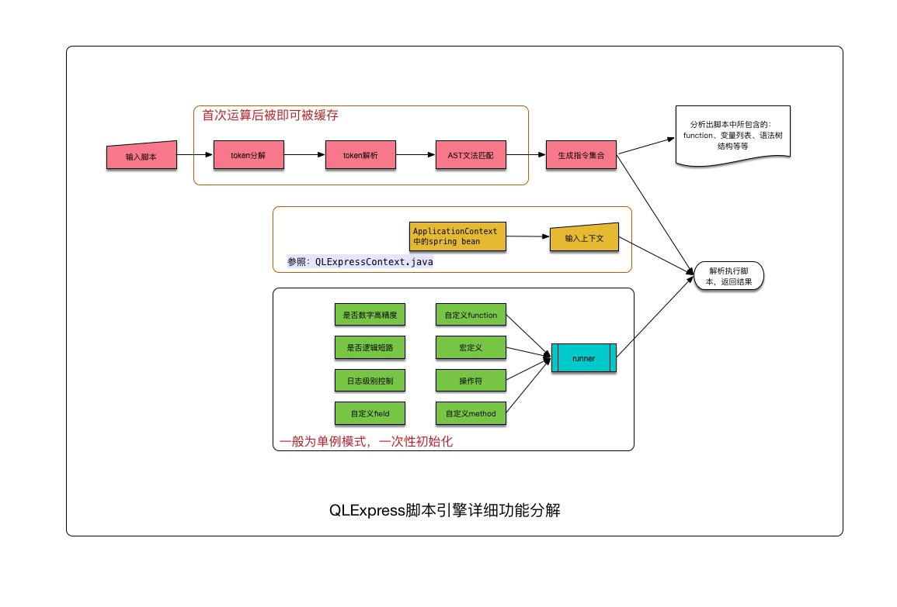

# QlExpress使用

一、背景介绍

由阿里的电商业务规则、表达式（布尔组合）、特殊数学公式计算（高精度）、语法分析、脚本二次定制等强需求而设计的一门动态脚本引擎解析工具。 在阿里集团有很强的影响力，同时为了自身不断优化、发扬开源贡献精神，于2012年开源。

QLExpress脚本引擎被广泛应用在阿里的电商业务场景，具有以下的一些特性:

- 1、线程安全，引擎运算过程中的产生的临时变量都是threadlocal类型。
- 2、高效执行，比较耗时的脚本编译过程可以缓存在本地机器，运行时的临时变量创建采用了缓冲池的技术，和groovy性能相当。
- 3、弱类型脚本语言，和groovy，javascript语法类似，虽然比强类型脚本语言要慢一些，但是使业务的灵活度大大增强。
- 4、安全控制,可以通过设置相关运行参数，预防死循环、高危系统api调用等情况。
- 5、代码精简，依赖最小，250k的jar包适合所有java的运行环境，在android系统的低端pos机也得到广泛运用。

# 基本概念

## 架构图




## 三个核心组件

(1)表达式express

- 直接写在java类中 注意使用ql语法
- 写在ql文件中 ql文件中读取表达式

(2)上下文context

(3)运行时 runner

- 单例模式

# 快速上手

引入pom依赖

```xml
<dependency>
  <groupId>com.alibaba</groupId>
  <artifactId>QLExpress</artifactId>
  <version>3.2.0</version>
</dependency>
```

写个简单的例子计算a+b+c

```java
public void quick_start() throws Exception {
    ExpressRunner runner = new ExpressRunner();
    DefaultContext<String, Object> context = new DefaultContext<String, Object>();
    context.put("a", 1);
    context.put("b", 2);
    context.put("c", 3);
    //下面五个参数意义分别是 表达式，上下文，errorList，是否缓存，是否输出日志
    Object result = runner.execute("a+b+c", context, null, true, false);
    System.out.println("a+b+c=" + result);
}
```

步骤总结

(1)生成Runner

实际使用建议是单例的，看下上面的架构图

(2)上下文传参

生成DefaultContext，并往里面添加数据

(3)定义表达式

(4)执行得到结果

# 语法

## 操作符和java对象操作

### 普通java语法

- 支持 +,-,*,/,<,>,<=,>=,==,!=,<>【等同于!=】,%,mod【取模等同于%】,++,--,
- in【类似sql】,like【sql语法】,&&,||,!,等操作符
- 支持for，break、continue、if then else 等标准的程序控制逻辑
- 三目运算符

下面展示一些基本的例子

- 计算1-100的和

```java
public void test_basic_use_for() throws Exception {
    ExpressRunner runner = new ExpressRunner();
    DefaultContext<String, Object> context = new DefaultContext<String, Object>();
    String express = "n=100;sum=0;" +
            "for(i=1;i<=n;i++){" +
            "sum = sum+i;" +
            "}" +
            "return sum;";
    Object result = runner.execute(express, context, null, true, false);
    System.out.println("1...100的和是: " + result);
}
```

- 三目运算符

```java
public void test_basic_use_three_var() throws Exception {
    ExpressRunner runner = new ExpressRunner();
    DefaultContext<String, Object> context = new DefaultContext<String, Object>();
    context.put("a", 5);
    context.put("b", 10);
    String express = "a>b?a:b";
    Object max = runner.execute(express, context, null, true, false);
    System.out.println("a和b中较大的指是：" + max);
}
```

### 注意点

和java语法相比，要避免ql的一些写法错误

- 不支持try{}catch{}
- 不支持java8的lambda表达式
- 不支持for循环集合操作for (GRCRouteLineResultDTO item : list)
  - 通过数组方式访问
- 弱类型语言，请不要定义类型声明,更不要用Templete（Map<String,List>之类的）
- array的声明不一样
  - 使用[]
- min,max,round,print,println,like,in 都是系统默认函数的关键字，请不要作为变量名

### 数组

- 声明的方式类似arr=new int[3];
- 声明并赋值的时候和java有点不同
  - mins=[5,30];
- 迭代的时候属性叫做length


```java
public void test_array_use() throws Exception {
    ExpressRunner runner = new ExpressRunner();
    DefaultContext<String, Object> context = new DefaultContext<String, Object>();
    String express = "arr=new int[3];" +
            "arr[0]=1;arr[1]=2;arr[2]=3;" +
            "sum=arr[0]+arr[1]+arr[2];" +
            "return sum;";
    Object arrSum = runner.execute(express, context, null, true, false);
    System.out.println("arrSum: " + arrSum);
}
```

### list

- new ArrayList(); 不用范型
- 迭代的时候属性list.size()
- 取的时候用list.get(i)


```java
public void test_list_use() throws Exception {
    ExpressRunner runner = new ExpressRunner();
    DefaultContext<String, Object> context = new DefaultContext<String, Object>();
    String express = "list = new ArrayList();" +
            "list.add(3);list.add(4);list.add(5);" +
            "sum=0;" +
            "for(i=0;i<list.size();i++){" +
            "sum = sum+list.get(i);" +
            "}" +
            "return sum;";
    Object listSum = runner.execute(express, context, null, true, false);
    System.out.println("listSum: " + listSum);
}
```

### map

- 不使用范型 new HashMap()
- 迭代的时候先生成keySet
- keySet.toArray()获取keyArray
- 迭代keyArray获取key
- 通过key获取value


```java
public void test_map_use() throws Exception {
    ExpressRunner runner = new ExpressRunner();
    DefaultContext<String, Object> context = new DefaultContext<String, Object>();
    String express = "map=new HashMap();" +
            "map.put('a',2);map.put('b',2);map.put('c',2);" +
            "sum=0;" +
            "keySet=map.keySet();" +
            "keyArray=keySet.toArray();" +
            "for(i=0;i<keyArray.length;i++){" +
            "sum=sum+map.get(keyArray[i]);" +
            "}" +
            "return sum;";
    Object mapValueSum = runner.execute(express, context, null, true, false);
    System.out.println("mapValueSum: " + mapValueSum);
}
```

### 语法糖

可以使用NewList和NewMap快速创建list和map

- NewList


```java
public void test_NewList() throws Exception {
    ExpressRunner runner = new ExpressRunner();
    DefaultContext<String, Object> context = new DefaultContext<String, Object>();
    String express = "abc=NewList(1,2,3);return abc.get(0)+abc.get(1)+abc.get(2);";
    Object listSum = runner.execute(express, context, null, true, false);
    System.out.println("listSum: " + listSum);
}
```

- NewMap


```java
public void test_NewMap() throws Exception {
    ExpressRunner runner = new ExpressRunner();
    DefaultContext<String, Object> context = new DefaultContext<String, Object>();
    String express = "abc=NewMap('a':1,'b':2,'c':3);return abc.get('a')+abc.get('b')+abc.get('c');";
    Object mapSum = runner.execute(express, context, null, true, false);
    System.out.println("mapSum: " + mapSum);
}
```

### java bean

- 需要import引入依赖
  - 系统自动会import java.lang.*,import java.util.*;
- 创建对象后可以调用静态和非静态的方法


```java
package com.ql.util.express.zihao;

/**
 * @author tangzihao
 * @Date 2021/1/20 9:17 下午
 */
public class Person {
    public void sayHello() {
        System.out.println("hello,world! this is non static method");
    }

    public void sayHelloStatic() {
        System.out.println("hello,world! this is static method");
    }
}
```


```java
public void test_java_bean() throws Exception {
    ExpressRunner runner = new ExpressRunner();
    DefaultContext<String, Object> context = new DefaultContext<String, Object>();
    //qlexpress只会引入java.util.*和java.lang.*
    String express = "import com.ql.util.express.zihao.Person;" +
            "person=new Person();" +
            "person.sayHello();" +
            "person.sayHelloStatic();";
    runner.execute(express, context, null, true, false);
}
```

## 脚本中定义function

写法和js非常相似。
 注意点

- 在入参的地方需要声明类型
- function的右}需要添加;


```java
public void test_add_func() throws Exception {
    ExpressRunner runner = new ExpressRunner();
    DefaultContext<String, Object> context = new DefaultContext<String, Object>();
    String express = "function add(int a,int b){" +
            "return a+b;" +
            "};" +
            "a=2;b=2;" +
            "return add(a,b);";
    Object funcResult = runner.execute(express, context, null, true, false);
    System.out.println("add(a,b)=" + funcResult);
}
```

## 扩展操作符Operator

### 替换if,then,else关键字

注意then和else后需要使用;

```java
public void test_replace_if_then_else() throws Exception {
    ExpressRunner runner = new ExpressRunner();
    DefaultContext<String, Object> context = new DefaultContext<String, Object>();
    runner.addOperatorWithAlias("如果", "if", null);
    runner.addOperatorWithAlias("则", "then", null);
    runner.addOperatorWithAlias("否则", "else", null);
    context.put("语文", 100);
    context.put("数学", 100);
    context.put("英语", 100);
    String express = "如果 ((语文+数学+英语)>270) 则 return 1;否则 return 0;";
    Object result = runner.execute(express, context, null, true, false);
    System.out.println(result);
}
```

### 定义自己的operator


```java
public class JoinOperator extends Operator {
    public Object executeInner(Object[] list) throws Exception {
        java.util.List result = new java.util.ArrayList();
        Object opdata1 = list[0];
        if(opdata1 instanceof java.util.List){
            result.addAll((java.util.List)opdata1);
        }else{
            result.add(opdata1);
        }
        for(int i=1;i<list.length;i++){
            result.add(list[i]);
        }
        return result;
    }
}
```

## 使用Operator

### addOperator

输出结果[1,2,3]


```java
public void test_add_operator() throws Exception {
    ExpressRunner runner = new ExpressRunner();
    DefaultContext<String, Object> context = new DefaultContext<String, Object>();
    String express = "1 join 2 join 3";
    runner.addOperator("join", new JoinOperator());
    Object result = runner.execute(express, context, null, true, false);
    System.out.println(result);
}
```

### replaceOperator

替换原有的操作符，比如将+替换为join


```java
public void test_replace_operator() throws Exception {
    ExpressRunner runner = new ExpressRunner();
    DefaultContext<String, Object> context = new DefaultContext<String, Object>();
    String express = "1 + 2 + 3";
    runner.replaceOperator("+", new JoinOperator());
    Object result = runner.execute(express, context, null, true, false);
    System.out.println(result);
}
```

### addFunction


```java
public void test_add_function() throws Exception {
    ExpressRunner runner = new ExpressRunner();
    DefaultContext<String, Object> context = new DefaultContext<String, Object>();
    String express = "join(1,2,3)";
    runner.addFunction("join", new JoinOperator());
    Object result = runner.execute(express, context, null, true, false);
    System.out.println(result);
}
```

## 绑定java类型或者对象的method

- addFunctionOfClassMethod 绑定静态方法
- addFunctionOfServiceMethod 绑定实例方法

参数说明:

- 函数名称
- 类名称或者对象实例
- 方法名称
- 方法的参数类型
- 错误信息 *如果函数执行的结果是false，需要输出的错误信息*


```java
ExpressRunner runner = new ExpressRunner();
DefaultContext<String, Object> context = new DefaultContext<String, Object>();

runner.addFunctionOfClassMethod("取绝对值", Math.class.getName(), "abs",
       new String[]{"double"}, null);
runner.addFunctionOfClassMethod("转换为大写", BeanExample.class.getName(),
       "upper", new String[]{"String"}, null);

runner.addFunctionOfServiceMethod("打印", System.out, "println", new String[]{"String"}, null);
runner.addFunctionOfServiceMethod("contains", new BeanExample(), "anyContains",
       new Class[]{String.class, String.class}, null);

String exp = "取绝对值(-100);转换为大写(\"hello world\");打印(\"你好吗？\");contains(\"helloworld\",\"aeiou\");";
runner.execute(exp, context, null, false, false);
```

- addFunctionAndClassMethod 给现有的类增加方法


```java
public void test_function_and_class_method() throws Exception {
    ExpressRunner runner = new ExpressRunner();
    DefaultContext<String, Object> context = new DefaultContext<String, Object>();
    //给类增加方法
    runner.addFunctionAndClassMethod("isBlank", String.class, new Operator() {
        @Override
        public Object executeInner(Object[] list) throws Exception {
            Object obj = list[0];
            if (obj == null) {
                return true;
             }

             String str = String.valueOf(obj);
             return str.length() == 0;
        }
    });

    String express = "a=\"\".isBlank()";
    Object r = runner.execute(express, context, null, true, false);
    System.out.println(r);
}
```

## 宏定义


```java
public void test_macro_use() throws Exception {
    ExpressRunner runner = new ExpressRunner();
    IExpressContext<String, Object> context = new DefaultContext<String, Object>();

    runner.addMacro("计算平均成绩", "(语文+数学+英语)/3.0");
    runner.addMacro("是否优秀", "计算平均成绩>90");
    context.put("语文", 88);
    context.put("数学", 99);
    context.put("英语", 95);
    Object result = runner.execute("是否优秀", context, null, false, false);
    System.out.println(result);
}
```

## 编译脚本，查询外部需要定义的变量和函数


```java
public void test_compile_script() throws Exception {
    String express = "int 平均分 = (语文+数学+英语+综合考试.科目2)/4.0;return 平均分";
    ExpressRunner runner = new ExpressRunner(true, true);
    String[] names = runner.getOutVarNames(express);
    for (String s : names) {
        System.out.println("var : " + s);
    }

    String[] functions = runner.getOutFunctionNames(express);
    for (String s : functions) {
        System.out.println("function : " + s);
    }
}
```

## 关于不定参数的使用

比如BeanExample类的getTemplate方法的入参是不定参数。


```java
public class BeanExample {
    public Object getTemplate(Object... params) throws Exception{
        String result = "";
        for(Object obj:params){
            result = result+obj+",";
        }
        return result;
    }
}
```

### 使用数组


```java
@Test
public void test_multi_params_use_array() throws Exception {
    ExpressRunner runner = new ExpressRunner();
    IExpressContext<String, Object> expressContext = new DefaultContext<String, Object>();
    runner.addFunctionOfServiceMethod("getTemplate", new BeanExample(), "getTemplate", new Class[]{Object[].class}, null);
    Object r = runner.execute("getTemplate([11,'22',33L,true])", expressContext, null, false, false);
    System.out.println(r);
}
```

### 使用动态参数

注意需要打开动态开关 DynamicParamsUtil.supportDynamicParams = true;否则会抛出异常


```java
public void test_multi_params_dynamic() throws Exception {
    DynamicParamsUtil.supportDynamicParams = true;
    ExpressRunner runner = new ExpressRunner();
    IExpressContext<String, Object> expressContext = new DefaultContext<String, Object>();
    runner.addFunctionOfServiceMethod("getTemplate", new BeanExample(), "getTemplate", new Class[]{Object[].class}, null);

    Object r = runner.execute("getTemplate(11,'22',33L,true)", expressContext, null, false, false);
    System.out.println(r);
}
```

## 集合的遍历

类似java的语法，只是ql不支持for(obj:list){}的语法，只能通过下标访问。
 详细见 操作符和java对象操作 这一小节的示例

# 运行参数和api介绍

## 属性开关

### isPrecise

高精度计算在会计财务中非常重要，java的float、double、int、long存在很多隐式转换，做四则运算和比较的时候其实存在非常多的安全隐患。 所以类似汇金的系统中，会有很多BigDecimal转换代码。而使用QLExpress，你只要关注数学公式本身 订单总价 = 单价 * 数量 + 首重价格 + （ 总重量 - 首重） * 续重单价 ，然后设置这个属性即可，所有的中间运算过程都会保证不丢失精度。


```java
/**
* 是否需要高精度计算
*/
private boolean isPrecise = false;
```


```java
public void is_precise() throws Exception {
    ExpressRunner runner = new ExpressRunner(true, false);
    DefaultContext<String, Object> context = new DefaultContext<String, Object>();
    //订单总价 = 单价 * 数量 + 首重价格 + （总重量 - 首重） * 续重单价
    context.put("单价", 1.25);
    context.put("数量", 100);
    context.put("首重价格", 125.25);
    context.put("总重量", 20.55);
    context.put("首重", 10.34);
    context.put("续重单价", 3.33);

    String express = "单价*数量+首重价格+(总重量-首重)*续重单价";
    Object totalPrice = runner.execute(express, context, null, true, false);
    System.out.println("totalPrice:" + totalPrice);
}
```

上面在创建ExpressRunner的时候第一个参数是是否开启高精度默认false，第二个参数是是否开启trace。
 开启高精度的情况下输出是284.2493
 没有开启高精度的情况下输出是284.2493

### isShortCicuit


```java
/**
* 是否使用逻辑短路特性
*/
private boolean isShortCircuit = true;
```

在很多业务决策系统中，往往需要对布尔条件表达式进行分析输出，普通的java运算一般会通过逻辑短路来减少性能的消耗。例如规则公式： star>10000 and shoptype in('tmall','juhuasuan') and price between (100,900) 假设第一个条件 star>10000 不满足就停止运算。但业务系统却还是希望把后面的逻辑都能够运算一遍，并且输出中间过程，保证更快更好的做出决策。
 具体可以参见ShortCircuitLogicTest测试类


```java
runner.setShortCircuit(true);
runner.setShortCircuit(false);//显式指定，默认是true
```

### isTrace


```java
/**
* 是否输出所有的跟踪信息，同时还需要log级别是DEBUG级别
*/
private boolean isTrace = false;
```


```java
ExpressRunner runner = new ExpressRunner(true, false);//第二个参数是否开启trace
```

这个主要是是否输出脚本的编译解析过程，一般对于业务系统来说关闭之后会提高性能。

## 调用入参

对于runner.execute执行方法的参数入参说明


```java
/**
 * 执行一段文本
 * @param expressString 程序文本
 * @param context 执行上下文，可以扩展为包含ApplicationContext
 * @param errorList 输出的错误信息List
 * @param isCache 是否使用Cache中的指令集,建议为true
 * @param isTrace 是否输出详细的执行指令信息，建议为false
 * @param aLog 输出的log
 * @return
 * @throws Exception
 */
Object execute(String expressString, IExpressContext<String,Object> context,List<String> errorList, boolean isCache, boolean isTrace, Log aLog);
```

## 功能扩展API列表

QLExpress主要通过子类实现Operator.java提供的以下方法来最简单的操作符定义，然后可以被通过addFunction或者addOperator的方式注入到ExpressRunner中。
 具体参见上面的JoinOperator的例子。
 如果你使用Operator的基类OperatorBase.java将获得更强大的能力，基本能够满足所有的要求。

### function相关API


```java
//通过name获取function的定义
OperatorBase getFunciton(String name);

//通过自定义的Operator来实现类似：fun(a,b,c)
void addFunction(String name, OperatorBase op);
//fun(a,b,c) 绑定 object.function(a,b,c)对象方法
void addFunctionOfServiceMethod(String name, Object aServiceObject,
            String aFunctionName, Class<?>[] aParameterClassTypes,
            String errorInfo);
//fun(a,b,c) 绑定 Class.function(a,b,c)类方法
void addFunctionOfClassMethod(String name, String aClassName,
            String aFunctionName, Class<?>[] aParameterClassTypes,
            String errorInfo);
//给Class增加或者替换method，同时 支持a.fun(b) ，fun(a,b) 两种方法调用
//比如扩展String.class的isBlank方法:“abc”.isBlank()和isBlank("abc")都可以调用
void addFunctionAndClassMethod(String name,Class<?>bindingClass, OperatorBase op);
```

### Operator相关API

提到脚本语言的操作符，优先级、运算的目数、覆盖原始的操作符(+,-,*,/等等)都是需要考虑的问题，QLExpress统统帮你搞定了。


```java
//添加操作符号,可以设置优先级
void addOperator(String name,Operator op);
void addOperator(String name,String aRefOpername,Operator op);
    
//替换操作符处理
//比如将+替换成自定义的operator 见上面的例子
OperatorBase replaceOperator(String name,OperatorBase op);
    
//添加操作符和关键字的别名，比如 if..then..else -> 如果。。那么。。否则。。
//具体见上面的例子
void addOperatorWithAlias(String keyWordName, String realKeyWordName,
            String errorInfo);
```

### 宏相关API

QLExpress的宏定义比较简单，就是简单的用一个变量替换一段文本，和传统的函数替换有所区别。
 见上面使用宏计算是否优秀的例子


```java
//比如addMacro("天猫卖家","userDO.userTag &1024 ==1024")
void addMacro(String macroName,String express) 
```

### java class相关API

QLExpress可以通过给java类增加或者改写一些method和field，比如链式调用："list.join("1").join("2")"，比如中文属性："list.长度"。


```java
//添加类的属性字段
void addClassField(String field,Class<?>bindingClass,Class<?>returnType,Operator op);

//添加类的方法
void addClassMethod(String name,Class<?>bindingClass,OperatorBase op);
```


```java
public void testArrayOrMapJoinMethod() throws Exception {
    ExpressRunner runner = new ExpressRunner();
    IExpressContext<String,Object> context = new DefaultContext<String, Object>();

    runner.addClassMethod("join", java.util.List.class, new Operator() {
        @Override
        public Object executeInner(Object[] list) throws Exception {
            ArrayList arrayList = (ArrayList) list[0];
            return StringUtils.join(arrayList,(String) list[1]);
        }
    });
    runner.addClassMethod("join", java.util.Map.class, new Operator() {
        @Override
        public Object executeInner(Object[] list) throws Exception {
            HashMap map = (HashMap) list[0];
            StringBuilder sb = new StringBuilder();
            for(Object key: map.keySet()){
                sb.append(key).append("=").append(map.get(key)).append((String) list[1]);
            }
            return sb.substring(0,sb.length()-1);
        }
    });
    Object result = runner.execute("list=new ArrayList();list.add(1);list.add(2);list.add(3);return list.join(' , ');",context,null,false,false);
    System.out.println(result);
    result = runner.execute("list=new HashMap();list.put('a',1);list.put('b',2);list.put('c',3);return list.join(' , ');",context,null,false,false);
    System.out.println(result);
}
```


```java
public void testAop() throws Exception {
    ExpressRunner runner = new ExpressRunner();
    IExpressContext<String,Object> context = new DefaultContext<String, Object>();

    runner.addClassMethod("size", java.util.List.class, new Operator() {
        @Override
        public Object executeInner(Object[] list) throws Exception {
            ArrayList arrayList = (ArrayList) list[0];
            System.out.println("拦截到List.size()方法");
            return arrayList.size();
        }
    });

    runner.addClassField("长度", java.util.List.class, new Operator() {
        @Override
        public Object executeInner(Object[] list) throws Exception {
            ArrayList arrayList = (ArrayList) list[0];
            System.out.println("拦截到List.长度 字段的计算");
            return arrayList.size();
        }
    });
    Object result = runner.execute("list=new ArrayList();list.add(1);list.add(2);list.add(3);return list.size();",context,null,false,false);
    System.out.println(result);
    result  = runner.execute("list=new ArrayList();list.add(1);list.add(2);list.add(3);return list.长度;",context,null,false,false);
    System.out.println(result);

    //bugfix 没有return 的时候可能会多次调用getType，并且返回错误
    Object result2  = runner.execute("list=new ArrayList();list.add(1);list.add(2);list.add(3);list.长度;",context,null,false,false);
    System.out.println(result2);
}
```

注意，这些类的字段和方法是执行器通过解析语法执行的，而不是通过字节码增强等技术，所以只在脚本运行期间生效，不会对jvm整体的运行产生任何影响，所以是绝对安全的。

### 语法树解析变量、函数的API

这些接口主要是对一个脚本内容的静态分析，可以作为上下文创建的依据，也可以用于系统的业务处理。 比如：计算 “a+fun1(a)+fun2(a+b)+c.getName()” 包含的变量:a,b,c 包含的函数:fun1,fun2


```java
//获取一个表达式需要的外部变量名称列表
String[] getOutVarNames(String express);

String[] getOutFunctionNames(String express);
```

### 语法解析校验API

脚本语法是否正确，可以通过ExpressRunner编译指令集的接口来完成。


```java
String expressString = "for(i=0;i<10;i++){sum=i+1}return sum;";
InstructionSet instructionSet = expressRunner.parseInstructionSet(expressString);
//如果调用过程不出现异常，指令集instructionSet就是可以被加载运行（execute）了！
```

### 指令集缓存相关API

因为QLExpress对文本到指令集做了一个本地HashMap缓存，通常情况下一个设计合理的应用脚本数量应该是有限的，缓存是安全稳定的，但是也提供了一些接口进行管理。


```java
//优先从本地指令集缓存获取指令集，没有的话生成并且缓存在本地
InstructionSet getInstructionSetFromLocalCache(String expressString);
//清除缓存
void clearExpressCache();
```

### 安全风险控制

#### 防止死循环


```java
try {
    express = "sum=0;for(i=0;i<1000000000;i++){sum=sum+i;}return sum;";
    //可通过timeoutMillis参数设置脚本的运行超时时间:1000ms
    Object r = runner.execute(express, context, null, true, false, 1000);
    System.out.println(r);
    throw new Exception("没有捕获到超时异常");
    } catch (QLTimeOutException e) {
    System.out.println(e);
}
```

#### 防止调用不安全系统API


```java
public void test_invoke_risk_api() {
    ExpressRunner runner = new ExpressRunner();
    QLExpressRunStrategy.setForbiddenInvokeSecurityRiskMethods(true);

    DefaultContext<String, Object> context = new DefaultContext<String, Object>();
    try {
        String express = "System.exit(1);";
        Object r = runner.execute(express, context, null, true, false);
        System.out.println(r);
        throw new Exception("没有捕获到不安全的方法");
    } catch (QLException e) {
        System.out.println(e);
    } catch (Exception e) {
        e.printStackTrace();
    }
}
```

## 增强上下文参数Context相关的API

### 与spirng集成

上下文参数 IExpressContext context 非常有用，它允许put任何变量，然后在脚本中识别出来。
 在实际中我们很希望能够无缝的集成到spring框架中，可以仿照下面的例子使用一个子类。


```java
public class QLExpressContext extends HashMap<String, Object> implements
        IExpressContext<String, Object> {

    private ApplicationContext context;

    //构造函数，传入context和 ApplicationContext
    public QLExpressContext(Map<String, Object> map,
                            ApplicationContext aContext) {
        super(map);
        this.context = aContext;
    }

    /**
     * 抽象方法：根据名称从属性列表中提取属性值
     */
    public Object get(Object name) {
        Object result = null;
        result = super.get(name);
        try {
            if (result == null && this.context != null
                    && this.context.containsBean((String) name)) {
                // 如果在Spring容器中包含bean，则返回String的Bean
                result = this.context.getBean((String) name);
            }
        } catch (Exception e) {
            throw new RuntimeException(e);
        }
        return result;
    }

    public Object put(String name, Object object) {
        return super.put(name, object);
    }

}
```

完整的demo参照 [SpringDemoTest.java](https://github.com/alibaba/QLExpress/blob/master/src/test/java/com/ql/util/express/test/spring/SpringDemoTest.java)

### 自定义函数操作符获取原始context控制上下文

自定义的Operator需要直接继承OperatorBase，获取到parent即可，可以用于在运行一组脚本的时候，直接编辑上下文信息，业务逻辑处理上也非常有用。


```java
public class ContextMessagePutTest {
    class OperatorContextPut extends OperatorBase {
        
        public OperatorContextPut(String aName) {
            this.name = aName;
        }
    
        @Override
        public OperateData executeInner(InstructionSetContext parent, ArraySwap list) throws Exception {
            String key = list.get(0).toString();
            Object value = list.get(1);
            parent.put(key,value);
            return null;
        }
    }
    
    @Test
    public void test() throws Exception{
        ExpressRunner runner = new ExpressRunner();
        OperatorBase op = new OperatorContextPut("contextPut");
        runner.addFunction("contextPut",op);
        String exp = "contextPut('success','false');contextPut('error','错误信息');contextPut('warning','提醒信息')";
        IExpressContext<String, Object> context = new DefaultContext<String, Object>();
        context.put("success","true");
        Object result = runner.execute(exp,context,null,false,true);
        System.out.println(result);
        System.out.println(context);
    }
}
```

输出内容是
 也就是说原始的上下文没有被污染


```java
{success=false, warning=提醒信息, error=错误信息}
```

# 其他

## 脚本预热

可以通过提前加载脚本的方式来进行预热，防止初次编译脚本带来的耗时。

## 动态规则推送

可以通过接入配置中心来实现规则的动态推送。

## 流程设计器

因为这个流程引擎没有流程设计器，所以可以看下https://www.jianshu.com/p/9bb2f01ad816 我写的另外一篇文章。


作者：捞月亮的阿汤哥
链接：https://www.jianshu.com/p/a3ff29cf579d
来源：简书
著作权归作者所有。商业转载请联系作者获得授权，非商业转载请注明出处。