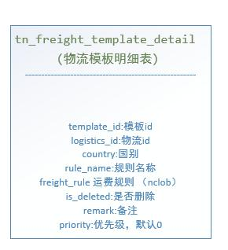

#### 物流的运费计算

DPDRuleTest.java

```
是否符合 = 1;
运费 = 0;
如果 (30 < 重量 ) 则
{
    是否符合 = 0;
    return 是否符合;
}
最长边 = 长 > 宽 ? 长 : 宽;
最长边 = 最长边 > 高 ? 最长边 : 高;
最短边 = 长 < 宽 ? 长 : 宽;
最短边 = 最短边 < 高 ? 最短边 : 高;
中间边 = (长 + 宽 + 高) - 最长边 - 最短边;
围长 = (中间边 + 最短边) * 2 + 最长边;
如果 (围长 > 300) 则
{
    是否符合 = 0;
    return 是否符合;
}
如果 (最长边 > 175) 则
{
    是否符合 = 0;
    return 是否符合;
}
```


规则ql文件

也可以把这些规则全都放到数据库字段里面保存起来，并且页面化，进行可配置操作，达到方便配置的效果。




#### 优惠金额判断

```
"如果 (价格 大于 300)  则 {返回 价格*0.8;}  " +
"如果 (价格 大于 200)  则 {返回 价格*0.85;}  " +
"如果 (价格 大于 100 ) 则 {返回 价格*0.9;} " +
"否则 {返回 价格;}"
```


```
public void test_discount() throws Exception {
        String express = "如果 (价格 大于 300)  则 {返回 价格*0.8;}  " +
                "如果 (价格 大于 200)  则 {返回 价格*0.85;}  " +
                "如果 (价格 大于 100 ) 则 {返回 价格*0.9;} " +
                "否则 {返回 价格;}";
        DefaultContext<String, Object> context = new DefaultContext<String, Object>();
        ExpressRunner runner = new ExpressRunner(false, false);
        runner.addOperatorWithAlias("如果", "if", null);
        runner.addOperatorWithAlias("则", "then", null);
        runner.addOperatorWithAlias("否则", "else", null);
        runner.addOperatorWithAlias("返回","return",null);
        runner.addOperatorWithAlias("大于",">", null);

        context.put("价格", 150);
        Object r = runner.execute(express, context, null, false, false, null);
        System.out.println(r);


        context.put("价格", 100);
        System.out.println(runner.execute(express, context, null, false, false, null));

        context.put("价格", 50);
        System.out.println(runner.execute(express, context, null, false, false, null));
}
```

返回结果

```
135.0
100
50
```


#### 投放条件判断

```
@Test
    public void test_condition() throws Exception {
        String express = "如果 ((投放页面 是 'H5' 并且  人群 是 '新人') " +
                "或者 商品ID 包含 [1,2,3]  ) " +
                "则 {return '符合XX活动条件';} 否则 {return '不符合条件';}";
        DefaultContext<String, Object> context = new DefaultContext<String, Object>();
        ExpressRunner runner = new ExpressRunner(false, false);
        runner.addOperatorWithAlias("如果", "if", null);
        runner.addOperatorWithAlias("则", "then", null);
        runner.addOperatorWithAlias("或者", "||", null);
        runner.addOperatorWithAlias("返回","return",null);
        runner.addOperatorWithAlias("并且","&&", null);
        runner.addOperatorWithAlias("是","==", null);
        runner.addOperatorWithAlias("包含","in", null);
        runner.addOperatorWithAlias("否则","else", null);


        context.put("投放页面", "H4");
        context.put("人群", "新人");
        context.put("消费门槛", 10);
        context.put("类目", "酒店");
        context.put("商品ID", 3);
        context.put("SKU", 123);

        Object r = runner.execute(express, context, null, false, false, null);
        System.out.println(r);
    }
```


#### qlexpress——setShortCircuit

```
天樵，您好！  
   
        网上看到你BLOG中开源出的QLExpress表达式，在实际的项目应用中有个问题请教你一下：  
                     
        我们的项目想要使用QLExpress表达式来控制业务操作的可行性校验，通过表达式返回的true/false 确定业务操作是否被允许  
          
        例如：  
        用户.状态 =='有效' && （用户.网龄 > 2年 || 用户.类型=='VIP'）  
   
        但是要求结果除了true/false外，如果最终操作不被允许，还想得出具体不被允许的原因（哪一段、几段原子表达式导致了整体的结果为不通过）；、、  
   
        目前未在QL中看到类似功能，如果想要基于QLExpress来实现，希望你能向我们提供一些方向或者指导性的意见。  
```


**其实逻辑方面的控制大概在两年前我们就已经实现了，而且淘宝内部业务系统也多有在使用。物流宝，营销系统，监管系统等等。**

 

隐含两个需求：

1、避免逻辑短路，因为要输出所有出错信息。

2、友好地显示出错信息。

 

解答：1

第一个问题很好解决：设置runner属性即可，这个设置在很多场景下还是很有用的（即想运行完所有的表达式，又想获取一个最后的结果）。

```
runner.setShortCircuit(true);  
```


解答：2

 

ExpressRunner.addOperatorWithAlias(String keyWordName, String realKeyWordName,String errorInfo)

美其名曰：“操作符 重命名”，这个函数其实是专为逻辑判断出错信息的设计的。

 

例如我希望 （100 小于 99） 的时候报错，那我就可以重新定义下 “<”

runner.addOperatorWithAlias("小于","<","$1 小于 $2 不满足期望");

这样就会显示出错信息： 100小于99不满足期望

那有些大哥会苦恼了 ，我如果表达式内容就希望是  （100<99）而非 （100 小于 99）怎么办？

由于受限于ExpressRunner内部的操作符体系设计，我们只能妥协下，先做一个文字替换工作。

```
text = "100<99 and 100<=99 and 100>1";  
text = text.replaceAll("<"，“小于”).replaceAll("<="，“小于或等于”).replaceAll(">","大于")；  
runner.setShortCircuit(true);  
runner.addOperatorWithAlias("小于","<","$1 小于 $2");  
runner.addOperatorWithAlias("小于或等于","<=","$1 小于 $2");  
runner.addOperatorWithAlias("大于",">","$1 小于 $2");  
  
List<String> errorInfo = new ArrayList<String>();  
IExpressContext<String,Object> expressContext = new DefaultContext<String,Object>();  
runner.execute(text , expressContext, errorInfo, true, false);  
if(result){  
    System.out.println("result is success!");  
}else{  
    System.out.println("result is fail!");  
    for(String error : errorInfo){  
        error=error.replaceAll(“小于”,"<").replaceAll(“小于或等于”,"<=").replaceAll("大于",">")；  
        System.out.println(error);  
    }  
}  
```


参考网址：

1、https://blog.csdn.net/yulei0524/article/details/107248709/

2、https://www.csdn.net/tags/OtTaQg3sOTA1NzUtYmxvZwO0O0OO0O0O.html

3、https://www.iteye.com/blog/express-wind-2074249