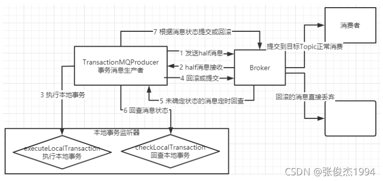

事务消息只和生产者有关系,和消费者没有太大的关系。


订单系统生产者通过RocketMQ发送消息给消费者

1.首先会把我们在代码中发的普通消息转成一个half消息,这个half对消费者是不可见的.

2.RocketMQ会返回half消息接收的结果

3.订单系统接收到了half消息结果之后会去执行一个本地事务,就是执行executeLocalTransaction方法

4.订单系统向RocketMQ返回一个状态,状态包括commit,rollback,unknown 三种状态：
- 如果是commit状态的话,RocketMQ就把消息给下游服务消费者去处理消费
- 如果是rollback状态就直接丢弃这个消息
- 如果是unknown状态的话RocketMQ就会等一段时间去订单系统生产者进行回查事务的状态,也就是去执行checkLocalTransaction方法。

5.订单系统生产者接收到了RocketMQ的状态回查请求后就会去执行checkLocalTransaction方法去检查本地事务状态,也相当于执行本地事务

6.向RocketMQ返回一个本地事务的检查状态,这个状态结果同样是有三个的,commit,rollback,unknown 三种状态,然后还会接着重复类似步骤4的操作,就是：
- 如果是commit状态的话,RocketMQ就把消息给下游服务消费者去处理消费
- 如果是rollback状态就直接丢弃这个消息
- 如果是unknown状态接着等一段时间去订单系统生产者进行回查事务的状态.
- 如果你消息一直都是unknown状态的话,会一直循环的查询,当然RocketMQ也会有个回查次数,默认是15次,如果回查15次之后消息状态还是unknown的话,RocketMQ就会确认你这个事务状态是失败的,就会丢弃这个消息.


rocketMQ-API
#### 先执行Consumer 再执行TransactionProducer


执行结果：
TransactionProducer执行后的日志
```text
SendResult [sendStatus=SEND_OK, msgId=C0A80102E2C118B4AAC299FE3BA60000, offsetMsgId=null, messageQueue=MessageQueue [topic=TopicTest2, brokerName=yangxiaohuan.local, queueId=0], queueOffset=16]
SendResult [sendStatus=SEND_OK, msgId=C0A80102E2C118B4AAC299FE3BBF0001, offsetMsgId=null, messageQueue=MessageQueue [topic=TopicTest2, brokerName=yangxiaohuan.local, queueId=1], queueOffset=17]
SendResult [sendStatus=SEND_OK, msgId=C0A80102E2C118B4AAC299FE3BCE0002, offsetMsgId=null, messageQueue=MessageQueue [topic=TopicTest2, brokerName=yangxiaohuan.local, queueId=2], queueOffset=18]
SendResult [sendStatus=SEND_OK, msgId=C0A80102E2C118B4AAC299FE3BDE0003, offsetMsgId=null, messageQueue=MessageQueue [topic=TopicTest2, brokerName=yangxiaohuan.local, queueId=3], queueOffset=19]
SendResult [sendStatus=SEND_OK, msgId=C0A80102E2C118B4AAC299FE3BEF0004, offsetMsgId=null, messageQueue=MessageQueue [topic=TopicTest2, brokerName=yangxiaohuan.local, queueId=0], queueOffset=20]
SendResult [sendStatus=SEND_OK, msgId=C0A80102E2C118B4AAC299FE3BFB0005, offsetMsgId=null, messageQueue=MessageQueue [topic=TopicTest2, brokerName=yangxiaohuan.local, queueId=1], queueOffset=21]
SendResult [sendStatus=SEND_OK, msgId=C0A80102E2C118B4AAC299FE3C080006, offsetMsgId=null, messageQueue=MessageQueue [topic=TopicTest2, brokerName=yangxiaohuan.local, queueId=2], queueOffset=22]
SendResult [sendStatus=SEND_OK, msgId=C0A80102E2C118B4AAC299FE3C160007, offsetMsgId=null, messageQueue=MessageQueue [topic=TopicTest2, brokerName=yangxiaohuan.local, queueId=3], queueOffset=23]
SendResult [sendStatus=SEND_OK, msgId=C0A80102E2C118B4AAC299FE3C230008, offsetMsgId=null, messageQueue=MessageQueue [topic=TopicTest2, brokerName=yangxiaohuan.local, queueId=0], queueOffset=24]
SendResult [sendStatus=SEND_OK, msgId=C0A80102E2C118B4AAC299FE3C2F0009, offsetMsgId=null, messageQueue=MessageQueue [topic=TopicTest2, brokerName=yangxiaohuan.local, queueId=1], queueOffset=25]
```

Consumer执行的日志
```text
Consumer Started.
当前时间是: 2022年10月30日21时40分钟1秒  , 当前线程为ConsumeMessageThread_2 收到新消息:[MessageExt [brokerName=yangxiaohuan.local, queueId=2, storeSize=323, queueOffset=0, sysFlag=8, bornTimestamp=1667137175503, bornHost=/192.168.1.2:49676, storeTimestamp=1667137199686, storeHost=/192.168.1.2:10911, msgId=C0A8010200002A9F0000000000034FDA, commitLogOffset=217050, bodyCRC=1250039395, reconsumeTimes=0, preparedTransactionOffset=214569, toString()=Message{topic='TopicTest2', flag=0, properties={TRANSACTION_CHECK_TIMES=1, TRAN_MSG=true, CONSUME_START_TIME=1667137201057, MIN_OFFSET=0, REAL_TOPIC=TopicTest2, MAX_OFFSET=1, KEYS=KEY2, UNIQ_KEY=C0A80102E2C118B4AAC299FE3BCE0002, CLUSTER=DefaultCluster, PGROUP=please_rename_unique_group_name, WAIT=true, TAGS=TagC, REAL_QID=2}, body=[72, 101, 108, 108, 111, 32, 82, 111, 99, 107, 101, 116, 77, 81, 32, 50], transactionId='C0A80102E2C118B4AAC299FE3BCE0002'}]] 
当前时间是: 2022年10月30日21时40分钟1秒  , 当前线程为ConsumeMessageThread_1 收到新消息:[MessageExt [brokerName=yangxiaohuan.local, queueId=3, storeSize=323, queueOffset=0, sysFlag=8, bornTimestamp=1667137175574, bornHost=/192.168.1.2:49676, storeTimestamp=1667137199683, storeHost=/192.168.1.2:10911, msgId=C0A8010200002A9F0000000000034E0F, commitLogOffset=216591, bodyCRC=988340972, reconsumeTimes=0, preparedTransactionOffset=215580, toString()=Message{topic='TopicTest2', flag=0, properties={TRANSACTION_CHECK_TIMES=1, TRAN_MSG=true, CONSUME_START_TIME=1667137201057, MIN_OFFSET=0, REAL_TOPIC=TopicTest2, MAX_OFFSET=1, KEYS=KEY7, UNIQ_KEY=C0A80102E2C118B4AAC299FE3C160007, CLUSTER=DefaultCluster, PGROUP=please_rename_unique_group_name, WAIT=true, TAGS=TagC, REAL_QID=3}, body=[72, 101, 108, 108, 111, 32, 82, 111, 99, 107, 101, 116, 77, 81, 32, 55], transactionId='C0A80102E2C118B4AAC299FE3C160007'}]] 
统计当前接收到了消息的个数2
统计当前接收到了消息的个数1
当前时间是: 2022年10月30日21时40分钟2秒  , 当前线程为ConsumeMessageThread_3 收到新消息:[MessageExt [brokerName=yangxiaohuan.local, queueId=0, storeSize=297, queueOffset=0, sysFlag=8, bornTimestamp=1667137175463, bornHost=/192.168.1.2:49676, storeTimestamp=1667137175478, storeHost=/192.168.1.2:10911, msgId=C0A8010200002A9F00000000000336C8, commitLogOffset=210632, bodyCRC=613185359, reconsumeTimes=0, preparedTransactionOffset=210321, toString()=Message{topic='TopicTest2', flag=0, properties={MIN_OFFSET=0, REAL_TOPIC=TopicTest2, MAX_OFFSET=1, KEYS=KEY0, TRAN_MSG=true, CONSUME_START_TIME=1667137202047, UNIQ_KEY=C0A80102E2C118B4AAC299FE3BA60000, CLUSTER=DefaultCluster, PGROUP=please_rename_unique_group_name, WAIT=true, TAGS=TagA, REAL_QID=0}, body=[72, 101, 108, 108, 111, 32, 82, 111, 99, 107, 101, 116, 77, 81, 32, 48], transactionId='C0A80102E2C118B4AAC299FE3BA60000'}]] 
统计当前接收到了消息的个数3
当前时间是: 2022年10月30日21时40分钟2秒  , 当前线程为ConsumeMessageThread_4 收到新消息:[MessageExt [brokerName=yangxiaohuan.local, queueId=1, storeSize=297, queueOffset=0, sysFlag=8, bornTimestamp=1667137175547, bornHost=/192.168.1.2:49676, storeTimestamp=1667137175549, storeHost=/192.168.1.2:10911, msgId=C0A8010200002A9F0000000000033F14, commitLogOffset=212756, bodyCRC=1424393152, reconsumeTimes=0, preparedTransactionOffset=212445, toString()=Message{topic='TopicTest2', flag=0, properties={MIN_OFFSET=0, REAL_TOPIC=TopicTest2, MAX_OFFSET=1, KEYS=KEY5, TRAN_MSG=true, CONSUME_START_TIME=1667137202049, UNIQ_KEY=C0A80102E2C118B4AAC299FE3BFB0005, CLUSTER=DefaultCluster, PGROUP=please_rename_unique_group_name, WAIT=true, TAGS=TagA, REAL_QID=1}, body=[72, 101, 108, 108, 111, 32, 82, 111, 99, 107, 101, 116, 77, 81, 32, 53], transactionId='C0A80102E2C118B4AAC299FE3BFB0005'}]] 
统计当前接收到了消息的个数4
```


执行结果以及说明
先启动消费者,再启动生产者

生产者控制台:

生产者控制台就不发了, 就是发了10个消息,其中两个消息是 TagA ,两个消息是TagB,两个消息是TagC,两个消息是TagD,两个消息是TagE

消费者控制台:

说明 , 可以看到2021年10月24日19时2分钟54秒收到了两个TAGS都是 TagA的消息.

然后2021年10月24日19时3分钟10秒的时候收到了一个TAGS=TagC的消息,

然后2021年10月24日19时3分钟13秒的时候收到了一个TAGS=TagC多消息.

为什么会是这样的输出结果呢? 原因是因为TransactionListenerImpl 的executeLocalTransaction那里配置了,如果tags包含了"TagA" 就进行本地事务commit操作,所以这样RocketMQ就会将消息直接发送给Consumer,所以Consumer就能立马接收到了两个TAGS=TagA的消息.

为什么隔了几十秒才接收到了TAGS=TagC的消息?

原因是因为TransactionListenerImpl的executeLocalTransaction方法那里如果tags不是"TagA"或者"TagB"的时候,就会返回给RocketMQ的本地事务状态为unknow. 此时RocketMQ会在十几秒之后进行回查事务状态操作, 回查事务状态的时候会执行TransactionListenerImpl的checkLocalTransaction方法,在checkLocalTransaction方法里面的逻辑是如果tags包含了"TagC"就发送给RocketMQ一个本地事务状态为commit状态,这样RocketMQ在接收到了这个commit状态之后,就会将这个消息发送给Consumer了,这样Consumer就接收到了TAGS=TagC的消息

为什么没有接收到TAGS=TagB的消息,因为在TransactionListenerImpl的executeLocalTransaction方法里面逻辑是 如果tags包含了"TagB"就会发送rollback的本地事务状态给RocketMQ,RocketMQ接收到了rollback状态之后就会把这个消息丢弃掉,这样tags包含"TagB"的消息就不会被Consumer消费.

来源于：
https://blog.51cto.com/u_14861909/5439369
