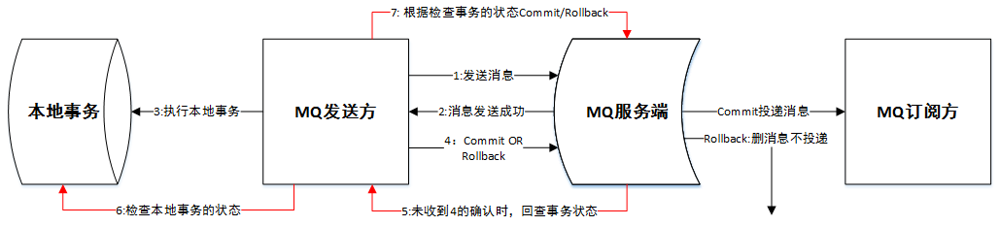
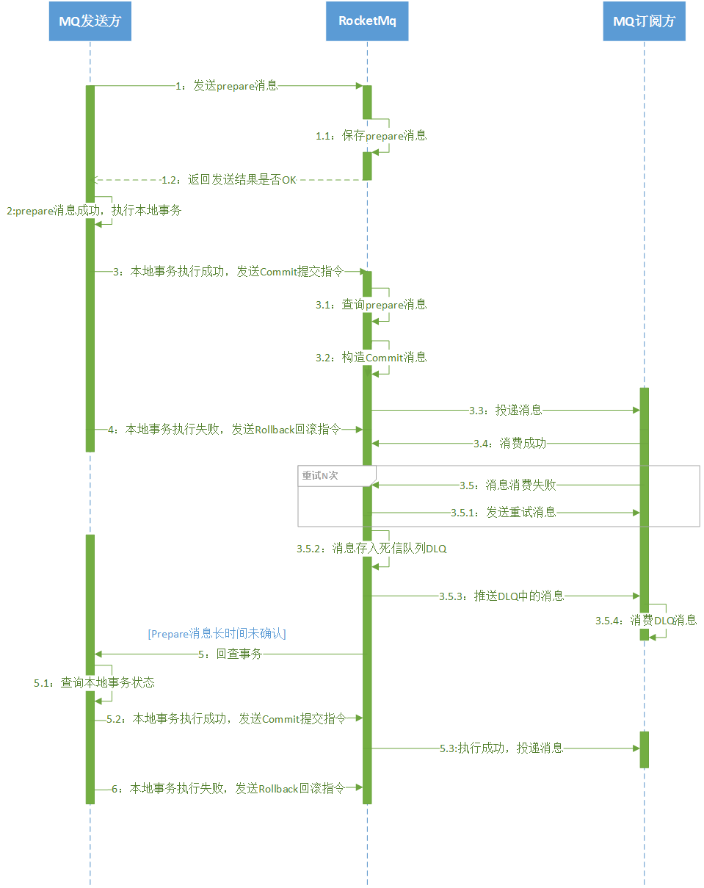

来自于：https://gitee.com/veromca/transaction-rocketmq

在工程目录distributed-transaction中，提供了数据库文件。模拟了事务消息。
producer和consumer工程，都是简单的生产者与消费者demo。

# transaction-rocketmq

### 项目介绍

本项目是基于rocketmq 事务消息实现的分布式事务解决方案demo

模拟场景：生成订单记录 -> RocketMQ-> 增加积分

### RocketMQ事务消息原理

### 逻辑时序图

### 主要逻辑流程说明
一）事务消息发送及提交
1. 【MQ发送方】发送half消息至【MQ】
2. 【MQ】存储消息至队列并通知【MQ发送方】消息发送结果
3. 【MQ发送方】根据发送结果执行 本地事务（如果写入失败，此时half消息对【MQ订阅方】不可见，本地逻辑不执行）
4. 【MQ发送方】根据本地事务状态执行 Commit 或者 Rollback指令（Commit操作提交本地事务、生成消息索引，消息对【MQ订阅方】可见）
   【MQ】查询prepare消息，构造Commit消息，投递消息至【MQ订阅方】
5. 【MQ订阅方】消费MQ消息，执行本地事务（失败：进行重试，达到重试次数后失败进入死信队列）
6. 【MQ订阅方】针对死信队列开启监听，消费DLQ队列中的消息
二）回查流程
1. 【MQ】对于长时间没有收到【MQ发送方】的确认时（ Commit/Rollback 的事务消息，pending 状态的消息），发起一次事务回查
2. 【MQ发送方】收到【MQ】的回查消息，检查回查消息（含业务消息内容）对应的 本地事务状态
3. 【MQ发送方】根据本地事务状态，重新 Commit 或者 Rollback，实现消息的可靠生产

如何保证事务消息在消费方正常消费？
本方案是利用 rocketmq 的两个特性 重试 和 死信队列 来协助消费端处理：
消费端消费失败后，MQ服务端会进行一定次数的重试；
重试后还是失败时消息会进入死信队列DLQ;
消费端需针对DLQ另外启动一个监听消费死信队列中的消息，可以对消息进行记录日志/持久化/预警/通过通知人工处理达保证消费方最终消费成功

【注意】因为消费失败会重试，要求消费方接口需要实现幂等性；

### 部署和测试

### 1. 修改application.yml配置

修改`rocketmq-transactional`里`namesrv-addr`的值为`RocketMQ`的服务地址

### 2. 启动

运行`distributed-transaction `的`RocketMqTxApplication`

### 3. 测试

测试的场景主要有3个：

#### 3.1. 正常情况

流程如下：

1. 订单创建
2. 发送mq消息
3. 消费消息增加积分

http://localhost:11002/success

#### 3.2. 发送消息失败

流程如下：

1. 订单创建
2. 发送mq消息 -> 失败
3. 事务回查(等待1分钟左右)
4. 发送mq消息
5. 消费消息增加积分

http://localhost:11002/produceError

#### 3.3. 消费消息失败

流程如下：

1. 订单创建
2. 发送mq消息
3. 消费消息增加积分 -> 失败
4. 重试消费消息 -> 失败
5. 进入死信队列
6. 消费死信队列的消息
7. 记录日志并发出预警

http://localhost:11002/consumeError

> 注意：消费死信队列topic，必需把topic的perm改成6才能消费，默认是2

