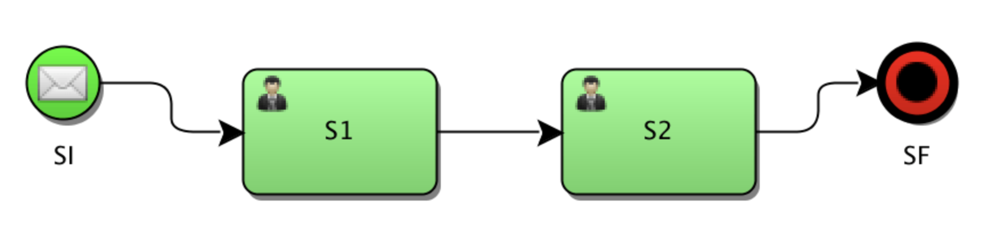
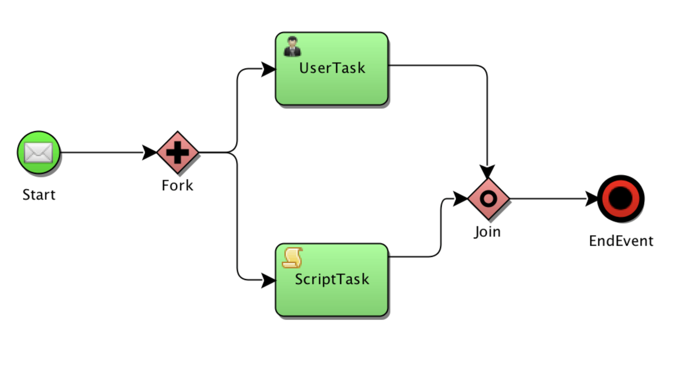

以下是摘抄于 [baeldung spring-state-machine](https://www.baeldung.com/spring-state-machine)




```
states
  .withStates()
  .stateEntry("S3", entryAction())
  .state("S3", executeAction())
  .stateExit("S3", exitAction());
```


#### Extended State

Spring State Machine keeps track of its state, but to keep track of our *application* state, be it some computed values, entries from admins or responses from calling external systems, we need to use what is called an *extended state*.

Suppose we want to make sure that an account application goes through two levels of approval. We can keep track of approvals count using an integer stored in the extended state:

```java
@Bean
public Action<String, String> executeAction() {
    return ctx -> {
        int approvals = (int) ctx.getExtendedState().getVariables()
          .getOrDefault("approvalCount", 0);
        approvals++;
        ctx.getExtendedState().getVariables()
          .put("approvalCount", approvals);
    };
}
```


#### guard
A guard can be used to validate some data before a transition to a state is executed. A guard looks very similar to an action:

```
@Bean
public Guard<String, String> simpleGuard() {
    return ctx -> (int) ctx.getExtendedState()
      .getVariables()
      .getOrDefault("approvalCount", 0) > 0;
}
```

The noticeable difference here is that a guard returns a true or false which will inform the state machine whether the transition should be allowed to occur.

Support for SPeL expressions as guards also exists. The example above could also have been written as:

```
.guardExpression("extendedState.variables.approvalCount > 0")
```


#### 9. Hierarchical States

Hierarchical states can be configured by using multiple *withStates()* in conjunction with *parent()*:

```java
states
  .withStates()
    .initial("SI")
    .state("SI")
    .end("SF")
    .and()
  .withStates()
    .parent("SI")
    .initial("SUB1")
    .state("SUB2")
    .end("SUBEND");
```

This kind of setup allows the state machine to have multiple states, so a call to *getState()* will produce multiple IDs. For example, immediately after startup the following expression results in:

```java
stateMachine.getState().getIds()
["SI", "SUB1"]
```


#### 10. Junctions (Choices)

So far, we've created state transitions which were linear by nature. Not only is this rather uninteresting, but it also does not reflect real-life use-cases that a developer will be asked to implement either. The odds are conditional paths will need to be implemented, and Spring state machine's junctions (or choices) allow us to do just that.

First, we need to mark a state a junction (choice) in the state definition:

```java
states
  .withStates()
  .junction("SJ")
```

Then in the transitions, we define first/then/last options which correspond to an if-then-else structure:

```java
.withJunction()
  .source("SJ")
  .first("high", highGuard())
  .then("medium", mediumGuard())
  .last("low")
```

*first* and *then* take a second argument which is a regular guard which will be invoked to find out which path to take:

```java
@Bean
public Guard<String, String> mediumGuard() {
    return ctx -> false;
}

@Bean
public Guard<String, String> highGuard() {
    return ctx -> false;
}
```

Note that a transition does not stop at a junction node but will immediately execute defined guards and go to one of the designated routes.

In the example above, instructing state machine to transition to SJ will result in the actual state to become *low* as the both guards just return false.

A final note is that **the API provides both junctions and choices. However, functionally they are identical in every aspect.**

#### 11. Fork

Sometimes it becomes necessary to split the execution into multiple independent execution paths. This can be achieved using the *fork* functionality.

First, we need to designate a node as a fork node and create hierarchical regions into which the state machine will perform the split:

```java
states
  .withStates()
  .initial("SI")
  .fork("SFork")
  .and()
  .withStates()
    .parent("SFork")
    .initial("Sub1-1")
    .end("Sub1-2")
  .and()
  .withStates()
    .parent("SFork")
    .initial("Sub2-1")
    .end("Sub2-2");
```

Then define fork transition:

```java
.withFork()
  .source("SFork")
  .target("Sub1-1")
  .target("Sub2-1");
```

#### 12. Join

The complement of the fork operation is the join. It allows us to set a state transitioning to which is dependent on completing some other states:



As with forking, we need to designate a join node in the state definition:

```java
states
  .withStates()
  .join("SJoin")
```

Then in transitions, we define which states need to complete to enable our join state:

```java
transitions
  .withJoin()
    .source("Sub1-2")
    .source("Sub2-2")
    .target("SJoin");
```

That's it! With this configuration, when both *Sub1-2* and *Sub2-2* are achieved, the state machine will transition to *SJoin*

#### 13. Enums Instead of Strings

In the examples above we have used string constants to define states and events for clarity and simplicity. On a real-world production system, one would probably want to use Java's enums to avoid spelling errors and gain more type safety.

First, we need to define all possible states and events in our system:

```java
public enum ApplicationReviewStates {
    PEER_REVIEW, PRINCIPAL_REVIEW, APPROVED, REJECTED
}

public enum ApplicationReviewEvents {
    APPROVE, REJECT
}
```

We also need to pass our enums as generic parameters when we extend the configuration:

```java
public class SimpleEnumStateMachineConfiguration 
  extends StateMachineConfigurerAdapter
  <ApplicationReviewStates, ApplicationReviewEvents>
```

Once defined, we can use our enum constants instead of strings. For example to define a transition:

```java
transitions.withExternal()
  .source(ApplicationReviewStates.PEER_REVIEW)
  .target(ApplicationReviewStates.PRINCIPAL_REVIEW)
  .event(ApplicationReviewEvents.APPROVE)
```

#### 14. Conclusion

This article explored some of the features of the Spring state machine.

As always you can find the sample source code **[over on GitHub](https://github.com/eugenp/tutorials/tree/master/spring-state-machine)**.


参考文档：
1、https://www.baeldung.com/spring-state-machine