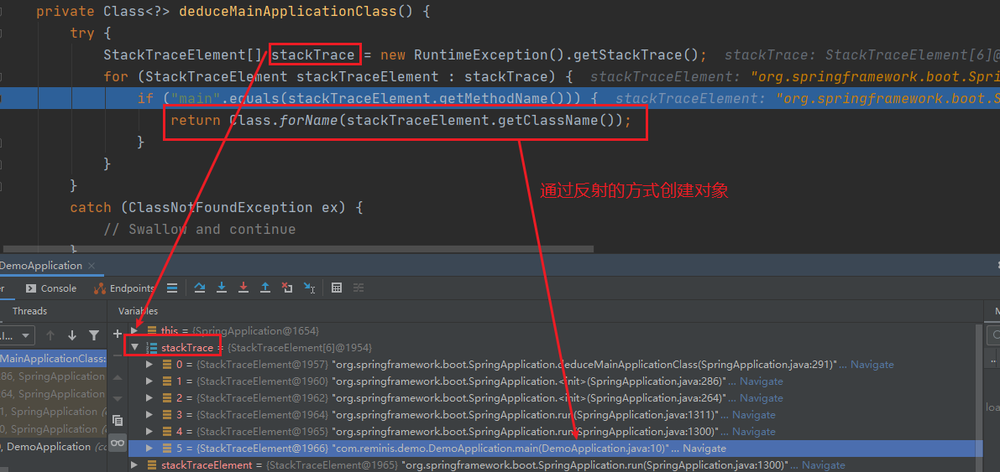
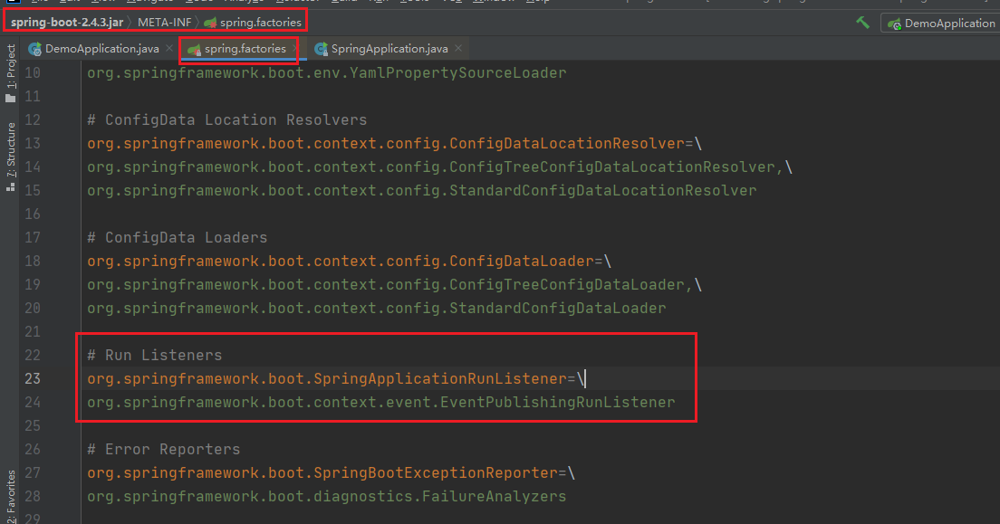
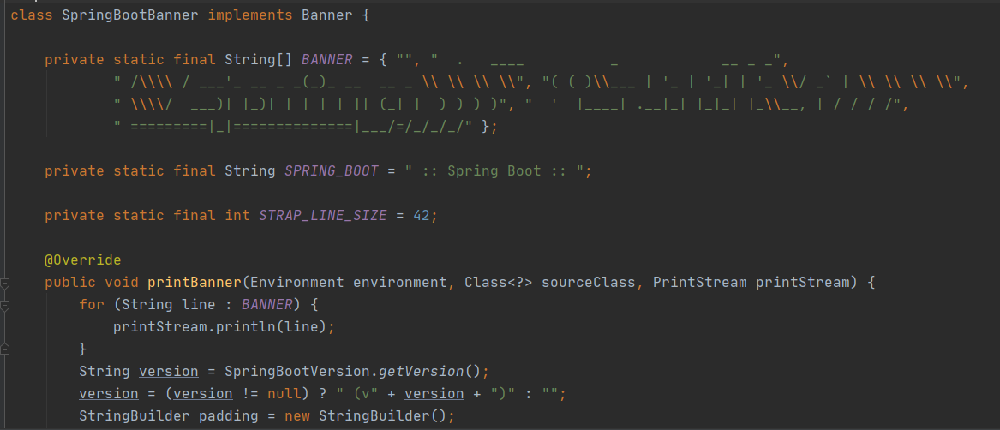
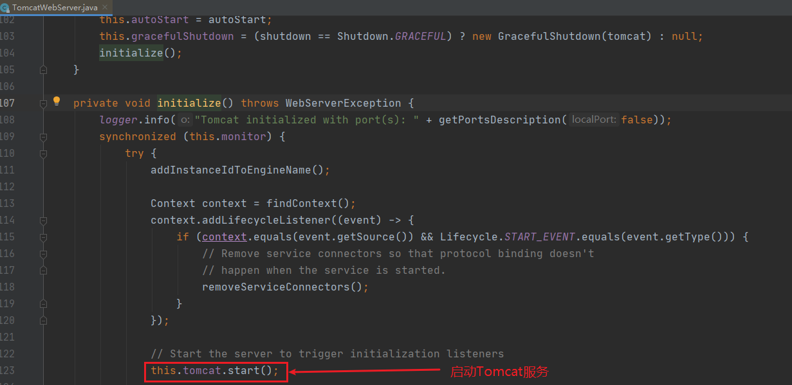

```
<dependency>
    <groupId>org.springframework.boot</groupId>
    <artifactId>spring-boot-starter-web</artifactId>
</dependency>
```


从main方法开始


```
	/**
	 * Static helper that can be used to run a {@link SpringApplication} from the
	 * specified sources using default settings and user supplied arguments.
	 * @param primarySources the primary sources to load
	 * @param args the application arguments (usually passed from a Java main method)
	 * @return the running {@link ApplicationContext}
	 */
	public static ConfigurableApplicationContext run(Class<?>[] primarySources, String[] args) {
		return new SpringApplication(primarySources).run(args);
	}
```


### 实例化SpingApplication的过程

```
	/**
	 * Create a new {@link SpringApplication} instance. The application context will load
	 * beans from the specified primary sources (see {@link SpringApplication class-level}
	 * documentation for details). The instance can be customized before calling
	 * {@link #run(String...)}.
	 * @param resourceLoader the resource loader to use
	 * @param primarySources the primary bean sources
	 * @see #run(Class, String[])
	 * @see #setSources(Set)
	 */
	@SuppressWarnings({ "unchecked", "rawtypes" })
	public SpringApplication(ResourceLoader resourceLoader, Class<?>... primarySources) {
	  // 资源加载器
		this.resourceLoader = resourceLoader;
		Assert.notNull(primarySources, "PrimarySources must not be null");
		this.primarySources = new LinkedHashSet<>(Arrays.asList(primarySources));
		// 1.可能的web应用程序类型的类型。
		this.webApplicationType = WebApplicationType.deduceFromClasspath();
		this.bootstrapRegistryInitializers = new ArrayList<>(
				getSpringFactoriesInstances(BootstrapRegistryInitializer.class));
		// 2.设置初始化应用context
		setInitializers((Collection) getSpringFactoriesInstances(ApplicationContextInitializer.class));
		// 3.设置初始化监听
		setListeners((Collection) getSpringFactoriesInstances(ApplicationListener.class));
		// 4.推演主程序类
		this.mainApplicationClass = deduceMainApplicationClass();
	}
```


很多不为人知的事情都是发生在这个对象初始化的时候，这里我们都来一一解密

```
	static WebApplicationType deduceFromClasspath() {
		if (ClassUtils.isPresent(WEBFLUX_INDICATOR_CLASS, null) && !ClassUtils.isPresent(WEBMVC_INDICATOR_CLASS, null)
				&& !ClassUtils.isPresent(JERSEY_INDICATOR_CLASS, null)) {
			return WebApplicationType.REACTIVE;
		}
		for (String className : SERVLET_INDICATOR_CLASSES) {
			if (!ClassUtils.isPresent(className, null)) {
				return WebApplicationType.NONE;
			}
		}
		// 这里是我们测试web容器
		return WebApplicationType.SERVLET;
	}
```


#### 1. 推断web 应用类型

> 这段代码是来推断我们的应用是哪种web应用程序

```
public enum WebApplicationType{
  
    // 不是web应用
    /**
    * The application should not run as a web application and should not start an
    * embedded web server.
    */
    NONE,
  
    /**
    The application should run as a servlet-based web application and should start an embedded servlet web server.
    */
    SERVLET，// servlet容器
   
    /**
    The application should run as a reactive web application and should start an embedded reactive web server.
    */
    REACTIVE; // 反应型web应用（webflux）
}
```

当然一开始我们加入了web的依赖，所以我们是 servlet 容器。


#### 2. 初始化应用上下文

> 在设置初始化应用context的时候，是先执行了`getSpringFactoriesInstances（ApplicationContextInitializer.class）`方法，参数是`ApplicationContextInitializer.class`字节码对象。

```
    private <T> Collection<T> getSpringFactoriesInstances(Class<T> type, Class<?>[] parameterTypes, Object... args) {
        ClassLoader classLoader = this.getClassLoader();
        // Use names and ensure unique to protect against dupLicates
        Set<String> names = new LinkedHashSet(
                 // 加载ApplicationContextInitializer.class类型的类
                 // 这里传入就是参数 ApplicationContextInitializer.class
                SpringFactoriesLoader.loadFactoryNames(type, classLoader));
        // 实例化加载到的类
        List<T> instances = this.createSpringFactoriesInstances(type, parameterTypes, classLoader, args, names);
        AnnotationAwareOrderComparator.sort(instances);
        // 返回
        return instances;
    }
```

我们先来看看他是如何加载到这些类

```
	private static Map<String, List<String>> loadSpringFactories(ClassLoader classLoader) {
	  // 从缓存中拿
		Map<String, List<String>> result = cache.get(classLoader);
		if (result != null) {
			return result;
		}

		result = new HashMap<>();
		try {
		  // 从资源路径下加载
			Enumeration<URL> urls = classLoader.getResources("META-INF/spring.factories");
			while (urls.hasMoreElements()) {
				URL url = urls.nextElement();
				UrlResource resource = new UrlResource(url);
				Properties properties = PropertiesLoaderUtils.loadProperties(resource);
				for (Map.Entry<?, ?> entry : properties.entrySet()) {
					String factoryTypeName = ((String) entry.getKey()).trim();
					String[] factoryImplementationNames =
							StringUtils.commaDelimitedListToStringArray((String) entry.getValue());
					for (String factoryImplementationName : factoryImplementationNames) {
						result.computeIfAbsent(factoryTypeName, key -> new ArrayList<>())
								.add(factoryImplementationName.trim());
					}
				}
			}

			// Replace all lists with unmodifiable lists containing unique elements
			result.replaceAll((factoryType, implementations) -> implementations.stream().distinct()
					.collect(Collectors.collectingAndThen(Collectors.toList(), Collections::unmodifiableList)));
			cache.put(classLoader, result);
		}
		catch (IOException ex) {
			throw new IllegalArgumentException("Unable to load factories from location [" +
					FACTORIES_RESOURCE_LOCATION + "]", ex);
		}
		// 返回所有的加载的类
		return result;
	}
```


#### 3. 初始化监听器类

当我们跟进去之后，会发现在初始化监听类的时候和上面初始化应用上下文是一样的代码。唯一不同的是 `getSpringFactoriesInstances(ApplicationListener.class))`传进去的是`ApplicationListener.class` 所以这里就不再赘述。


#### 4. 推演主程序类

> 也就是这个最关键的代码了
> `this.mainApplicationClass = this.deduceMainApplicationClass();`

```
	private Class<?> deduceMainApplicationClass() {
		try {
			StackTraceElement[] stackTrace = new RuntimeException().getStackTrace();
			for (StackTraceElement stackTraceElement : stackTrace) {
				if ("main".equals(stackTraceElement.getMethodName())) {
					return Class.forName(stackTraceElement.getClassName());
				}
			}
		}
		catch (ClassNotFoundException ex) {
			// Swallow and continue
		}
		return null;
	}
```




到这里就完成了`SpringBoot`启动过程中初始化SpringApplication 的过程。

这篇文章主要是给大家说了下`SpringBoot`启动过程中初始化`SpringApplication`的流程，大致可以分为四个步骤∶

1. 推演web应用的类型（如果没有加web依赖类型NONE）
2. 初始化 ApplicationContextInitializer
3. 初始化 ApplicationListener
4. 推演出主程序类
   通过这样四个步骤就完成了第一步 SpringApplication 的初始化过程。


### `run()`方法开始之后都做了那些事情

> 在上一章我们分析了SpingBoot启动流程中实例化SpingApplication的过程。

`return new SpringApplication(primarySources).run(args);`
这篇文章咱么说下`run()`方法开始之后都做了那些事情。

继续往下跟着源码进入到`run()`这个是比较核心的一个方法了。

```
		public ConfigurableApplicationContext run(String... args) {
		StopWatch stopWatch = new StopWatch();
    // 计时器开始
		stopWatch.start();
    // 创建启动上下文对象
		DefaultBootstrapContext bootstrapContext = createBootstrapContext();
		ConfigurableApplicationContext context = null;
    // 配置Handless模式，是在缺少显示屏、键盘或鼠标时的系统配置
    // 默认为true
		configureHeadlessProperty();
    //获取并启动监听器
		SpringApplicationRunListeners listeners = getRunListeners(args);
    // 启动监听器
		listeners.starting(bootstrapContext, this.mainApplicationClass);
		try {
			ApplicationArguments applicationArguments = new DefaultApplicationArguments(args);
      // 准备环境
			ConfigurableEnvironment environment = prepareEnvironment(listeners, bootstrapContext, applicationArguments);
      // 忽略配置的bean
			configureIgnoreBeanInfo(environment);
      // 打印banner,就是启动的时候在控制台的spring图案
			Banner printedBanner = printBanner(environment);
      // 创建容器
			context = createApplicationContext();
			context.setApplicationStartup(this.applicationStartup);
      // 准备应用上下文(spring容器前置处理)
			prepareContext(bootstrapContext, context, environment, listeners, applicationArguments, printedBanner);
      // 刷新容器
			refreshContext(context);
      // 刷新容器后的扩展接口(spring容器后置处理)
			afterRefresh(context, applicationArguments);
      // 结束计时器并打印，这就是我们启动后console的显示的时间
			stopWatch.stop();
			if (this.logStartupInfo) {
				new StartupInfoLogger(this.mainApplicationClass).logStarted(getApplicationLog(), stopWatch);
			}
      // 发布监听应用上下文启动完成（发出启动结束事件）
			listeners.started(context);
      // 执行runner
			callRunners(context, applicationArguments);
		}
		catch (Throwable ex) {
      // 异常处理，如果run过程发生异常
			handleRunFailure(context, ex, listeners);
			throw new IllegalStateException(ex);
		}

		try {
      // 监听应用上下文运行中
			listeners.running(context);
		}
		catch (Throwable ex) {
			handleRunFailure(context, ex, null);
			throw new IllegalStateException(ex);
		}
    // 返回最终构建的容器对象
		return context;
	}
```


接下来就对上面的关键步骤一一解释

#### 1. 获取所有的监听器

```
	private SpringApplicationRunListeners getRunListeners(String[] args) {
		Class<?>[] types = new Class<?>[] { SpringApplication.class, String[].class };
		return new SpringApplicationRunListeners(logger,
				getSpringFactoriesInstances(SpringApplicationRunListener.class, types, this, args),
				this.applicationStartup);
	}

	private <T> Collection<T> getSpringFactoriesInstances(Class<T> type) {
		return getSpringFactoriesInstances(type, new Class<?>[] {});
	}

	private <T> Collection<T> getSpringFactoriesInstances(Class<T> type, Class<?>[] parameterTypes, Object... args) {
		ClassLoader classLoader = getClassLoader();
		// Use names and ensure unique to protect against duplicates
		Set<String> names = new LinkedHashSet<>(SpringFactoriesLoader.loadFactoryNames(type, classLoader));
		List<T> instances = createSpringFactoriesInstances(type, parameterTypes, classLoader, args, names);
		AnnotationAwareOrderComparator.sort(instances);
		return instances;
	}
```

这段代码我们比较熟悉了，上一篇"实例化SpingApplication的过程"咱么详细介绍过，它的主要作用就是去`META-INFO/spring.factories` 中加载配置SpringApplicationRunListener的监听器如下



显然只有一个事件发布监听器类，拿到了`EventPublishingRunListener`启动事件发布监听器，下一步就是开始启动了`listeners.starting（）`;我们往下跟源码看

```
	void starting(ConfigurableBootstrapContext bootstrapContext, Class<?> mainApplicationClass) {
		doWithListeners("spring.boot.application.starting", (listener) -> listener.starting(bootstrapContext),
				(step) -> {
					if (mainApplicationClass != null) {
						step.tag("mainApplicationClass", mainApplicationClass.getName());
					}
				});
	}
```

启动的时候实际上是又创建了一个`ApplicationStartingEvent`对象，其实就是监听应用启动事件。
其中 `initialMulticaster`是一个`SimpleApplicationEventMuticaster`

```
	@Override
	public void multicastEvent(final ApplicationEvent event, @Nullable ResolvableType eventType) {
		ResolvableType type = (eventType != null ? eventType : resolveDefaultEventType(event));
		// 获取线程池，为每个监听事件创建一个线程
		Executor executor = getTaskExecutor();
		// 根据ApplicationStartingEvent事件类型找到对应的监听器，并迭代。遍历符合事件的监听器，向这些监听器发布事件
		for (ApplicationListener<?> listener : getApplicationListeners(event, type)) {
			if (executor != null) {
				executor.execute(() -> invokeListener(listener, event));
			}
			else {
				invokeListener(listener, event);
			}
		}
	}
```


#### 2.准备环境

```
ConfigurableEnvironment environment = prepareEnvironment(listeners, bootstrapContext, applicationArguments);
```

```
	private ConfigurableEnvironment prepareEnvironment(SpringApplicationRunListeners listeners,
			DefaultBootstrapContext bootstrapContext, ApplicationArguments applicationArguments) {
		// Create and configure the environment
                // 这里我们加入了web依赖所以是一个servlet容器
		ConfigurableEnvironment environment = getOrCreateEnvironment();
                // 配置环境
		configureEnvironment(environment, applicationArguments.getSourceArgs());
                // 环境准备完成
		ConfigurationPropertySources.attach(environment);
		listeners.environmentPrepared(bootstrapContext, environment);
		DefaultPropertiesPropertySource.moveToEnd(environment);
		configureAdditionalProfiles(environment);
		bindToSpringApplication(environment);
		if (!this.isCustomEnvironment) {
			environment = new EnvironmentConverter(getClassLoader()).convertEnvironmentIfNecessary(environment,
					deduceEnvironmentClass());
		}
		ConfigurationPropertySources.attach(environment);
		return environment;
	}
```

由于我们是添加了web的依赖 `getOrCreateEnvironment（）`返回的是一个`standardservletEnviroment` 标准的servlet环境。


##### 2.1 配置环境

```
	protected void configureEnvironment(ConfigurableEnvironment environment, String[] args) {
		if (this.addConversionService) {
      // 嵌入式的转换器
			ConversionService conversionService = ApplicationConversionService.getSharedInstance();
			environment.setConversionService((ConfigurableConversionService) conversionService);
		}
    // 配置属性资源文件
		configurePropertySources(environment, args);
    // 配置文件
		configureProfiles(environment, args);
	}
```

应用嵌入的转换器`ApplicationConversionService`

```
	public static void configure(FormatterRegistry registry) {
		DefaultConversionService.addDefaultConverters(registry);
		DefaultFormattingConversionService.addDefaultFormatters(registry);
                // 格式转换
		addApplicationFormatters(registry);
                // 类型转换
		addApplicationConverters(registry);
	}

        ===============格式转换=================
	public static void addApplicationFormatters(FormatterRegistry registry) {
		registry.addFormatter(new CharArrayFormatter());
		registry.addFormatter(new InetAddressFormatter());
		registry.addFormatter(new IsoOffsetFormatter());
	}


        ========================类型转换===================
	public static void addApplicationConverters(ConverterRegistry registry) {
		addDelimitedStringConverters(registry);
		registry.addConverter(new StringToDurationConverter());
		registry.addConverter(new DurationToStringConverter());
		registry.addConverter(new NumberToDurationConverter());
		registry.addConverter(new DurationToNumberConverter());
		registry.addConverter(new StringToPeriodConverter());
		registry.addConverter(new PeriodToStringConverter());
		registry.addConverter(new NumberToPeriodConverter());
		registry.addConverter(new StringToDataSizeConverter());
		registry.addConverter(new NumberToDataSizeConverter());
		registry.addConverter(new StringToFileConverter());
		registry.addConverter(new InputStreamSourceToByteArrayConverter());
		registry.addConverterFactory(new LenientStringToEnumConverterFactory());
		registry.addConverterFactory(new LenientBooleanToEnumConverterFactory());
		if (registry instanceof ConversionService) {
			addApplicationConverters(registry, (ConversionService) registry);
		}
	}
```


#### 2.2 环境准备完成

> 同上面启动监听事件，这次的环境准备也是同样的代码

```
	@Override
	public void environmentPrepared(ConfigurableBootstrapContext bootstrapContext,
			ConfigurableEnvironment environment) {
		this.initialMulticaster.multicastEvent(
                                // 创建一个应用环境准备事件对象
				new ApplicationEnvironmentPreparedEvent(bootstrapContext, this.application, this.args, environment));
	}
```


debug进去之后代码跟AppLicationstrigevent 事件对象是一样的。不再赘述。
不过这里是7个监听器对象

#### 3.配置忽略的bean

```
configureIgnoreBeanInfo(environment);
```

#### 4.打印banner

> 这是SpringBoot默认的启动时的图标
> `Banner printedBanner = printBanner(environment);`



> 这个是可以自定义的，也可以是图篇或是文本文件中的图形


#### 5.创建容器

紧接着上一篇，接下来就是创建容器

```
	protected ConfigurableApplicationContext createApplicationContext() {
		return this.applicationContextFactory.create(this.webApplicationType);
	}
```

#### 6.准备应用上下文

```
	private void prepareContext(DefaultBootstrapContext bootstrapContext, ConfigurableApplicationContext context,
			ConfigurableEnvironment environment, SpringApplicationRunListeners listeners,
			ApplicationArguments applicationArguments, Banner printedBanner) {
    // 设置环境参数
		context.setEnvironment(environment);
    // 设置后处理应用上下文
		postProcessApplicationContext(context);
    //把从spring.factories中加载的org.springframework.bt.context.ConfigurationwarningsApplicationContextIitiaLizer，进行初始化操作
		applyInitializers(context);
    //EventPubLishingRunListener发布应用上下文事件 
		listeners.contextPrepared(context);
    // 打印启动日志
		bootstrapContext.close(context);
		if (this.logStartupInfo) {
			logStartupInfo(context.getParent() == null);
			logStartupProfileInfo(context);
		}
		// Add boot specific singleton beans
                
		ConfigurableListableBeanFactory beanFactory = context.getBeanFactory();
		beanFactory.registerSingleton("springApplicationArguments", applicationArguments);
		if (printedBanner != null) {
      //注册一个字是springAppLicationArguments单例的bean 
			beanFactory.registerSingleton("springBootBanner", printedBanner);
		}
		if (beanFactory instanceof DefaultListableBeanFactory) {
			((DefaultListableBeanFactory) beanFactory)
					.setAllowBeanDefinitionOverriding(this.allowBeanDefinitionOverriding);
		}
		if (this.lazyInitialization) {
			context.addBeanFactoryPostProcessor(new LazyInitializationBeanFactoryPostProcessor());
		}
		// Load the sources 获取所有资源
		Set<Object> sources = getAllSources();
		Assert.notEmpty(sources, "Sources must not be empty");
    // 创建BeanDefinitionLoader加载器加载注册所有的资源 
		load(context, sources.toArray(new Object[0]));
    // 同之前，发布应用上下文 加载事件 
		listeners.contextLoaded(context);
	}
```


#### 7.刷新应用上下文

> 刷新应用上下文就进入了spring的源码了

```
    public void refresh() throws BeansException, IllegalStateException {
        synchronized(this.startupShutdownMonitor) {
            StartupStep contextRefresh = this.applicationStartup.start("spring.context.refresh");
            // Prepare this context for refreshing.
            //准备刷新上下文
            this.prepareRefresh();
            // Tetl the subclass to refresh the internal bean facto
            // 通知子类刷新内部工厂
            ConfigurableListableBeanFactory beanFactory = this.obtainFreshBeanFactory();
            // Prepare the bean factory for use in this context.
            // 准备Bean工厂
            this.prepareBeanFactory(beanFactory);

            try {
                 // Allows post-processing of the bean factory in contex t subc lasses.
                // 允许在上下文子类中对bean工厂进行后处理。
                // Invoke factory processors registered as beans in the context,
                this.postProcessBeanFactory(beanFactory);
                StartupStep beanPostProcess = this.applicationStartup.start("spring.context.beans.post-process");
                this.invokeBeanFactoryPostProcessors(beanFactory);
                // 注册后置处理器。
                this.registerBeanPostProcessors(beanFactory);
                beanPostProcess.end();
                // 初始化信息源
                this.initMessageSource();
                // 初始化上下文事件发布器
                this.initApplicationEventMulticaster();
                // 初始化其他自定义bean 
                this.onRefresh();
                // 注册监听器
                this.registerListeners();
                this.finishBeanFactoryInitialization(beanFactory);
                //完成刷新，清缓存，初始化生命周期，事件发布等
                this.finishRefresh();
            } catch (BeansException var10) {
                if (this.logger.isWarnEnabled()) {
                    this.logger.warn("Exception encountered during context initialization - cancelling refresh attempt: " + var10);
                }
                // 销毁bean 
                this.destroyBeans();
                // Reset 'active'flag.
                this.cancelRefresh(var10);
                throw var10;
            } finally {
                this.resetCommonCaches();
                contextRefresh.end();
            }

        }
    }
```


刷新的代码有点深，也是在这时创建了Tomcat对象，这也是`SpringBoot` **一键启动**web工程的关键

```
	@Override
	protected void onRefresh() {
		super.onRefresh();
		try {
		  // 创建web服务
			createWebServer();
		}
		catch (Throwable ex) {
			throw new ApplicationContextException("Unable to start web server", ex);
		}
	}
```


```
private void createWebServer() {
		WebServer webServer = this.webServer;
		ServletContext servletContext = getServletContext();
		if (webServer == null && servletContext == null) {
			StartupStep createWebServer = this.getApplicationStartup().start("spring.boot.webserver.create");
			ServletWebServerFactory factory = getWebServerFactory();
			createWebServer.tag("factory", factory.getClass().toString());
			// 获取到tomcat
			this.webServer = factory.getWebServer(getSelfInitializer());
			createWebServer.end();
			getBeanFactory().registerSingleton("webServerGracefulShutdown",
					new WebServerGracefulShutdownLifecycle(this.webServer));
			getBeanFactory().registerSingleton("webServerStartStop",
					new WebServerStartStopLifecycle(this, this.webServer));
		}
		else if (servletContext != null) {
			try {
				getSelfInitializer().onStartup(servletContext);
			}
			catch (ServletException ex) {
				throw new ApplicationContextException("Cannot initialize servlet context", ex);
			}
		}
		initPropertySources();
	}
```


创建了Tomcat对象，并设置参数

```
	@Override
	public WebServer getWebServer(ServletContextInitializer... initializers) {
		if (this.disableMBeanRegistry) {
			Registry.disableRegistry();
		}
		Tomcat tomcat = new Tomcat();
		File baseDir = (this.baseDirectory != null) ? this.baseDirectory : createTempDir("tomcat");
		tomcat.setBaseDir(baseDir.getAbsolutePath());
		Connector connector = new Connector(this.protocol);
		connector.setThrowOnFailure(true);
		tomcat.getService().addConnector(connector);
		customizeConnector(connector);
		tomcat.setConnector(connector);
		tomcat.getHost().setAutoDeploy(false);
		configureEngine(tomcat.getEngine());
		for (Connector additionalConnector : this.additionalTomcatConnectors) {
			tomcat.getService().addConnector(additionalConnector);
		}
		prepareContext(tomcat.getHost(), initializers); 
                // 返回TomcatWebServer服务
		return getTomcatWebServer(tomcat);
	}
```



#### 8.刷新后处理

> `afterReftesh();` //是个一空实现，留着后期扩展

```
	/**
	 * Called after the context has been refreshed.
	 * @param context the application context
	 * @param args the application arguments
	 */
	protected void afterRefresh(ConfigurableApplicationContext context, ApplicationArguments args) {
	}
```


#### 9.发布监听应用启动事件

```
	@Override
	public void started(ConfigurableApplicationContext context) {
		context.publishEvent(new ApplicationStartedEvent(this.application, this.args, context));
		AvailabilityChangeEvent.publish(context, LivenessState.CORRECT);
	}
```

> 这里是调用context.publishEvent（）方法，发布应用启动事件ApplicationStartedEvent.

#### 10.执行Runner

> 获取所有的ApplicationRuner和CommandLineRunner来初始化一些参数，callRuner（是一个回调函数)

```
	private void callRunners(ApplicationContext context, ApplicationArguments args) {
		List<Object> runners = new ArrayList<>();
		runners.addAll(context.getBeansOfType(ApplicationRunner.class).values());
		runners.addAll(context.getBeansOfType(CommandLineRunner.class).values());
		AnnotationAwareOrderComparator.sort(runners);
		for (Object runner : new LinkedHashSet<>(runners)) {
			if (runner instanceof ApplicationRunner) {
				callRunner((ApplicationRunner) runner, args);
			}
			if (runner instanceof CommandLineRunner) {
				callRunner((CommandLineRunner) runner, args);
			}
		}
	}
```

#### 11.发布上下文准备完成的事件

```
listeners.running(context);
```

```
	@Override
	public void running(ConfigurableApplicationContext context) {
		context.publishEvent(new ApplicationReadyEvent(this.application, this.args, context));
		AvailabilityChangeEvent.publish(context, ReadinessState.ACCEPTING_TRAFFIC);
	}
```

这段代码看上去似成相识，前面有很多类似的代码，不同的是这里上下文准备完成之后发布了一个ApplicationReadyEvent事件，声明一下应用上下文准备完成。
小结
这篇主要是介绍了SpringBoot启动过程中`run（）`的这个过程。从中我们也可以发现一些非常好的编码习惯，大家可以在日常的工作中从模仿到内化，慢慢变成自己的东西。


参考网址

1、https://www.cnblogs.com/reminis/p/14486867.html

2、https://www.cnblogs.com/reminis/p/14487674.html
