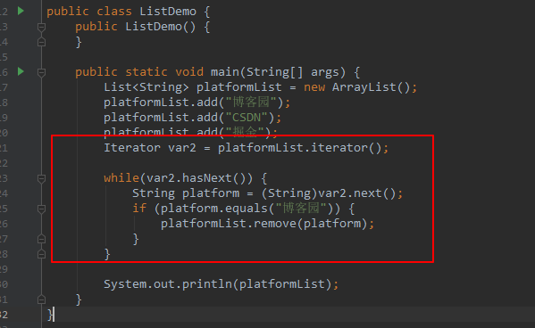
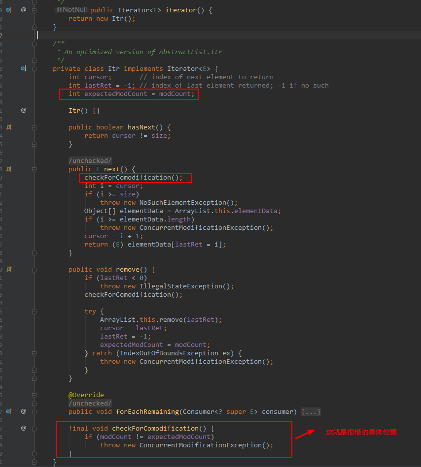
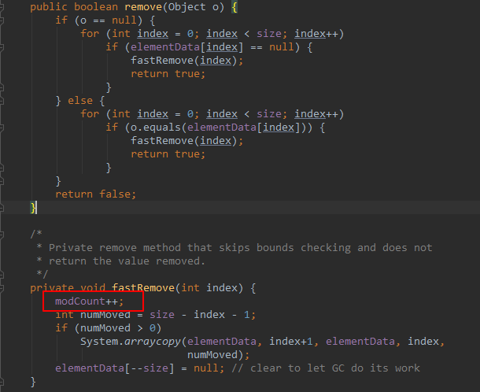
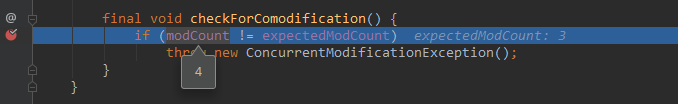
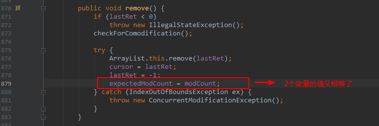
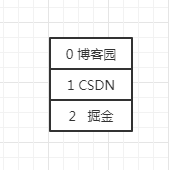
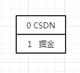
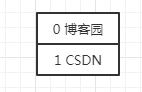
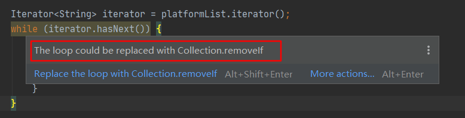
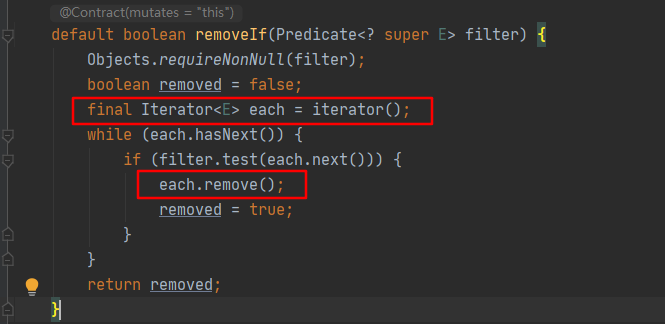

### 1. 新手常犯的错误

可能很多新手（包括当年的我，哈哈）第一时间想到的写法是下面这样的：

```
public static void main(String[] args) {
    List<String> platformList = new ArrayList<>();
    platformList.add("博客园");
    platformList.add("CSDN");
    platformList.add("掘金");

    for (String platform : platformList) {
        if (platform.equals("博客园")) {
            platformList.remove(platform);
        }
    }

    System.out.println(platformList);
}
```

然后满怀信心的去运行，结果竟然抛`java.util.ConcurrentModificationException`异常了，翻译成中文就是：并发修改异常。


是不是很懵，心想这是为什么呢？

让我们首先看下上面这段代码生成的字节码，如下所示：



由此可以看出，foreach循环在实际执行时，其实使用的是`Iterator`，使用的核心方法是`hasnext()`和`next()`。

然后再来看下ArrayList类的Iterator是如何实现的呢？



可以看出，调用`next()`方法获取下一个元素时，第一行代码就是调用了`checkForComodification();`，而该方法的核心逻辑就是比较`modCount`和`expectedModCount`这2个变量的值。

在上面的例子中，刚开始`modCount`和`expectedModCount`的值都为3，所以第1次获取元素"博客园"是没问题的，但是当执行完下面这行代码时：

```
platformList.remove(platform);
```

`modCount`的值就被修改成了4。



所以在第2次获取元素时，`modCount`和`expectedModCount`的值就不相等了，所以抛出了`java.util.ConcurrentModificationException`异常。



既然不能使用foreach来实现，那么我们该如何实现呢？

主要有以下3种方法：

1. 使用Iterator的remove()方法
2. 使用for循环正序遍历
3. 使用for循环倒序遍历

接下来一一讲解。


### 2. 使用Iterator的remove()方法

使用Iterator的remove()方法的实现方式如下所示：

```java
public static void main(String[] args) {
    List<String> platformList = new ArrayList<>();
    platformList.add("博客园");
    platformList.add("CSDN");
    platformList.add("掘金");

    Iterator<String> iterator = platformList.iterator();
    while (iterator.hasNext()) {
        String platform = iterator.next();
        if (platform.equals("博客园")) {
            iterator.remove();
        }
    }

    System.out.println(platformList);
}
```

输出结果为：

> [CSDN, 掘金]

为什么使用`iterator.remove();`就可以呢？

让我们看下它的源码：



可以看出，每次删除一个元素，都会将`modCount`的值重新赋值给`expectedModCount`，这样2个变量就相等了，不会触发`java.util.ConcurrentModificationException`异常。

### 3. 使用for循环正序遍历

使用for循环正序遍历的实现方式如下所示：

```java
public static void main(String[] args) {
    List<String> platformList = new ArrayList<>();
    platformList.add("博客园");
    platformList.add("CSDN");
    platformList.add("掘金");

    for (int i = 0; i < platformList.size(); i++) {
        String item = platformList.get(i);

        if (item.equals("博客园")) {
            platformList.remove(i);
            i = i - 1;
        }
    }

    System.out.println(platformList);
}
```

这种实现方式比较好理解，就是通过数组的下标来删除，不过有个注意事项就是删除元素后，要修正下下标的值：

```java
i = i - 1;
```

为什么要修正下标的值呢？

因为刚开始元素的下标是这样的：



第1次循环将元素"博客园"删除后，元素的下标变成了下面这样：



第2次循环时i的值为1，也就是取到了元素”掘金“，这样就导致元素"CSDN"被跳过检查了，所以删除完元素后，我们要修正下下标，这也是上面代码中`i = i - 1;`的用途。

### 4. 使用for循环倒序遍历

使用for循环倒序遍历的实现方式如下所示：

```java
public static void main(String[] args) {
    List<String> platformList = new ArrayList<>();
    platformList.add("博客园");
    platformList.add("CSDN");
    platformList.add("掘金");

    for (int i = platformList.size() - 1; i >= 0; i--) {
        String item = platformList.get(i);

        if (item.equals("掘金")) {
            platformList.remove(i);
        }
    }

    System.out.println(platformList);
}
```

这种实现方式和使用for循环正序遍历类似，不过不用再修正下标，因为刚开始元素的下标是这样的：


第1次循环将元素"掘金"删除后，元素的下标变成了下面这样：



第2次循环时i的值为1，也就是取到了元素”CSDN“，不会导致跳过元素，所以不需要修正下标。

### 5. 评论区释疑(2020-06-15更新)

#### 5.1 使用removeIf()方法(推荐)

从JDK1.8开始，可以使用`removeIf()`方法来代替 `Iterator`的`remove()`方法实现一边遍历一边删除，其实，IDEA中也会提示：



所以原来的代码：

```java
Iterator<String> iterator = platformList.iterator();
while (iterator.hasNext()) {
    String platform = iterator.next();
    if (platform.equals("博客园")) {
        iterator.remove();
    }
}
```

就可以简化为如下所示的1行代码，非常简洁：

```java
platformList.removeIf(platform -> "博客园".equals(platform));
```

看下removeIf()方法的源码，会发现其实底层也是用的`Iterator`的`remove()`方法：



#### 5.2 使用for循环正序遍历，是否需要修正下标？

先说结论：需要。

不过之前文中举得例子不是太好，所以好多读者看完认为不修正下标也是可以的，其实不是，我们换个例子来理解：

```java
List<String> platformList = new ArrayList<>();
platformList.add("博客园");
platformList.add("博客园");
platformList.add("CSDN");
platformList.add("掘金");

for (int i = 0; i < platformList.size(); i++) {
	String item = platformList.get(i);
    if ("博客园".equals(item)) {
    	platformList.remove(i);
    }
}

System.out.println(platformList);
```

输出结果：

[博客园, CSDN, 掘金]

可以发现，如果不修正下标，第2个元素“博客园”在循环遍历时被跳过了，也就无法删除，所以一定要修正下标：


原文来自于：[【Java面试题】List如何一边遍历，一边删除？ ](https://www.cnblogs.com/zwwhnly/p/12530819.html)](https://www.cnblogs.com/zwwhnly/p/12530819.html)