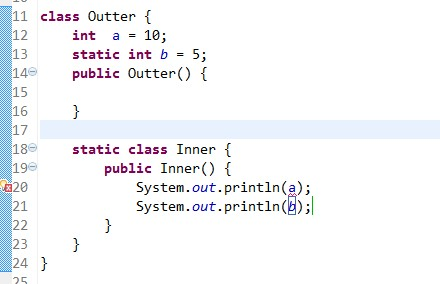

### java中的匿名内部类总结 

匿名内部类也就是没有名字的内部类

正因为没有名字，所以匿名内部类只能使用一次，它通常用来简化代码编写

但使用匿名内部类还有个前提条件：必须继承一个父类或实现一个接口

 

#### 实例1:不使用匿名内部类来实现抽象方法

```java
abstract class Person {
    public abstract void eat();
}
 
class Child extends Person {
    public void eat() {
        System.out.println("eat something");
    }
}
 
public class Demo {
    public static void main(String[] args) {
        Person p = new Child();
        p.eat();
    }
}
```


**运行结果：**eat something

可以看到，我们用Child继承了Person类，然后实现了Child的一个实例，将其向上转型为Person类的引用

但是，如果此处的Child类只使用一次，那么将其编写为独立的一个类岂不是很麻烦？

这个时候就引入了匿名内部类

 

#### 实例2：匿名内部类的基本实现

```java
abstract class Person {
    public abstract void eat();
}
 
public class Demo {
    public static void main(String[] args) {
        Person p = new Person() {
            public void eat() {
                System.out.println("eat something");
            }
        };
        p.eat();
    }
}
```

**运行结果：**eat something

可以看到，我们直接将抽象类Person中的方法在大括号中实现了

这样便可以省略一个类的书写

并且，匿名内部类还能用于接口上

####  

#### 实例3：在接口上使用匿名内部类

```java
interface Person {
    public void eat();
}
 
public class Demo {
    public static void main(String[] args) {
        Person p = new Person() {
            public void eat() {
                System.out.println("eat something");
            }
        };
        p.eat();
    }
}
```

**运行结果：**eat something

 

由上面的例子可以看出，只要一个类是抽象的或是一个接口，那么其子类中的方法都可以使用匿名内部类来实现

最常用的情况就是在多线程的实现上，因为要实现多线程必须继承Thread类或是继承Runnable接口

 

#### 实例4：Thread类的匿名内部类实现

```java
public class Demo {
    public static void main(String[] args) {
        Thread t = new Thread() {
            public void run() {
                for (int i = 1; i <= 5; i++) {
                    System.out.print(i + " ");
                }
            }
        };
        t.start();
    }
}
```

**运行结果：**1 2 3 4 5

 

#### 实例5：Runnable接口的匿名内部类实现

```java
public class Demo {
    public static void main(String[] args) {
        Runnable r = new Runnable() {
            public void run() {
                for (int i = 1; i <= 5; i++) {
                    System.out.print(i + " ");
                }
            }
        };
        Thread t = new Thread(r);
        t.start();
    }
}
```

**运行结果：**1 2 3 4 5


----


### 详解匿名内部类

#### 一、使用匿名内部类内部类

   匿名内部类由于没有名字，所以它的创建方式有点儿奇怪。创建格式如下：

```java
new 父类构造器（参数列表）|实现接口（）  
    {  
     //匿名内部类的类体部分  
    }
```

   在这里我们看到使用匿名内部类我们必须要继承一个父类或者实现一个接口，当然也仅能只继承一个父类或者实现一个接口。同时它也是没有class关键字，这是因为匿名内部类是直接使用new来生成一个对象的引用。当然这个引用是隐式的。


```java
public abstract class Bird {
    private String name;

    public String getName() {
        return name;
    }

    public void setName(String name) {
        this.name = name;
    }
    
    public abstract int fly();
}

public class Test {
    
    public void test(Bird bird){
        System.out.println(bird.getName() + "能够飞 " + bird.fly() + "米");
    }
    
    public static void main(String[] args) {
        Test test = new Test();
        test.test(new Bird() {
            
            public int fly() {
                return 10000;
            }
            
            public String getName() {
                return "大雁";
            }
        });
    }
}
------------------
Output：
大雁能够飞 10000米
```


   在Test类中，test()方法接受一个Bird类型的参数，同时我们知道一个抽象类是没有办法直接new的，我们必须要先有实现类才能new出来它的实现类实例。所以在mian方法中直接使用匿名内部类来创建一个Bird实例。

   由于匿名内部类不能是抽象类，所以它必须要实现它的抽象父类或者接口里面所有的抽象方法。

   对于这段匿名内部类代码其实是可以拆分为如下形式：


```java
public class WildGoose extends Bird{
    public int fly() {
        return 10000;
    }
    
    public String getName() {
        return "大雁";
    }
}

WildGoose wildGoose = new WildGoose();
test.test(wildGoose);
```


​    在这里系统会创建一个继承自Bird类的匿名类的对象，该对象转型为对Bird类型的引用。

   对于匿名内部类的使用它是存在一个缺陷的，就是它仅能被使用一次，创建匿名内部类时它会立即创建一个该类的实例，该类的定义会立即消失，所以匿名内部类是不能够被重复使用。对于上面的实例，如果我们需要对test()方法里面内部类进行多次使用，建议重新定义类，而不是使用匿名内部类。

#### 二、注意事项

   在使用匿名内部类的过程中，我们需要注意如下几点：

   **1、**使用匿名内部类时，我们必须是继承一个类或者实现一个接口，但是两者不可兼得，同时也只能继承一个类或者实现一个接口。

   **2、**匿名内部类中是不能定义构造函数的。

   **3、**匿名内部类中不能存在任何的静态成员变量和静态方法。

   **4、**匿名内部类为局部内部类，所以局部内部类的所有限制同样对匿名内部类生效。

   **5、**匿名内部类不能是抽象的，它必须要实现继承的类或者实现的接口的所有抽象方法。

#### 三、使用的形参为何要为final

   参考文件：http://android.blog.51cto.com/268543/384844

​    我们给匿名内部类传递参数的时候，若该形参在内部类中需要被使用，那么该形参必须要为final。也就是说：**当所在的方法的形参需要被内部类里面使用时，该形参必须为final。**

   为什么必须要为final呢？

   首先我们知道在内部类编译成功后，它会产生一个class文件，该class文件与外部类并不是同一class文件，仅仅只保留对外部类的引用。当外部类传入的参数需要被内部类调用时，从java程序的角度来看是直接被调用：


```java
public class OuterClass {
    public void display(final String name,String age){
        class InnerClass{
            void display(){
                System.out.println(name);
            }
        }
    }
}
```


   从上面代码中看好像name参数应该是被内部类直接调用？其实不然，在java编译之后实际的操作如下：


```java
public class OuterClass$InnerClass {
    public InnerClass(String name,String age){
        this.InnerClass$name = name;
        this.InnerClass$age = age;
    }
    
    
    public void display(){
        System.out.println(this.InnerClass$name + "----" + this.InnerClass$age );
    }
}
```


   所以从上面代码来看，内部类并不是直接调用方法传递的参数，而是利用自身的构造器对传入的参数进行备份，自己内部方法调用的实际上时自己的属性而不是外部方法传递进来的参数。

   直到这里还没有解释为什么是final？在内部类中的属性和外部方法的参数两者从外表上看是同一个东西，但实际上却不是，所以他们两者是可以任意变化的，也就是说在内部类中我对属性的改变并不会影响到外部的形参，而然这从程序员的角度来看这是不可行的，毕竟站在程序的角度来看这两个根本就是同一个，如果内部类该变了，而外部方法的形参却没有改变这是难以理解和不可接受的，所以为了保持参数的一致性，就规定使用final来避免形参的不改变。

   **简单理解就是，拷贝引用，为了避免引用值发生改变，例如被外部类的方法修改等，而导致内部类得到的值不一致，于是用final来让该引用不可改变。**

   **故如果定义了一个匿名内部类，并且希望它使用一个其外部定义的参数，那么编译器会要求该参数引用是final的。**

#### 四、匿名内部类初始化

我们一般都是利用构造器来完成某个实例的初始化工作的，但是匿名内部类是没有构造器的！那怎么来初始化匿名内部类呢？使用构造代码块！利用构造代码块能够达到为匿名内部类创建一个构造器的效果。

```java
public class OutClass {
    public InnerClass getInnerClass(final int age,final String name){
        return new InnerClass() {
            int age_ ;
            String name_;
            //构造代码块完成初始化工作
            {
                if(0 < age && age < 200){
                    age_ = age;
                    name_ = name;
                }
            }
            public String getName() {
                return name_;
            }
            
            public int getAge() {
                return age_;
            }
        };
    }
    
    public static void main(String[] args) {
        OutClass out = new OutClass();
        
        InnerClass inner_1 = out.getInnerClass(201, "chenssy");
        System.out.println(inner_1.getName());
        
        InnerClass inner_2 = out.getInnerClass(23, "chenssy");
        System.out.println(inner_2.getName());
    }
}
```


----


### Java 内部类详解

在 Java 中，可以将一个类定义在另一个类里面或者一个方法里面，这样的类称为内部类。广泛意义上的内部类一般来说包括这四种：成员内部类、局部内部类、匿名内部类和静态内部类。下面就先来了解一下这四种内部类的用法。

#### 1.成员内部类

成员内部类是最普通的内部类，它的定义为位于另一个类的内部，形如下面的形式：

```java
class Circle {
    double radius = 0;
     
    public Circle(double radius) {
        this.radius = radius;
    }
     
    class Draw {     //内部类
        public void drawSahpe() {
            System.out.println("drawshape");
        }
    }
}
```

这样看起来，类Draw像是类Circle的一个成员，Circle称为外部类。成员内部类可以无条件访问外部类的所有成员属性和成员方法（包括private成员和静态成员）。

```java
class Circle {
    private double radius = 0;
    public static int count =1;
    public Circle(double radius) {
        this.radius = radius;
    }
     
    class Draw {     //内部类
        public void drawSahpe() {
            System.out.println(radius);  //外部类的private成员
            System.out.println(count);   //外部类的静态成员
        }
    }
}
```


当成员内部类拥有和外部类同名的成员变量或者方法时，会发生隐藏现象，即默认情况下访问的是成员内部类的成员。如果要访问外部类的同名成员，需要以下面的形式进行访问：

```
外部类.this.成员变量
外部类.this.成员方法
```

虽然成员内部类可以无条件地访问外部类的成员，而外部类想访问成员内部类的成员却不是这么随心所欲了。在外部类中如果要访问成员内部类的成员，必须先创建一个成员内部类的对象，再通过指向这个对象的引用来访问：

```java
class Circle {
    private double radius = 0;
 
    public Circle(double radius) {
        this.radius = radius;
        getDrawInstance().drawSahpe();   //必须先创建成员内部类的对象，再进行访问
    }
     
    private Draw getDrawInstance() {
        return new Draw();
    }
     
    class Draw {     //内部类
        public void drawSahpe() {
            System.out.println(radius);  //外部类的private成员
        }
    }
}
```

成员内部类是依附外部类而存在的，也就是说，如果要创建成员内部类的对象，前提是必须存在一个外部类的对象。创建成员内部类对象的一般方式如下：

```java
public class Test {
    public static void main(String[] args)  {
        //第一种方式：
        Outter outter = new Outter();
        Outter.Inner inner = outter.new Inner();  //必须通过Outter对象来创建
         
        //第二种方式：
        Outter.Inner inner1 = outter.getInnerInstance();
    }
}
 
class Outter {
    private Inner inner = null;
    public Outter() {
         
    }
     
    public Inner getInnerInstance() {
        if(inner == null)
            inner = new Inner();
        return inner;
    }
      
    class Inner {
        public Inner() {
             
        }
    }
}
```

内部类可以拥有 private 访问权限、protected 访问权限、public 访问权限及包访问权限。比如上面的例子，如果成员内部类 Inner 用 private 修饰，则只能在外部类的内部访问，如果用 public 修饰，则任何地方都能访问；如果用 protected 修饰，则只能在同一个包下或者继承外部类的情况下访问；如果是默认访问权限，则只能在同一个包下访问。这一点和外部类有一点不一样，外部类只能被 public 和包访问两种权限修饰。我个人是这么理解的，由于成员内部类看起来像是外部类的一个成员，所以可以像类的成员一样拥有多种权限修饰。

#### 2.局部内部类

局部内部类是定义在一个方法或者一个作用域里面的类，它和成员内部类的区别在于局部内部类的访问仅限于方法内或者该作用域内。

```java
class People{
    public People() {
         
    }
}
 
class Man{
    public Man(){
         
    }
     
    public People getWoman(){
        class Woman extends People{   //局部内部类
            int age =0;
        }
        return new Woman();
    }
}
```

　

**注意**: 局部内部类就像是方法里面的一个局部变量一样，是不能有 public、protected、private 以及 static 修饰符的。

#### 3.匿名内部类

匿名内部类应该是平时我们编写代码时用得最多的，在编写事件监听的代码时使用匿名内部类不但方便，而且使代码更加容易维护。下面这段代码是一段 Android 事件监听代码：

```java
scan_bt.setOnClickListener(new OnClickListener() {
    @Override
    public void onClick(View v) {
        // TODO Auto-generated method stub
         
    }
});
 
history_bt.setOnClickListener(new OnClickListener() {
     
    @Override
    public void onClick(View v) {
        // TODO Auto-generated method stub
         
    }
});
```

这段代码为两个按钮设置监听器，这里面就使用了匿名内部类。这段代码中的：

```java
new OnClickListener() {
    @Override
    public void onClick(View v) {
        // TODO Auto-generated method stub
         
    }
}
```

就是匿名内部类的使用。代码中需要给按钮设置监听器对象，使用匿名内部类能够在实现父类或者接口中的方法情况下同时产生一个相应的对象，但是前提是这个父类或者接口必须先存在才能这样使用。当然像下面这种写法也是可以的，跟上面使用匿名内部类达到效果相同。

```java
private void setListener()
{
    scan_bt.setOnClickListener(new Listener1());       
    history_bt.setOnClickListener(new Listener2());
}
 
class Listener1 implements View.OnClickListener{
    @Override
    public void onClick(View v) {
    // TODO Auto-generated method stub
             
    }
}
 
class Listener2 implements View.OnClickListener{
    @Override
    public void onClick(View v) {
    // TODO Auto-generated method stub
             
    }
}
```

这种写法虽然能达到一样的效果，但是既冗长又难以维护，所以一般使用匿名内部类的方法来编写事件监听代码。同样的，匿名内部类也是不能有访问修饰符和 static 修饰符的。

匿名内部类是唯一一种没有构造器的类。正因为其没有构造器，所以匿名内部类的使用范围非常有限，大部分匿名内部类用于接口回调。匿名内部类在编译的时候由系统自动起名为 Outter$1.class。一般来说，匿名内部类用于继承其他类或是实现接口，并不需要增加额外的方法，只是对继承方法的实现或是重写。

#### 4.静态内部类

静态内部类也是定义在另一个类里面的类，只不过在类的前面多了一个关键字static。静态内部类是不需要依赖于外部类的，这点和类的静态成员属性有点类似，并且它不能使用外部类的非static成员变量或者方法，这点很好理解，因为在没有外部类的对象的情况下，可以创建静态内部类的对象，如果允许访问外部类的非static成员就会产生矛盾，因为外部类的非static成员必须依附于具体的对象。

```java
public class Test {
    public static void main(String[] args)  {
        Outter.Inner inner = new Outter.Inner();
    }
}
 
class Outter {
    public Outter() {
         
    }
     
    static class Inner {
        public Inner() {
             
        }
    }
}
```




摘抄文章：

1、https://www.cnblogs.com/nerxious/archive/2013/01/25/2876489.html

2、https://www.cnblogs.com/chenssy/p/3390871.html

3、https://www.runoob.com/w3cnote/java-inner-class-intro.html